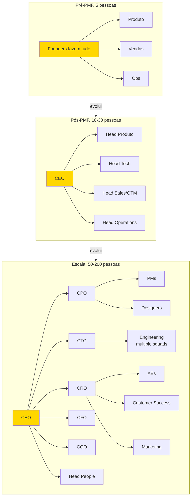
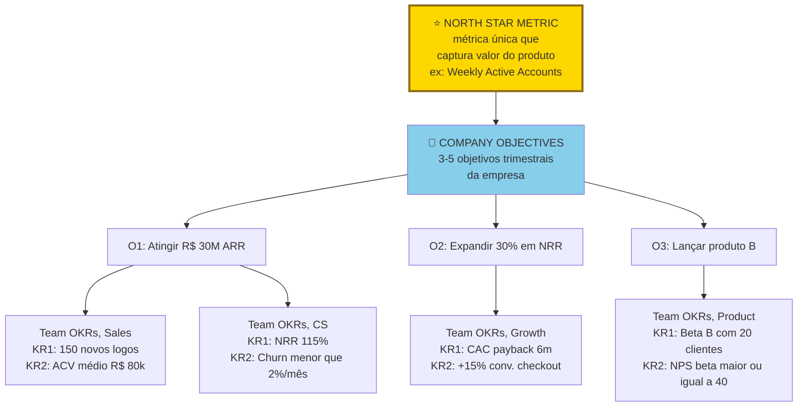
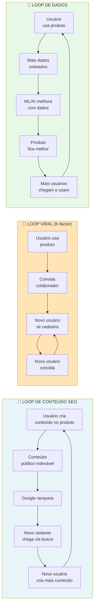
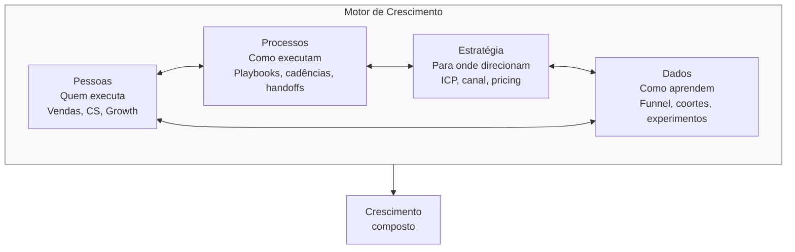

## FASE 14 — ESCALA: TIME, OPERAÇÕES, CRESCIMENTO E CAPITAL

### O que esse apêndice cobre

A [[#FASE 14 — ESCALA: TIME, OPERAÇÕES, CRESCIMENTO E CAPITAL|Fase 14]] é o longo período em que a empresa transita de *ter PMF* para *ser máquina*. Aqui você sai do modo fundador-fazendo-tudo, e entra no modo empresa-institucional-funcionando-sem-você-diariamente. É a fase mais longa e trabalhosa da trajetória. Tipicamente dois a cinco anos. Com picos de atividade, mas também platôs. É também a fase onde boa parte das empresas brasileiras com PMF genuíno trava. Porque escalar envolve disciplinas que não tinham sido requeridas até aqui.

A [[#FASE 14 — ESCALA: TIME, OPERAÇÕES, CRESCIMENTO E CAPITAL|Fase 14]] tem três frentes simultâneas: Time e Liderança em Escala, Operações e Gestão em Escala, e Máquina de Crescimento, Capital e Expansão. Cada uma com lógica própria, mas inseparáveis na prática. As três evoluem em paralelo — esse capítulo as trata em subseções ordenadas por intuição operacional.

### POR QUE

Sem escala, o PMF vira curiosidade histórica. Empresa que atinge PMF mas não escala é empresa que fica pequena para sempre. Possivelmente lucrativa. Possivelmente satisfatória para o fundador. Mas não é o que o ecossistema de venture capital busca financiar. Se o seu caminho é construir uma empresa de software de bilhões, a [[#FASE 14 — ESCALA: TIME, OPERAÇÕES, CRESCIMENTO E CAPITAL|Fase 14]] é onde se prova, ou não se prova.

A escala também muda quem você é como líder. Na [[#FASE 12 — PRODUCT-MARKET FIT|Fase 12]] você é artesão. Na [[#FASE 14 — ESCALA: TIME, OPERAÇÕES, CRESCIMENTO E CAPITAL|Fase 14]] você é industrial. O conjunto de habilidades é diferente. Às vezes oposto. Muitos fundadores tropeçam aqui. Não por falta de mérito. Mas porque insistem em operar como artesão quando a empresa precisa de industrial. Trocar de modo é parte da [[#FASE 14 — ESCALA: TIME, OPERAÇÕES, CRESCIMENTO E CAPITAL|Fase 14]].

### Quando usar

Comece quando você declarou PMF na [[#FASE 12 — PRODUCT-MARKET FIT|Fase 12]], e fez a estruturação formal da [[#FASE 13 — ESTRUTURAÇÃO JURÍDICA, FINANCEIRA E OPERACIONAL|Fase 13]]. Em prática, doze a dezoito meses depois do primeiro MVP validado. A [[#FASE 14 — ESCALA: TIME, OPERAÇÕES, CRESCIMENTO E CAPITAL|Fase 14]] não tem fim claro. Ela se funde à Parte III desse manual (Em Escala) quando a empresa atinge uma massa crítica. Tipicamente cento e cinquenta a quinhentos funcionários, operação em múltiplas frentes, e governance formal. A frequência de revisão é contínua. A [[#FASE 14 — ESCALA: TIME, OPERAÇÕES, CRESCIMENTO E CAPITAL|Fase 14]] não é "documento que se escreve uma vez". É rotina gerencial e estratégica permanente.

### Quem envolve

O executor principal é você, com o time executivo que começa a se formar. Primeiros VPs. Depois heads. Depois C-level. O decisor sobre arquitetura é você. O apoio externo vem de advisors, board (quando existir), e investidores (em questões de capital, e estratégia).

---

### TIME E LIDERANÇA EM ESCALA

#### O primeiro funcionário, a transição de fundador solo para mais um

A [[#FASE 14 — ESCALA: TIME, OPERAÇÕES, CRESCIMENTO E CAPITAL|Fase 14]] (Time e Liderança) trata time em escala com processos formais. Mas a transição do fundador solo, ou dupla, para fundador mais um funcionário é um momento específico que raramente é bem-tratado em manuais. Essa seção cobre.

> [!important] Por que é momento crítico
> Até aqui, o fundador fazia tudo, e delegava nada. A dificuldade é mais emocional que técnica. Aprender a *confiar* em alguém com coisas que antes você controlava. O primeiro funcionário define a cultura da empresa com peso desproporcional. Os valores dessa pessoa moldam os próximos cinco a quinze funcionários. Erros de contratação cedo são caros. Em tempo perdido. Em moral quebrada. Em aprendizado de gestão ainda embrionário no fundador. O primeiro funcionário frequentemente tem perfil diferente dos seguintes. Requer empreendedorismo no DNA, mesmo sendo funcionário.

##### Quando contratar o primeiro funcionário

Sinais de que é hora. O fundador (ou dupla) está no gargalo há dois a três meses seguidos, sem conseguir avançar em frentes específicas. Há capital disponível para doze a dezoito meses de salário dessa pessoa. Há PMF inicial, ou claro caminho para ele (receita recorrente começando, ou grande confiança). Você sabe *exatamente* o que essa pessoa vai fazer nos próximos seis meses.

Sinais de que *não* é hora. "Seria bom ter alguém, mas não sei bem para quê" — contratar por vaidade ou ansiedade. Caixa para menos de seis meses do novo salário, sem plano de caixa claro. Ainda não tem PMF, e está iterando muito. Contratação cria pressão a manter curso, e reduz flexibilidade. A sua própria agenda está quarenta por cento livre. O fundador não está no gargalo ainda.

##### Quem contratar, perfis mais eficazes

Perfil A, ex-colega sênior que já confia em você (ideal). Você já trabalhou com essa pessoa. Sabe como ela trabalha sob pressão. Ela está trocando emprego estável por aposta. Precisa acreditar em você, e na ideia. Compensação frequentemente abaixo de mercado, mais equity significativo (um a cinco por cento dependendo de perfil).

Perfil B, generalista de alto potencial. Pessoa de três a sete anos de experiência. Adaptável. Quer aprender ampliando skills em empresa pequena. Topa fazer "tudo que aparecer" nos primeiros meses. Salário próximo de mercado, mais equity modesto (zero vírgula vinte e cinco a um por cento).

Perfil C, especialista em gargalo específico. Se o fundador é técnico, e o gargalo é vendas, contratar AE sênior. Se o fundador é comercial, e o gargalo é tech, contratar full-stack sênior. Especialista com cinco a dez anos. Salário próximo a mercado.

> [!warning] Evitar no primeiro funcionário
> Júnior que precisa de muito suporte (o fundador não tem tempo). Superstar de empresa grande sem experiência em startup (cultura choque). Parente, ou amigo próximo (conflitos são mais difíceis de resolver).

##### Onde encontrar

Rede pessoal ([[#APÊNDICE AL — REDE, MENTORES E ADVISORS — COMO CONSTRUIR O CAPITAL HUMANO DO EMPREENDEDOR|Apêndice AL]]). Origem de setenta por cento das primeiras contratações bem-sucedidas. LinkedIn ativo. "Estou contratando o meu primeiro funcionário, [descrição]. Quem você conhece?" Plataformas. Gupy, Revelo no Brasil. AngelList ou Wellfound internacional. Comunidades setoriais. Grupos Slack ou Discord da sua categoria.

##### Processo de contratação para primeiro funcionário

Sete passos. Descrição da vaga (trinta minutos). Título, cinco a sete responsabilidades, e três a cinco critérios de sucesso em seis meses. Sourcing (uma a duas semanas). Rede pessoal, LinkedIn, plataformas. Vinte a quarenta candidatos conversados. Tela inicial (trinta minutos cada). Cultura fit, motivação, e match básico de skills. Oito a quinze candidatos. Entrevista técnica, ou case (noventa minutos cada). Avaliação de trabalho real. Quatro a seis candidatos. Culture fit aprofundado (sessenta minutos). Conversa sobre valores, estilo de trabalho, e tolerância a ambiguidade. Dois a três candidatos. Reference check (mínimo de duas referências trabalhadas). Conversa direta. Não e-mail. Pedir exemplos concretos. Oferta, e negociação.

Prazo total: três a seis semanas, do início ao primeiro dia.

##### Oferta para primeiro funcionário, estrutura típica

Salário de oitenta a noventa e cinco por cento do mercado, para cargo equivalente. Abaixo sinaliza startup. Perto do mercado reconhece o risco que está aceitando.

> [!tip] Apêndice ED — Compensação e Benefícios
> Estrutura de salário, equity, bônus e benefícios por estágio e senioridade, benchmarks salariais para startups brasileiras, e como montar pacotes competitivos em escala.

Equity de zero vírgula cinco a cinco por cento, dependendo de perfil, senioridade, equity total disponível, e quanto a pessoa está assumindo de risco. Como conciliar com as faixas dos três perfis acima? Perfil A (ex-colega sênior trocando emprego estável) fica tipicamente em **um a cinco por cento**, com o topo da faixa reservado para o "primeiro funcionário VP-level" do tipo que vira C-level naturalmente. Perfil B (generalista de alto potencial) fica em **zero vírgula vinte e cinco a um por cento**. Perfil C (especialista para gargalo) fica em **zero vírgula cinco a dois por cento**, dependendo de quão crítico é o gargalo e quão fácil seria substituir a pessoa. A faixa ampla "zero vírgula cinco a cinco por cento" desta linha é a envoltória que cobre os três perfis — não significa que toda contratação fica entre 0,5% e 5%, mas sim que esse é o intervalo onde alguma das três combinações cabe.

Vesting de quatro anos, com um ano de cliff. Padrão inegociável.

Benefícios mínimos mas claros. Plano de saúde se possível. VR ou VA se CLT.

Modelo contratual. CLT padrão, ou PJ se realmente é estrutura de PJ (risco de pejotização, [[#APÊNDICE AH — CONTRATOS E ASPECTOS LEGAIS OPERACIONAIS|Apêndice AH]]).

##### Primeiros noventa dias, onboarding que dá certo

Dias 1-7. Apresentação a tudo. Produto, mercado, clientes atuais, métricas, e rede. Leitura de documentos-chave (pitch deck, declaração da ideia, mapa de problemas). Expectativas dos primeiros trinta, sessenta, e noventa dias escritas, e acordadas.

Dias 8-30. Observação estruturada de cliente-zero, chamadas de vendas, e produto real. Pequenos entregáveis com autonomia crescente. 1:1 semanal de sessenta minutos com fundador. Calibração constante.

Dias 31-60. Primeiro projeto substantivo com ownership. Feedback bidirecional formal. Introduções a rede (mentores, advisors, e clientes).

Dias 61-90. Revisão formal. Como está indo? O critério acordado no dia um está sendo atingido? Se sim, ampliar escopo. Se não, conversa honesta. Plano de recuperação, ou saída amigável.

##### A primeira demissão, quando acontecer

> [!tip] Apêndice BV — Layoffs e Desligamentos
> Quando e como conduzir desligamentos individuais ou coletivos: protocolo legal, comunicação ao time, impacto de moral, e como preservar a cultura durante reduções de headcount.

Estatisticamente, trinta a quarenta por cento das primeiras contratações não se encaixam. Problema de fit, de timing, de expectativa, ou de momento da empresa. Esse número parece alto. Mas é normal.

Quando precisa acontecer. Fazer rápido, mas não precipitado. Demora duas semanas de reflexão, mais uma semana de preparação jurídica. Conversa direta, com respeito. Nunca por e-mail, Slack, ou WhatsApp. Pacote justo (mínimo CLT mais algo, ou PJ com aviso razoável). Transparência com o resto do time pequeno. Sem detalhes. Mas sem disfarce.

> [!note] Lições do processo de primeira demissão
> A primeira demissão ensina dez vezes mais que a primeira contratação sobre gestão. O fundador aprende a diferenciar entre três coisas. Pessoa errada. Timing errado. Ou gestão inadequada da própria pessoa. As próximas contratações beneficiam desse aprendizado.

A evolução de estrutura organizacional, de founders para dez, cinquenta, e duzentas pessoas:



> [!warning] Transições não são suaves
> Cada salto (cinco para dez, dez para trinta, trinta para cem) exige mudança estrutural do fundador. Deixar de executar, depois liderar, depois liderar líderes. A maioria das crises organizacionais acontece nos saltos, não nos plateaus.

#### O QUE (Time e Liderança)

Construção deliberada do time que vai executar o crescimento pós-PMF, e da liderança (começando pelo fundador) capaz de comandar uma empresa com trinta, cinquenta, ou cem pessoas, sem virar o gargalo central. O entregável é o Plano de Time de dezoito meses, mais a Carta de Valores e Cultura, mais o Processo de Contratação documentado.

#### POR QUE (Time e Liderança)

Depois do PMF, a restrição binding muda. Antes, era "existe mercado?". Agora, é "você consegue montar o time capaz de executar?". A maioria dos fundadores que atingem PMF, e depois estagnam, não falham em produto, ou canal. Falham em contratação. Em delegação. Ou em evoluir o próprio papel de "faço tudo" para "construo quem faz".

#### QUANDO (Time e Liderança)

Comece com PMF confirmado (Sean Ellis quarenta por cento ou mais, retenção estável, e crescimento orgânico mensurável). Termine quando as cinco a sete contratações críticas dos próximos doze meses estão definidas, a cultura documentada, e os processos de hiring em operação. Revisite a cada seis meses, e a cada mudança significativa de estágio (passou de dez para trinta, de trinta para sessenta, ou de sessenta para mais de cem pessoas).

#### QUEM (Time e Liderança)

O executor principal é o fundador (CEO), e o COO se houver. Os participantes são sócios, primeiro head de RH ou People (quando houver), e advisors. O decisor final é o CEO. Com responsabilidade compartilhada em decisões de C-level.

#### COMO (Time e Liderança)

Sete passos.

##### Passo 1, faça o diagnóstico de "onde o fundador virou gargalo"

Nos doze primeiros meses pós-PMF, quase todo fundador é gargalo em pelo menos três áreas. Identifique as suas por escrito, respondendo cinco perguntas. Em quais decisões a empresa trava esperando a minha aprovação? Em quais áreas sou competente, mas outra pessoa faria melhor? Em quais áreas sou incompetente, mas continuo fazendo? Quais reuniões eu poderia sair sem prejuízo, e saio mesmo assim? Que tipo de trabalho consome mais de trinta por cento do meu tempo, mas poderia ser delegado?

As respostas revelam as primeiras contratações críticas.

> [!warning] Sinal-alerta de gargalo
> Se você se sente indispensável em tudo, você é o maior risco estrutural da empresa.

##### Passo 2, mapeie as contratações críticas dos próximos 12 meses

Use o framework dos "três pilares" (mesmo da [[#FASE 0 — PREPARAÇÃO DO EMPREENDEDOR|Fase 0]], agora em escala). Pilar Técnico: head de engenharia, VP de engenharia, ou CTO (se ainda não existe). Pilar Comercial: head of sales, head of marketing, e head of customer success. Pilar Operacional: head of finance (ou CFO), head of people, e head of operations.

A ordem típica de contratação C-level para startups SaaS B2B pós-PMF:

| Estágio | Receita aproximada | Contratações-chave |
|---|---|---|
| Pós-PMF inicial (10-20 pessoas) | R$ 1-5M ARR | Primeiros sêniores em engenharia, primeiro vendedor não-fundador, controller financeiro |
| Crescimento inicial (20-50 pessoas) | R$ 5-15M ARR | VP de Engenharia, Head of Sales, Head of Customer Success |
| Scale-up (50-100 pessoas) | R$ 15-50M ARR | CFO, Head of People, VP Marketing |
| Pré-Série B+ (100-200 pessoas) | R$ 50M+ ARR | COO, CRO (Chief Revenue Officer), General Counsel |

> [!important] Regra operacional sobre C-level
> Cada C-level só deve ser contratado quando *existir função clara, e métrica associada*. Contratar um CTO sem time técnico para liderar é pagar cargo pelo ego. Contratar CFO antes de haver complexidade financeira real é peso morto no payroll.

##### Passo 3, defina critérios de contratação de C-level (diferentes dos de IC)

> [!tip] Apêndice BN — Executive Hiring
> Processo completo de busca, avaliação e onboarding de executivos C-level e VPs: scorecard, entrevistas estruturadas, reference check profundo e os primeiros noventa dias.

> [!tip] Apêndice CO — Recrutamento Técnico
> Contratação de engenheiros seniores, tech leads e CTOs: avaliação de competência técnica, desafios de coding, e como calibrar senioridade em startups sem bancada de engenharia prévia.

Contratar um primeiro vendedor é diferente de contratar um Head of Sales. Os erros mais comuns. Contratar pela empresa anterior prestigiosa. "Veio da Google" é diferente de "vai performar aqui". Pergunte o que a pessoa fez *concretamente*, em que estágio, e com que recursos. Contratar por fit cultural apenas. É necessário, mas não suficiente. Resultado passado em contexto similar é o melhor preditor. Contratar sem contratar. Manter sócio-fundador no papel apenas porque "ele é o sócio", quando ele já não é a pessoa ideal para o estágio. Conversa difícil. Necessária. Contratar fast. Nunca. Senioridade exige três a oito entrevistas. Pelo menos um teste prático ou case. E três ou mais referências reais.

O processo padrão de contratação sênior leva quatro a seis semanas. Nove etapas. JD escrita com outcomes em três, seis, e doze meses (não só atividades). Triagem por recrutador, ou por você direto. Entrevista cultural com CEO (trinta a quarenta e cinco minutos). Entrevista técnica com profissional sênior da área, ou advisor. Case ou teste prático (quatro a oito horas de trabalho remunerado é razoável). Bar-raiser (um avaliador que não é da área, e tem poder de veto). Reference check rigoroso. Mínimo de três referências, idealmente cinco. Pergunte "em uma escala de um a dez, quão forte foi o desempenho dessa pessoa?". Qualquer coisa abaixo de nove merece investigação. Oferta, e negociação. Onboarding estruturado de noventa dias, com marcos claros.

##### Passo 4, evolua o papel do fundador (anti-gargalo)

Tipicamente, o CEO-fundador passa por três transições de papel.

De "faz tudo" para "faz algumas coisas bem" (em torno de vinte a cinquenta pessoas). Você delega sales ops, marketing operacional, e engenharia do dia a dia. Mantém visão, decisões estratégicas, contratações C-level, captação, e relacionamento com top 10 clientes.

De "gerencia diretos" para "gerencia gerentes" (em torno de cinquenta a cento e cinquenta pessoas). Você passa a ter seis a dez reportes diretos, que são VPs. O seu impacto é em cascata. Skip-levels meetings viram ritual.

De "operador" para "institucionalizador" (mais de cento e cinquenta pessoas). A sua função primária é construir a organização que construirá o produto. Decisões de design organizacional, sucessão, e cultura em escala.

> [!warning] Sinais de que você virou gargalo
> Decisões esperam você por mais de quarenta e oito horas. Reuniões sem você travam. Pessoas perguntam "o que o fundador quer?" em vez de decidir. Você tem mais de doze reportes diretos. Você aprovou mais de trinta decisões na última semana, que poderiam ter sido decididas sem você.

Quando três ou mais desses sinais aparecerem, pare e desenhe intervenção. A transição mais frequente é contratar um COO, ou segundo CEO operacional. Revisite mensalmente.

> [!tip] Apêndice BQ — Gestão de Tempo do Fundador
> Como o CEO aloca tempo por função (estratégia, contratação, cliente, produto) em cada estágio, técnicas de time-blocking, e como auditar o próprio calendário para identificar onde o tempo está sendo mal gasto.

##### Passo 5, documente valores e cultura antes dos primeiros 15 contratados

> [!tip] Apêndice AP — Cultura Organizacional
> Como documentar, reforçar e medir cultura em empresas de dez a quinhentas pessoas: rituais, artefatos, processo de contratação cultural e diagnóstico quando a cultura começa a derivar.

Valores escritos depois que a empresa passou de quinze pessoas já estão tarde. A cultura de fato está formada. Os "valores" viram poster de parede. Antes disso, a cultura ainda é plástica. E o documento molda comportamento real.

Valores efetivos têm três características. São específicos o suficiente para gerar disputa. "Respeitamos as pessoas" é inútil — todo mundo concorda. "Priorizamos clareza sobre cordialidade em feedbacks" é acionável. Pode haver discordância legítima. E isso orienta escolha. Têm uma versão negativa explícita. "Valorizamos X, *mesmo quando* isso significa não fazer Y". Sem trade-off, é apenas aspiração. São enforçáveis. Você está disposto a demitir alguém de alta performance por violá-los. Se não está, não é valor. É preferência.

Exemplos de valores com trade-offs explícitos. "High agency. Esperamos que você tome decisões sem pedir permissão, *mesmo que isso signifique errar mais vezes*." "Radical candor. Damos feedback duro rapidamente, *mesmo quando é desconfortável*." "Customer obsession. Escutamos cliente antes de escutar intuição interna, *mesmo quando o cliente pede o que a gente sabe que é errado*. Porque o 'errado' revela a necessidade real."

Rituais que reforçam valores na prática. All-hands semanais ou quinzenais, com CEO falando. Reconhecimento público de comportamentos exemplares (weekly shoutouts). Post-mortems sem culpa (blameless), depois de incidentes grandes. Revisões 360º anuais com feedback cruzado.

> [!tip] Apêndice BZ — Performance Reviews
> Estrutura de ciclos de avaliação (360º, calibração, PIP), como separar conversa de desenvolvimento da conversa de compensação, e cadência recomendada por tamanho de time.

##### Passo 6, construa o processo de onboarding de novos contratados

A regra. Cada pessoa que entra deve atingir "produtividade mínima" em trinta dias, e "produtividade plena" em noventa dias. Sem processo, isso leva seis a nove meses. E é fonte de churn voluntário.

Playbook de onboarding de noventa dias. Semana 1: imersão em produto, cultura, e valores. Reuniões com lideranças de cada área. Leitura obrigatória (valores, top dez estudos de caso de clientes, e histórico de pivôs). Semanas 2-4: projeto inicial pequeno e bem definido, para gerar primeira "vitória". Mês 2: projeto médio com mais autonomia. Mês 3: check-in formal. Performing, needs support, ou mismatch. Decisão explícita.

##### Passo 7, instrumente eNPS e pesquisa de clima mensal

Cultura degrada sem medição. eNPS trimestral é o mínimo. A pergunta. "Em escala de zero a dez, quão provável é você recomendar trabalhar aqui para um amigo?".

Acompanhe também três coisas. Taxa de retenção de doze meses. Tempo médio de permanência por nível de seniority. E razão de saídas (categorize, e aprenda).

#### PERGUNTAS A RESPONDER (Time e Liderança)

- Em quais três áreas eu virei gargalo no último trimestre?
- Quais são as cinco a sete contratações críticas dos próximos doze meses?
- O meu processo de contratação de C-level consegue filtrar alguém que parece bom, mas é ruim?
- Os meus valores geram disputa (sinal de especificidade), ou todos concordam (sinal de inutilidade)?
- Qual é a minha transição de papel pessoal como CEO nos próximos doze meses?
- Quando um novo contratado atinge produtividade plena?
- Eu consigo, honestamente, demitir alguém de alta performance por violação de valores?

#### MÉTRICAS (Time e Liderança)

Tempo médio para preencher vaga crítica. Alvo: até sessenta dias para especialistas. Até noventa dias para C-level.

Taxa de aceitação de oferta. Alvo: setenta por cento ou mais. Abaixo disso, a sua marca empregadora, ou remuneração, está fraca.

Retenção em doze meses pós-contratação. Alvo: oitenta e cinco por cento ou mais para seniores. Setenta e cinco por cento ou mais para todos.

eNPS. Trinta ou mais é saudável. Cinquenta ou mais é excelente. Menos de dez é preocupante.

Tempo até produtividade plena. Alvo: noventa dias ou menos.

Número de decisões por semana que só você pode tomar. Alvo: até cinco até a empresa com cinquenta pessoas. Até três acima de cem pessoas. A trajetória trimestre a trimestre deve ser decrescente. Se cresce, o gargalo de delegação está piorando.

Reportes diretos do CEO. Até dez em qualquer tamanho de empresa. Mais que isso indica estrutura organizacional disfuncional (falta camada de liderança).

> [!tip] Team Canvas para formalizar o alinhamento do time antes de escalar
> Antes de formalizar a cultura da empresa (Passo 5) e a cada ciclo de expansão, uma sessão de Team Canvas (CZ.8) com os primeiros líderes revela desalinhamentos em papéis, objetivos e modos de trabalho que processos operacionais depois não conseguem corrigir. Veja instruções, estrutura dos 9 blocos e exemplo da Loggi em [[#APÊNDICE CZ — CANVASES E MAPAS VISUAIS DE MODELO|CZ.8]].

#### DEFINIÇÃO DE SUCESSO (Time e Liderança)

A [[#FASE 14 — ESCALA: TIME, OPERAÇÕES, CRESCIMENTO E CAPITAL|Fase 14]] (Time e Liderança) está concluída quando os sete itens abaixo estão cumpridos.

1. Diagnóstico de gargalo do fundador está escrito, e ações de delegação definidas.
2. Plano de contratação de doze meses está documentado, priorizado, e em execução.
3. Processo de contratação sênior está formalizado. Da JD às entrevistas, ao case, ao reference, à offer.
4. Valores e cultura estão escritos, com trade-offs explícitos. Aprovados pelo time fundador.
5. Playbook de onboarding de noventa dias está em uso.
6. eNPS está sendo medido trimestralmente.
7. Você tem menos de dez reportes diretos.

**Critérios observáveis.**

1. Organograma documentado, com reportes claros.
2. Pelo menos uma contratação sênior realizada nos últimos noventa dias.
3. Rituais básicos (all-hands, 1:1, skip) acontecendo consistentemente por dois ou mais meses.
4. Valores escritos em uma página, e compartilhados no onboarding de novos.
5. Pipeline de contratação mapeado para os próximos seis meses.
6. Retenção voluntária de key-people nos últimos doze meses, noventa por cento ou mais.

**Checklist de avanço.**

- [ ] Mapeei as posições críticas para os próximos doze meses (aquelas cuja ausência cria gargalo)?
- [ ] Tenho plano de contratação com perfis definidos, não só cargos?
- [ ] Defini estrutura organizacional provisória (quem se reporta a quem)?
- [ ] Contratei pelo menos uma pessoa sênior em área-chave (engenharia lead, ou head de vendas)?
- [ ] Implementei rituais básicos (weekly all-hands, 1:1s, skip-level mensal)?
- [ ] Documentei cultura inicial (valores, comportamentos, e o que NÃO toleramos)?
- [ ] Defini framework de feedback (estrutura, frequência, formato)?
- [ ] Tenho retenção esperada mapeada (quem seria perda crítica, plano de risco)?

**Próximos passos.**

1. Listar as três próximas contratações em ordem de prioridade. Perfil, não só cargo.
2. Escrever "valores iniciais" em uma página. O que faz a sua empresa única? O que não aceitamos?
3. Definir cadência de rituais. Weekly all-hands de trinta minutos. 1:1s semanais com liderança. Skip-level mensal.
4. Identificar uma contratação-âncora nos próximos sessenta dias. Pessoa sênior, que eleva o padrão.

#### EXEMPLO PRÁTICO (Time e Liderança)

**Plano de Time, PadariaPro pós-PMF, crescendo para 15 pessoas.**

O time atual: cinco pessoas (dois founders mais três contratados).

**Próximas três contratações prioritárias.**

| # | Papel | Perfil | Justificativa |
|---|---|---|---|
| 1 | Head of Sales (sênior, 8-12 anos) | B2B SaaS, vendeu ticket R$ 5-20k, preferência experiência em food/retail | Founder está em 80% do tempo em vendas, gargalo claro |
| 2 | Staff Engineer | 8+ anos, tem conhecimento de integrações e sistemas distribuídos | Integrações com fornecedores são moat, precisamos de dono técnico |
| 3 | Customer Success Lead | 4+ anos em SaaS, empatia alta, bom em processo | Churn vai subir se NÃO tivermos CS dedicado |

**Valores iniciais (uma página).**

Obsessão pelo dono-operador. As decisões se justificam pela pergunta: "isso devolve tempo, ou reduz estresse do dono?". Se a resposta é vaga, revisitar.

Simplicidade é virtude. O nosso diferencial é resolver problema complexo com experiência simples. Engenheiro, ou designer, que justifica complexidade por "completude" está desalinhado.

Honestidade radical. Falamos o que pensamos nos rituais apropriados. Não aceitamos política de corredor. Problema na reunião, ou em 1:1. Não em conversas privadas.

Urgência com qualidade. Velocidade sem qualidade vira churn. Qualidade sem velocidade vira irrelevância. A tensão é abraçada, não resolvida.

Dono do resultado, não da tarefa. Cada área tem resultado claro. Se para entregar resultado você precisa atravessar áreas, atravessa. Se culpa outra área, errado, resolve.

**Rituais.** Weekly all-hands: trinta minutos, segundas, 9h. Agenda fixa: métricas-chave, cliente da semana, aprendizado da semana. 1:1s liderança-time: trinta minutos, semanal, cada colaborador. Skip-level CEO com cada pessoa: uma hora, mensal (ou bimestral depois de vinte e cinco pessoas). Retrospectiva quinzenal de cada time (produto, engenharia, vendas).

**Framework de feedback.** SBI (Situação-Comportamento-Impacto) como padrão. Feedback semanal em 1:1. Obrigatório pelo menos um item construtivo. Performance review formal a cada seis meses, com calibração cruzada.

> [!note]
> Fundadores com perfil técnico que estão transitando para gestão encontram no [[apendice-dw|Apêndice DW — Management para o Fundador Técnico]] o detalhamento de 1:1 eficaz, feedback SBI, delegação e career ladder.

**Risco de perda.** Bruno (CTO), crítico para arquitetura e moat. Mitigação: documentação técnica viva, mais Staff Engineer como back-up. Pedro (primeiro customer success contratado), tem relações profundas com quarenta por cento da base. Mitigação: handoff formal em contas-chave para mais pessoas.

#### ARMADILHAS (Time e Liderança)

Delegar antes de documentar. Passar responsabilidade sem processo definido gera confusão e frustração.

Contratar C-level sem operação que justifique. Cargo inflado custa caro, e atrapalha.

"Já tive cultura antes". É necessário re-formalizar a cada fase de crescimento. A cultura de dez pessoas não é a cultura de cinquenta.

Over-hiring em rodadas. Captar e contratar em massa antes de ter estrutura para integrar destrói cultura, e queima caixa.

Tolerar C-level ruim por amizade, ou acordo antigo. O custo acumulado é altíssimo. Demita cedo, com generosidade.

Valores "motherhood and apple pie". Valores genéricos, que todo mundo aceita, são decorativos. Valores que geram discordância legítima em contratação são úteis.

---

#### CASO BRASILEIRO, Hotmart, cultura organizacional intencional

A Hotmart foi fundada em 2011 em Belo Horizonte, por João Pedro Resende e Mateus Bicalho, como plataforma de venda de infoprodutos (cursos online, ebooks, e conteúdos digitais). Foco em creators individuais, e pequenos. A empresa fez bootstrap nos primeiros anos. Sem capital de risco. O crescimento veio pela viabilidade do modelo de comissão sobre vendas dos creators usando a plataforma.

Entre 2014 e 2020, a empresa cresceu de dezenas para mais de mil funcionários. E de operação nacional para presença em múltiplos países. Com sedes em Amsterdam, além de Belo Horizonte. A pressão sobre cultura, que até então era informal — "clube de amigos" — tornou-se problema crítico.

A decisão de documentar e ritualizar cultura. Os fundadores identificaram que cultura não se mantém sozinha em empresa crescendo rapidamente, com contratações mensais. Documentaram valores explícitos. "Obsessão por creator". Comunicação direta. Autonomia com responsabilidade. Entre outros. O processo de onboarding passou a incluir imersão formal nesses valores. As contratações incorporaram avaliação cultural, além de skill técnico. A comunicação interna estruturou-se em reuniões gerais periódicas, e cartas regulares dos fundadores ao time.

O que funcionou. A cultura documentada não substituiu a cultura vivida. Mas serviu como referência durante o crescimento acelerado. Os novos contratados chegavam sabendo o que esperar. As decisões de promoção e desligamento podiam referenciar valores concretos. A narrativa de empresa tinha consistência em canais externos (recrutamento, PR, marketing).

O que exigiu ajuste. Nem toda versão inicial dos valores sobreviveu ao escalar. Alguns valores originais mostraram-se abstratos demais em escala. Outros precisaram ser reescritos para clareza de aplicação. A cultura documentada foi revisitada e ajustada ao longo dos anos. Não foi escrita uma vez, e arquivada.

A comunicação externa da cultura. Os fundadores optaram por comunicar a construção cultural publicamente. Entrevistas em podcasts. Postagens em LinkedIn. Eventos do ecossistema. Isso gerou tanto benefícios (atração de talento, marca empregadora), quanto riscos (escrutínio público quando a cultura é testada por incidentes).

**Cinco lições transferíveis.**

Cultura informal não escala. Entre trinta e cem pessoas, cultura "sabida mas não dita" começa a derivar. Documentar e ritualizar não é burocracia. É infraestrutura para preservar o que funcionou.

Valores sem aplicação concreta são decorativos. Cada valor precisa ter comportamento observável associado. "Obsessão por creator" sem critério de quando uma decisão é, ou não, obsessiva é slogan.

Cultura é processo de contratação. É mais fácil contratar pessoas que ressoam com a cultura, do que tentar converter. Entrevistas culturais formais (não só "chemistry check") fazem diferença em dezoito meses.

Cultura evolui ou estagna. Empresa em crescimento precisa revisitar valores a cada dois a três anos, para garantir que ainda servem. Valores fossilizados viram folclore.

A comunicação externa da cultura é arma de dois gumes. Atrai talento alinhado, mas expõe a empresa quando incidentes testam os valores declarados. Valores declarados precisam resistir a testes reais.

---

#### FERRAMENTAS DESTA SUBFASE (Time e Liderança)

Time e liderança em escala é a frente central de Liderança. Detalhamento no [[#APÊNDICE BG — FERRAMENTÁRIO COMPLETO DO EMPREENDEDOR|Apêndice BG]]. Quatorze ferramentas centrais.

##### Liderança e gestão de pessoas (BG.17)

Radical Candor (Kim Scott, 2017). Care Personally, mais Challenge Directly. Evita Ruinous Empathy (ser "nice" sem feedback genuíno). Use como base de todo feedback. Diário, não acumulado. Ver BG.17.1.

Situational Leadership (Hersey e Blanchard, 1969). Quatro estilos (Directing, Coaching, Supporting, Delegating) aplicados conforme maturidade do liderado, por tarefa. Use ao gerenciar time com experiências heterogêneas. Ver BG.17.2.

5 Dysfunctions of a Team (Lencioni, 2002). Pirâmide. Absence of Trust, depois Fear of Conflict, depois Lack of Commitment, depois Avoidance of Accountability, depois Inattention to Results. Use para diagnosticar leadership teams disfuncionais. Ver BG.17.3.

Topgrading (Brad Smart, 1999). Hiring rigoroso com entrevista de três a quatro horas, cronológica. Use em contratações executivas e de impacto alto. Ver BG.17.4.

Who, A Method for Hiring (Geoff Smart e Street, 2008). Scorecard, Source, Select, Sell. Versão operacional do Topgrading. Use para estruturar processo de contratação em startups. Ver BG.17.5.

Crucial Conversations (Patterson et al., 2002). Start with Heart, Learn to Look, Make it Safe, STATE/AMPP. Use em conversas difíceis. Demissão. Feedback sobre comportamento. Renegociação. Ver BG.17.6.

Extreme Ownership (Willink e Babin, 2015). Líder assume responsabilidade total. "No bad teams, only bad leaders". Use como filosofia de liderança, especialmente depois de incidentes ou falhas. Ver BG.17.7.

The Hard Things About Hard Things (Horowitz, 2014). Decisões sem respostas bonitas. Demitir amigos. Crises existenciais. Wartime versus peacetime CEO. Use como filosofia em momentos de crise. Ver BG.17.8.

Culture Code (Coyle, 2018). Três skills. Build Safety, Share Vulnerability, Establish Purpose. Use em construção de cultura em escala. Ver BG.17.9.

No Rules Rules (Hastings e Netflix, 2020). Talent density first, freedom and responsibility, e keeper test. Use em estágios pós-escala com capacidade de pagar top-of-market. Não early-stage. Ver BG.17.10.

Servant Leadership (Greenleaf, 1970). Líder serve liderados primeiro. Listening, empathy, stewardship, e commitment to growth. Ver BG.17.11.

Intent-Based Leadership (Marquet, 2012). "I intend to..." substitui comando descendente. Leader-leader model. Use para descentralizar decisões em escala. Ver BG.17.12.

##### Negociação e decisões

Harvard Negotiation, BATNA (Fisher e Ury). Negociação de contratação para roles seniores. Retenção de top performers. Pacotes compensatórios. Ver BG.15.1.

DACI, RACI, RAPID. Papéis de decisão clara quando o time cresce. Evita paralisia. Ver BG.5.5.

---

### Transição, do Time à Operação

> [!note]
> Conway's Law, design de squads, spans and layers e quando executar reorgs são tratados no [[apendice-fb|Apêndice FB — Design Organizacional]].

Com time em estrutura, e cultura declarada, o desafio seguinte vira disciplina operacional. Time bom com operação ruim vira frustração coletiva. Boas pessoas fazendo coisa errada. Ou coisa certa, sem coordenação. A frente Operações trata de montar a máquina operacional que ordena o trabalho do time que você acabou de estruturar.

---

### OPERAÇÕES, PROCESSOS E GESTÃO EM ESCALA

A hierarquia OKR, do North Star aos times:



> [!important] Hierarquia descendente
> Do North Star à Company, depois aos Times. Os KRs dos times devem somar ao KR do nível acima. Senão times viram silos otimizando métricas que não movem a empresa. Revisão quinzenal de scoring (zero a um). Sweet spot: zero vírgula seis a zero vírgula sete (ambicioso, mas atingível).

> [!tip] Stack mínimo da Fase 14, frente Operações
> Em escala, stack operacional fica mais importante que stack de produto. **OKRs e gestão**: Notion, Asana, ClickUp, Linear (para times tech), ou plataformas específicas de OKR (Perdoo, Weekdone). **Documentação interna**: Notion, Confluence, Coda. **Comunicação**: Slack ou Microsoft Teams. **Videoconferência**: Google Meet, Zoom. **RH e folha**: Gupy para recrutamento. Sólides, Pipefy ou Factorial para gestão. Omie ou Conta Azul mais parceiros para folha no Brasil. **Financeiro**: Conta Azul ou Omie para ERP pequeno. Sage Intacct, NetSuite para médio. QuickBooks internacional. **Analytics de produto**: Mixpanel, Amplitude, PostHog. **CRM**: HubSpot (grátis inicial), Pipedrive, Salesforce (pesado, enterprise). **Regra**: consolidar ferramentas sempre que possível. O custo escondido de integrar vinte SaaS diferentes é altíssimo.

#### O QUE (Operações)

Transformação da operação artesanal (que funcionou do zero ao PMF) em sistemas que escalam sem multiplicar caos. O entregável é a Arquitetura Operacional. Sistema de OKRs, cadência de reuniões, playbook de processos críticos, e stack de ferramentas de gestão.

#### POR QUE (Operações)

O que funciona com dez pessoas rodando em Slack e Notion quebra com quarenta pessoas distribuídas em três times. Processos que eram implícitos precisam virar explícitos. Decisões que eram discutidas no almoço precisam de fóruns formais. Sem essa transição, a empresa desacelera exponencialmente. Cada pessoa nova reduz produtividade das existentes, porque tudo precisa ser re-explicado.

#### QUANDO (Operações)

Comece quando o time passa de cerca de quinze pessoas, ou quando comunicação começa a gerar mais atrito do que velocidade. Termine quando processos críticos estão documentados, rituais de gestão estão em cadência, e stack de ferramentas estável. Revisite a cada seis a nove meses de alta velocidade de contratação.

#### QUEM (Operações)

O executor principal é o CEO, com Head of Operations (ou Chief of Staff se houver), e lideranças de área. O decisor é o CEO em cadência. As lideranças, em execução.

#### COMO (Operações)

Sete passos.

##### Passo 1, institua cadência de gestão em três camadas

> [!note]
> Cadência operacional — ritmo de all-hands, incidentes, automação e OKRs operacionais — é detalhada no [[apendice-dv|Apêndice DV — Operações em Escala]].

Toda empresa em escala roda em três ciclos simultâneos.

**Ciclo anual, planejamento estratégico.** Q4 do ano: revisão do ano, mais planejamento do próximo (visão, apostas estratégicas, metas anuais, orçamento, e estrutura organizacional). Os entregáveis: documento de estratégia anual, orçamento aprovado, e OKRs anuais em esboço.

**Ciclo trimestral, OKRs.** Semana 1 de cada trimestre: lançamento formal dos OKRs com todo o time. Semanas 4 e 8: check-ins de progresso (não apenas status, recalibração). Última semana: retrospectiva e scoring (zero a um por KR, com justificativa). Os entregáveis: documento de OKRs por área, e report trimestral para board (se houver).

**Ciclo semanal, operacional.** Segunda: reunião de liderança (C-level e VPs), focada nos top três a cinco bloqueios da semana. Terça ou quarta: reuniões 1:1 (cada gestor com cada reporte direto, quarenta e cinco a sessenta minutos). Quinta: reviews de área (engenharia, vendas, e CS). Sexta: all-hands, ou newsletter interna.

> [!important] A regra de fundo
> Se você não tem reunião de liderança semanal fixa, com agenda escrita, você não tem gestão. Tem reação.

##### Passo 2, implemente OKRs corretamente

A maioria implementa errado. Os erros mais comuns, em ordem de frequência.

Confundir OKR com KPI recorrente. OKRs descrevem *mudança* ("aumentar NRR de 95% para 115%"). KPIs descrevem *nível* ("NRR mensal"). Não misture.

OKRs demais. Mais de três a cinco OKRs por time é receita para não alcançar nenhum. Forçar priorização é função do processo.

Key Results que são iniciativas. "Lançar feature X" não é KR. É iniciativa. KR é o resultado mensurável que a feature deveria produzir. Por exemplo, "aumentar retenção D30 em dez pontos percentuais".

Sandbagging (metas conservadoras para garantir sucesso). OKRs ambiciosos têm threshold de sessenta a setenta por cento como "bom". Se você está batendo cem por cento sempre, as suas metas estão baixas.

Não recalibrar mid-quarter. Se nas semanas quatro a seis fica claro que um OKR vai falhar (ou exceder muito), ajuste com justificativa escrita. Rígido é pior do que honesto.

Formato canônico de OKR.

```text
Objective: [direcional, ambicioso, memorável]
 KR1: [número inicial] → [número alvo] (por [data])
 KR2: [número inicial] → [número alvo]
 KR3: [número inicial] → [número alvo]
Owner: [uma pessoa responsável, não um time]
```

##### Passo 3, documente os 10 processos críticos operacionais

> [!note]
> Estruturação de onboarding 30/60/90, wikis e runbooks — a infraestrutura de conhecimento que torna os playbooks consultáveis — está no [[apendice-fc|Apêndice FC — Gestão do Conhecimento]].

Cada empresa tem processos que, se quebrados, geram dor imediata. Liste os seus. Os típicos. Onboarding de novo cliente. Faturamento e cobrança (incluindo inadimplência). Suporte técnico (SLA por tier). Desenvolvimento de feature (da ideia ao deploy). Incident response (quando o produto cai). Onboarding de novo colaborador. Off-boarding de colaborador. Contratação sênior. Deal review (sales operations). Renewal e churn prevention.

Para cada um, crie playbook em texto simples (não precisa de software caro). Quem é o dono do processo. Passo a passo (numerado). SLA (tempo de resposta em cada etapa). Ferramentas usadas. Exceções conhecidas. Métrica de qualidade.

Os playbooks ficam em wiki (Notion, Confluence, GitBook). Revisão semestral obrigatória. Processos desatualizados são piores do que nenhum processo.

##### Passo 4, defina stack de ferramentas operacionais

A evolução do stack operacional por fase:

```mermaid
flowchart LR
 subgraph PreP["PRÉ-PMF (Fase 3-11)"]
 P1[Google Workspace]
 P2[Notion / Linear]
 P3[Slack]
 P4[GitHub]
 P5[Stripe / Pagar.me]
 P6[PostHog / Mixpanel]
 end

 subgraph PosP["PÓS-PMF (Fase 14, frente Time)"]
 PP1[Tudo do pré-PMF +]
 PP2[HubSpot / Salesforce CRM]
 PP3[Intercom / Zendesk]
 PP4[Amplitude]
 PP5[Datadog / Sentry]
 PP6[BambooHR / People]
 PP7[1Password / Vault]
 end

 subgraph Escala["ESCALA (Série B+)"]
 E1[Tudo anterior +]
 E2[CS: Gainsight / ChurnZero]
 E3[Data: Snowflake / BigQuery]
 E4[BI: Looker / Metabase]
 E5[Identity: Okta]
 E6[Security: Drata / Vanta]
 E7[Finance: NetSuite / Oracle]
 end

 PreP --> PosP --> Escala

 style PreP fill:#FFE4B5
 style PosP fill:#87CEEB
 style Escala fill:#90EE90
```



> [!warning] Não antecipar stack
> Adquirir ferramentas caras cedo é procrastinar com dinheiro. Ferramenta não resolve falta de processo. A regra: adicione ferramenta quando a ausência já custa mais que o custo anual da ferramenta.

| Função | Ferramentas típicas em 2026 |
|---|---|
| Comunicação | Slack, Discord, Teams |
| Documentação e wiki | Notion, Confluence, GitBook |
| Gestão de projetos | Linear, Jira, Asana |
| CRM | HubSpot, Salesforce, Attio |
| E-mail e calendário | Google Workspace, Microsoft 365 |
| Analytics de produto | Mixpanel, Amplitude, PostHog |
| Business intelligence | Metabase, Looker, Hex |
| Data warehouse | BigQuery, Snowflake, Redshift |
| Financeiro | Conta Azul, QuickBooks, Omie |
| RH e folha | Gupy, Sólides, Kenoby |
| Contratos | DocuSign, Clicksign, Zapsign |
| Pagamentos B2B | Iugu, Pagar.me, Stripe |

> [!important] Princípio do stack
> Menos é mais. Doze ferramentas bem-integradas valem mais que trinta ferramentas que ninguém usa direito. Cada ferramenta nova exige treinamento, integração, e custo marginal de atenção.

> [!note]
> Automação de CS, vendas e operações com IA — incluindo quando automatizar versus manter toque humano — é tratada no [[apendice-ei|Apêndice EI — AI Ops e Automação]].

##### Passo 5, evolua a comunicação interna de 10 para 50 e para 100 pessoas

> [!note]
> Formatos de all-hands, comunicação de RIF e protocolos async por tamanho de time estão no [[apendice-dz|Apêndice DZ — Comunicação Interna]].

Comunicação que funcionava com dez não funciona com cinquenta. A regra operacional. Em torno de dez pessoas, Slack no geral. Todo mundo sabe o que todo mundo faz. Em torno de trinta pessoas, times virtuais por projeto. All-hands semanais. Knowledge-sharing estruturado. Em torno de cinquenta a cem pessoas, comunicação em camadas (C-level para VPs para times). Newsletter interna mensal. Decisões importantes têm "RFC" (Request for Comments) escrito. Em torno de cem ou mais, fóruns formais (engineering review, product review, business review trimestral). Townhalls mensais. Comunicação executiva top-down, com tempo para perguntas.

> [!warning] Sinal-vermelho na comunicação
> Se mais de vinte por cento das pessoas dizem "não sei o que está acontecendo" em pesquisa anônima, comunicação interna falhou.

##### Passo 6, construa data infrastructure mínima desde cedo

> [!tip] Apêndice AO — Dados e Analytics
> Arquitetura de dados para startups em escala: data warehouse, ETL, modelagem de dados, cultura data-driven e como estruturar a função de analytics (self-serve vs. analista centralizado).

Antes de vinte pessoas, planilhas Google resolvem. Acima disso, você precisa de quatro coisas. Data warehouse, mesmo que pequeno: BigQuery ou Snowflake, com ingestão automática de produção, mais CRM, mais financeiro. Dashboards centrais: receita, retenção, CAC e LTV, churn, e pipeline. Atualizados diariamente. Acesso controlado: nem todos precisam ver tudo. Cultura de "dados antes de opinião": decisões grandes são acompanhadas de análise de dado antes.

##### Passo 7, institua blameless post-mortems

Quando algo dá errado (produto cai, cliente grande cancela, incidente de segurança), o processo é. Post-mortem escrito em até cinco dias. Foco em sistema, não em pessoa ("por que o processo permitiu o erro?"). Três seções: o que aconteceu, o que causou, e o que mudar. Publicação interna (toda empresa aprende). Ação de melhoria, com dono e prazo.

> [!important] Cultura de erro
> Cultura que pune erro gera ocultamento. Cultura que aprende do erro gera resiliência.

#### PERGUNTAS A RESPONDER (Operações)

- Tenho cadência semanal, trimestral, e anual formalizada?
- Os meus OKRs descrevem mudança, ou são KPIs disfarçados?
- Quais processos críticos ainda são "no implícito", e precisam virar playbook?
- A minha stack está enxuta (doze a quinze ferramentas), ou inflada?
- Pessoas entrando hoje conseguem saber o que está acontecendo em menos de uma semana?
- Quando o produto caiu da última vez, o que aprendemos formalmente?

#### MÉTRICAS (Operações)

Percentual dos processos críticos com playbook escrito. Alvo: cem por cento dos top dez.

Aderência à cadência (reuniões acontecendo na data, com agenda, e com ata). Alvo: noventa por cento ou mais.

OKRs atingidos dentro de sessenta a setenta por cento do alvo. Saudável. Cem por cento significa metas baixas.

Tempo médio de resolução de incidente (MTTR). P0 (sistema fora) menos de uma hora. P1 (função principal degradada) menos de quatro horas. P2 (não-crítico) menos de vinte e quatro horas. Trajetória trimestral decrescente em todas as severidades.

Net Promoter Score interno (eNPS). Trinta ou mais.

Percentual de decisões grandes com RFC escrito. Oitenta por cento ou mais para decisões que afetam dez ou mais pessoas, ou têm custo de R$ 100 mil ou mais.

#### DEFINIÇÃO DE SUCESSO (Operações)

A [[#FASE 14 — ESCALA: TIME, OPERAÇÕES, CRESCIMENTO E CAPITAL|Fase 14]] (Operações) está concluída quando os seis critérios abaixo estão cumpridos.

1. Cadência de gestão (semanal, trimestral, anual) está formalizada, e rodando há dois ou mais trimestres.
2. OKRs estão em uso, com scoring trimestral.
3. Os top dez processos críticos têm playbook escrito.
4. Stack operacional está estabilizada (até quinze ferramentas ativas).
5. Data infrastructure mínima está operando.
6. Blameless post-mortems estão instituídos.

**Critérios observáveis.**

1. OKRs trimestrais escritos, com revisão mensal documentada.
2. Dashboard central existe, com seis ou mais métricas atualizadas semanalmente.
3. Cinco ou mais processos críticos documentados, com dono claro.
4. Reuniões seguem agenda padrão, com decisões e ações registradas.
5. Stack de SaaS inventariado, e otimizado nos últimos seis meses.
6. Documentação interna centralizada, e atualizada.

**Checklist de avanço.**

- [ ] Implementei ciclos de planejamento (OKRs trimestrais ou equivalente)?
- [ ] Tenho dashboard operacional central, com métricas-chave atualizadas semanalmente?
- [ ] Defini processos documentados para contratação, onboarding, atendimento, e operação?
- [ ] Implementei sistema de tickets ou gestão para cada área (produto, customer, operação)?
- [ ] Tenho pessoas responsáveis nomeadas por cada sistema ou processo (dono único, não compartilhado)?
- [ ] As reuniões têm agenda, dono, duração, e saída clara (decisões ou ações)?
- [ ] Stack operacional consolidado, sem proliferação descontrolada de SaaS?
- [ ] Documentação interna centralizada (Notion, Confluence, ou equivalente)?

**Próximos passos.**

1. Rodar sessão de OKRs para o próximo trimestre. Três a cinco objetivos da empresa, mais dois a quatro key results cada.
2. Criar dashboard central em Notion, ou Looker. North Star, mais cinco a sete métricas secundárias atualizadas semanalmente.
3. Listar processos críticos ainda não documentados. Escolher dois para documentar essa semana.
4. Auditar SaaS pagos. Eliminar redundância. Consolidar onde possível.

#### EXEMPLO PRÁTICO (Operações)

**OKRs Q3, PadariaPro (exemplo).**

**O1: acelerar crescimento em SP Capital e RM, com qualidade de PMF.**
KR1: crescer de oitenta para cento e cinquenta clientes pagantes no trimestre.
KR2: manter retenção mensal de noventa e cinco por cento ou mais (churn de cinco por cento ou menos).
KR3: atingir NPS de cinquenta ou mais.

**O2: reduzir dependência do fundador em vendas.**
KR1: setenta por cento das deals do trimestre fechadas sem founder no pitch (hoje: trinta por cento).
KR2: Head of Sales contratado, e ramped em noventa dias.
KR3: Playbook de vendas v1 documentado, e usado em cem por cento das deals.

**O3: preparar expansão para duas novas cidades (Campinas, Grande Rio).**
KR1: dez clientes em Campinas até fim do Q3.
KR2: um Green Angel contratado para Campinas.
KR3: decisão go ou no-go para Grande Rio documentada até fim do Q3.

**Dashboard Central, seção principal.**

| Métrica | Meta Q3 | Hoje | Tendência |
|---|---|---|---|
| North Star: Pedidos confirmados/semana | 1.200 | 820 | ↑ |
| Clientes pagantes | 150 | 103 | ↑ |
| Churn mensal | ≤ 5% | 4,2% | → |
| NPS | ≥ 50 | 48 | → |
| CAC | ≤ R$ 2.000 | R$ 1.850 | → |
| Pipeline ativo | ≥ R$ 300k | R$ 290k | ↑ |
| NPS de colaborador | ≥ 70 | 68 | → |
| Burn mensal | ≤ R$ 85k | R$ 78k | → |

**Processos documentados (amostra).**

1. Onboarding de novo cliente (v3, dono: Paula, CS).
2. Onboarding de novo colaborador (v2, dono: Mariana, CEO).
3. Processo de triagem de bug crítico (v1, dono: Bruno, CTO).
4. Fluxo de cold outbound (v1, dono: Roberto, Sales).
5. Revisão trimestral de OKRs (v1, dono: Bruno, Estratégia).
6. Processo de contratação (v2, dono: Mariana).

#### ARMADILHAS (Operações)

"Processos matam cultura". Falso. Falta de processo mata cultura. As pessoas saem por frustração. O ponto é processos *leves e úteis*, não ausência deles.

Over-tooling. Adotar toda ferramenta nova que aparece. O resultado: quarenta logins, e nada integrado.

OKRs como teatro. A organização posta OKRs no início do trimestre, e ignora até o próximo. Os rituais de check-in são obrigatórios.

Reuniões demais sem agenda. Reunião sem agenda escrita é roubo de tempo. Cancele, ou peça para reenviarem com agenda.

"Data quando precisar". Esperar para construir infra de dados depois que já precisava é sempre mais caro do que construir cedo.

---

#### CASO BRASILEIRO, Fase 14 (Operações), VTEX e internacionalização

A VTEX, plataforma brasileira de comércio eletrônico, expandiu para LatAm, Europa, e América do Norte. A decisão. Antes de internacionalizar agressivamente, consolidaram operações internas com OKRs trimestrais, playbooks de onboarding de cliente multi-idioma, infraestrutura técnica multi-região, processo de contratação em três continentes, e governança de produto com roadmap global.

O resultado foi internacionalização bem-sucedida, com IPO em Nova York em 2021. Empresas brasileiras que tentaram internacionalizar sem infraestrutura operacional madura tipicamente falharam, ou queimaram capital excessivo na tentativa.

A lição transferível. Operação escalável é pré-requisito para internacionalização. Não consequência dela. Empresas que invertem a ordem pagam caro.

---

#### FERRAMENTAS DESTA SUBFASE (Operações)

Operações, processos, e gestão em escala são a frente central de Operações. Detalhamento no [[#APÊNDICE BG — FERRAMENTÁRIO COMPLETO DO EMPREENDEDOR|Apêndice BG]]. Catorze ferramentas centrais.

##### Operações e execução (BG.16)

OKRs, Objectives and Key Results (Andy Grove e John Doerr). Objectives qualitativos, mais Key Results quantitativos em ciclos trimestrais. Ambiciosos (setenta por cento de atingimento é meta). Desacoplados de bônus. Use como framework de metas mais usado em tech. Ver BG.16.1.

V2MOM (Marc Benioff e Salesforce, 1999). Vision, Values, Methods, Obstacles, Measures. Framework anual (versus OKR trimestral). Use em empresas que querem captar valores e visão, junto a métricas. Ver BG.16.2.

EOS, tração (Gino Wickman, 2007). Sistema operacional para PMEs. Vision, People, Data, Issues, Process, tração. Ferramentas. V/TO, Accountability Chart, Rocks, Scorecard, Level 10 Meeting. Use em empresas de dez a duzentos e cinquenta funcionários. Ver BG.16.3.

Scaling Up, Rockefeller Habits (Verne Harnish, 2014). Quatro decisões. People, Strategy, Execution, Cash. Dez Rockefeller Habits. OPSP de uma página. Meeting rhythm (daily, weekly, monthly, quarterly, annual). Use em empresas de vinte a dois mil funcionários. Ver BG.16.4.

MBO, Management by Objectives (Peter Drucker, 1954). Framework pai dos modernos. Objetivos acordados (não impostos), entre gestor e subordinado. Ver BG.16.5.

Scrum (Sutherland e Schwaber, 1995). Sprints iterativos com Product Owner, Scrum Master, e Developers. Cinco eventos. Três artefatos. Use em desenvolvimento de software com requisitos em evolução. Ver BG.16.6.

Kanban (Ohno e Anderson). Visualize workflow, limit WIP, manage flow. Mais flexível que Scrum. Bom para fluxos contínuos. Use em operações, suporte, e times com demanda contínua. Ver BG.16.7.

DORA Metrics, SPACE Framework (Forsgren et al.). Quatro métricas: Deployment Frequency, Lead Time, Change Failure Rate, Time to Restore. SPACE evolui para Satisfaction, Performance, Activity, Communication, Efficiency. Use para medir engineering performance. Ver BG.16.8.

Amazon 6-Pager (Bezos e Amazon). Documento narrativo de cerca de seis páginas, substitui PowerPoint. Os primeiros vinte minutos da reunião são leitura em silêncio. Use em decisões estratégicas grandes. Ver BG.16.9.

Weekly Business Review (Amazon). Revisão semanal de C-level de métricas-chave. Foco em exceções (red). Use como cadência de accountability em escala. Ver BG.16.10.

4 Disciplines of Execution, 4DX (McChesney, Covey, Huling, 2012). Foco em WIG (Wildly Important Goal), lead measures, scoreboard, e weekly huddle. Use para executar apesar do "whirlwind". Ver BG.16.11.

##### Complementos

Hoshin Kanri. Cascata de estratégia com catchball. Ver BG.3.1.

Balanced Scorecard (Kaplan e Norton, 1992). Quatro perspectivas: financeira, cliente, processos, e aprendizagem. Ver BG.3.3.

Lean Analytics (Croll e Yoskovitz, 2013). Métricas por estágio, mais modelo de negócio. OMTM (One Metric That Matters). Ver BG.12.8.

---

### Transição, da Operação ao Crescimento

Com time estruturado, e operação rodando, o crescimento deixa de ser subproduto, para virar motor independente. Growth vira engenharia previsível. Capital externo entra como alavanca. Expansão geográfica e de produto viram opções concretas. A frente Crescimento e Capital trata do crescimento como função organizacional. E do capital que sustenta essa função.

> [!tip] Apêndice CG — Growth como Função
> Como estruturar a função de growth dentro da empresa: onde fica na estrutura (produto, marketing ou independente), ritmo de experimentação, modelo de squad de growth, e OKRs específicos para times de crescimento.

> [!tip] Capital: equity, dívida ou bootstrap
> A escolha entre venture capital institucional, financiamento alternativo e bootstrap não é técnica — é fundacional. O [[#APÊNDICE CS — BOOTSTRAP vs VENTURE CAPITAL: A ESCOLHA FUNDACIONAL|Apêndice CS]] trata essa decisão. Empresas com economics fortes desde cedo podem optar por bootstrap (controle, velocidade própria, sem dilution); empresas que precisam ganhar mercado rápido escolhem VC (escala, mas com expectativa de crescimento ≥3x e exit). Marca pessoal do fundador, cada vez mais relevante como canal de aquisição e credibilidade pós-PMF, é tratada no [[#APÊNDICE CY — MARCA PESSOAL DO FUNDADOR: DISTRIBUIÇÃO, AUTORIDADE E CUSTO DE REPUTAÇÃO|Apêndice CY]].

---

### MÁQUINA DE CRESCIMENTO, CAPITAL E EXPANSÃO

Growth loops, alternativa moderna ao funil linear (adicional ao Bullseye):



> [!important] A diferença entre funil e loop
> Funil precisa de input constante (CAC por visitante). Loop *se alimenta*. Exemplos reais. Glassdoor (loop de conteúdo). Dropbox (loop viral de referência). Spotify (loop de dados). Os melhores SaaS modernos têm dois a três loops simultâneos. Sem loop, o crescimento é linear com investimento. Com loop, é composto.

> [!question] Pergunta de FMF nessa fase
> Em escala, a tentação é delegar tudo, e virar administrador. A pergunta de FMF aqui é. *Há decisões estratégicas que só você pode tomar, porque só você tem o contexto de mercado construído?* Se sim, delegar essas é destruir valor. Se não, se qualquer executivo profissional tomaria as mesmas decisões, o seu valor marginal como fundador está em declínio. Ambas as respostas têm implicações. A primeira pede preservação de Founder Mode seletivo ([[#APÊNDICE R — FOUNDER MODE, DELEGAÇÃO E QUANDO PARAR DE FAZER|Apêndice R]]). A segunda pede consideração de sucessão, ou exit.

#### O QUE (Crescimento e Capital)

Transformação do motor de aquisição (que provou unit economics em pequena escala na [[#FASE 11 — VALIDAÇÃO DO MODELO DE NEGÓCIO|Fase 11]]) em uma máquina de crescimento previsível, repetível, e escalável. Com capital estruturado para financiá-la. Os entregáveis são o Growth Plan de dezoito meses, mais o Capital Plan, mais o Expansion Plan (novos segmentos, geografias, ou produtos).

#### POR QUE (Crescimento e Capital)

Crescer três a cinco vezes ao ano exige infraestrutura. Vendas fundador-led não escala acima de R$ 5-10 milhões de ARR. Marketing ad-hoc não gera previsibilidade. Internacionalização intuitiva queima caixa. Cada uma dessas áreas tem padrões conhecidos de sucesso e falha. E ignorá-los é optar por aprender caro. Adicionalmente, captação estratégica, versus oportunista, é a diferença entre rodadas que aceleram, e rodadas que estrangulam.

#### QUANDO (Crescimento e Capital)

Comece depois da [[#FASE 14 — ESCALA: TIME, OPERAÇÕES, CRESCIMENTO E CAPITAL|Fase 14]] em operação estável. Termine quando a máquina de aquisição estiver previsível, o plano de capital executado (ou em execução), e a expansão (se aplicável) em curso, com pelo menos uma vertical, ou geografia, nova validada. Revisite anualmente. E a cada saturação de canal (a cada doze a dezoito meses).

#### QUEM (Crescimento e Capital)

O executor principal é o CEO, mais o Head of Sales ou Marketing, mais o CFO. Os participantes são o board, advisors, e investidores potenciais.

#### COMO (Crescimento e Capital)

Sete passos.

##### Passo 0, entenda o Motor de Crescimento como sistema integrado

Antes de otimizar qualquer peça específica (vendas, marketing, retenção), entenda. Um motor de crescimento é *sistema*, não componente. A formulação canônica (derivada do framework Antler) define quatro componentes interdependentes.



> [!warning] A regra do motor quebrado
> Se qualquer um dos quatro componentes falha, o motor inteiro gira no vazio. Pessoas certas + processos + estratégia, mas sem dados: "não sabem se estão ganhando, otimizam por intuição." Pessoas + processos + dados, mas sem estratégia: "executam bem a coisa errada, aceleram na direção do penhasco."

Diagnóstico mensal do motor. A cada trinta dias, avalie honestamente cada um dos quatro em escala de um a cinco.

| Componente | 1-2 (quebrado) | 3 (ok) | 4-5 (forte) |
|---|---|---|---|
| Pessoas | Vagas críticas abertas >6m, rotatividade >25%/ano | Vagas chave preenchidas, rotatividade aceitável | Bench forte, retenção >85%, perfil sênior atrai pares |
| Processos | Documentação ausente, handoffs informais | Top 5 processos documentados, cadência funcional | Playbooks revisados trimestralmente, onboarding sistemático |
| Estratégia | ICP difuso, canais não priorizados | ICP definido, 1-2 canais focados | Estratégia escrita, testada, revista por board |
| Dados | Decisões por opinião, sem dashboard | Dashboards principais, análise quinzenal | Data warehouse, experimentação contínua, cultura data-first |

> [!important] Quando qualquer componente fica vermelho
> Se qualquer componente marcar um a dois por dois trimestres consecutivos, *pare de escalar investimento*, e conserte antes de acelerar. Multiplicar investimento sobre motor quebrado multiplica queima. Não crescimento.

##### Passo 1, transforme venda fundador-led em motor repetível (se B2B)

Três perguntas diagnósticas. Que percentual das vendas fechadas nos últimos seis meses teve envolvimento direto do fundador? O primeiro vendedor não-fundador fecha com CAC comparável? Você tem três ou mais vendedores batendo quota consistentemente?

Se "não" para qualquer uma, você ainda está em venda fundador-led. A transição exige cinco itens.

Playbook de vendas escrito. Scripts de outbound, roteiros de discovery, objection handling, critérios de qualificação (MEDDPICC), e propostas padronizadas.

Pipeline hygiene. CRM com estágios claros, taxas de conversão conhecidas por estágio, e forecasting semanal.

Ramp time definido. Novo AE atinge quota em três a seis meses. Acima disso, a contratação, ou o onboarding, falhou.

Compensação variável. Vendedores recebem OTE (on-target earnings), com cinquenta a setenta por cento base, e trinta a cinquenta por cento variável. Comissão paga por deal fechado. Não só por pipeline.

Sales operations. Pessoa dedicada a CRM, forecasting, contest, e comp plan. A partir de cerca de cinco vendedores.

Framework de maturidade da equipe de vendas:

| Estágio | Composição | O que medir |
|---|---|---|
| Fundador-led | 1 fundador vendendo | Taxa de fechamento, ACV |
| Primeira contratação | 1 AE + fundador | Se AE atinge 80% da produtividade do fundador em 6 meses |
| Time de 3 | 3 AEs + 1 SDR | Consistência: os 3 estão batendo quota? |
| Time estruturado | 5+ AEs, 2+ SDRs, 1 sales ops, 1 manager | Velocity, magic number, pipeline coverage |
| Sales machine | Times por segmento (SMB/Mid/Enterprise), regiões, verticais | NRR, win rate por segmento |

##### Passo 2, escale marketing baseado no canal validado

Lembre-se do [[#APÊNDICE J — FRAMEWORK DE CANAIS DE AQUISIÇÃO|Apêndice J]]. Você deve ter escolhido um a dois canais validados na [[#FASE 11 — VALIDAÇÃO DO MODELO DE NEGÓCIO|Fase 11]]. Agora, escalar.

A estratégia por canal escalado, em seis frentes.

SEO mais content marketing. Contratar um a dois estrategistas de conteúdo, mais produtor. Produção consistente de quatro a doze pieces por mês. Keyword research estruturado. Link-building deliberado. Resultados em seis a doze meses.

Paid (Google, Meta, LinkedIn). Contratar paid specialist. Build de playbook de criativos. A/B testing contínuo. Attribution modeling (não só last-click).

Outbound. SDRs em time. Cadências estruturadas. Ferramentas (Outreach, Apollo.io, LinkedIn Sales Navigator).

Partnerships. Partnership manager, mais programa formal (tier, comissão, MDF, co-marketing).

Comunidade. Community manager, mais rituais (eventos, Slack ou Discord, conteúdo UGC).

Events. Events manager, mais calendário anual, mais ROI por evento.

> [!warning] Regra de escala de canal
> Não escale um segundo canal até o primeiro estar saturado (atingindo setenta por cento ou mais de alocação ótima).

##### Passo 3, defina e monitore métricas de saúde financeira

Pós-PMF, as métricas financeiras viram decisão estratégica. Acompanhe nove métricas.

| Métrica | Definição | Alvo SaaS |
|---|---|---|
| ARR / MRR | Receita recorrente anualizada/mensal | Crescimento 2-3x/ano em estágio de scale-up |
| Gross Margin | (Receita - custo de entrega) / Receita | SaaS B2B: 70-85%. Serviços: 40-60% |
| Net Revenue Retention (NRR) | (MRR inicial + expansão - contração - churn) / MRR inicial | ≥110% excelente, 100-110% saudável, <100% vazando |
| Gross Revenue Retention (GRR) | (MRR inicial - churn - contração) / MRR inicial | ≥90% saudável |
| Burn Multiple | Caixa queimado no período / ARR adicionado | <1 excelente, 1-2 bom, >3 queima caixa sem eficiência |
| Magic Number | ARR adicionado no trimestre x 4 / S&M do trimestre anterior | >1 saudável, >1.5 ótimo |
| CAC Payback | CAC / (ARR mensal x gross margin) | <12 meses B2B SaaS, <6 meses mais rápido |
| Rule of 40 | % crescimento de ARR + % EBITDA margin | ≥40 é benchmark de investidores |
| Cash runway | Caixa / burn mensal | ≥18 meses recomendado |

##### Passo 4, estruture captação estratégica (não oportunista)

> [!note]
> Linhas de crédito PJ via Pronampe e BNDES, gestão de score PJ e relacionamento bancário em escala estão no [[apendice-fa|Apêndice FA — Relações Bancárias e Crédito]]. Gestão do ciclo de conversão de caixa (CCC) e antecipação de recebíveis estão no [[apendice-ez|Apêndice EZ — Capital de Giro]].

Captar capital é decisão estratégica. Não sorte. Quatro perguntas antes de iniciar rodada.

Por quê. Qual o uso específico do capital? (Time, canal, M&A, runway). Vago é ruim.

Quanto. Valor para atingir o próximo milestone (dezoito a vinte e quatro meses), com buffer de trinta a cinquenta por cento. Nem mais, nem menos.

De quem. Investidor estratégico (traz conexões, expertise) versus investidor financeiro (só dinheiro). Ambos legítimos. Prioridades diferentes.

Quando. Capte com força em métricas. Não com desespero em caixa. Idealmente, comece rodada com nove a doze meses de runway. Depois dos seis meses, você está em modo sobrevivência. E perde poder de negociação.

A timeline típica de rodada Série A no Brasil e LatAm em 2026, em cinco janelas. Semanas 1-4: preparação (pitch deck, data room, modelo financeiro). Semanas 4-10: conversas iniciais com quinze a vinte e cinco fundos. Semanas 10-16: due diligence aprofundada com três a cinco fundos sérios. Semanas 16-20: term sheets e negociação. Semanas 20-28: closing (documentação legal, KYC). Total: cinco a sete meses.

> [!important] Comece cedo
> Sete meses de processo é o normal. Empresa que começa a captar com cinco meses de runway está em desespero. E os investidores percebem em dez minutos.

Os documentos necessários, em seis itens. Pitch deck (dez a quinze slides). Executive summary (duas páginas). Data room (financeiros auditados, cap table, KPIs, contratos materiais, e documentação legal). Modelo financeiro em Excel (base mais cenários). Deck de produto (demo mais roadmap). Referências (clientes, investidores atuais, e advisors).

Os termos críticos em term sheet, que não-especialistas ignoram. Em nove pontos.

Valuation pré e pós-money. Óbvio. Mas calcule a diluição real.

Option pool. Quanto de equity fica reservado para futuros contratados, antes ou depois do investimento (afeta valuation de fundadores).

Liquidation preference. Uma vez non-participating é padrão saudável. Duas vezes participating com cap é predatório.

Anti-dilution. Weighted average (padrão) versus full-ratchet (predatório).

Vesting de fundadores. Re-vesting parcial é comum em Série A. Termos fora do padrão merecem atenção.

Board composition. Quantos assentos os fundadores mantêm, quantos os investidores ganham, e quem escolhe o(s) independente(s).

Pro-rata rights. Direito de investir proporcionalmente em rodadas futuras. Padrão.

Protective provisions. Quais decisões precisam de aprovação do investidor (venda da empresa, novo investimento, mudança estratégica).

Drag-along, tag-along. Obrigações e direitos em cenário de venda.

> [!warning] Recomendação firme sobre advogado
> Contrate advogado com experiência em VC (não advogado generalista) antes de assinar qualquer term sheet. Os erros mais caros que founders cometem em term sheet vêm de não ter alguém ao lado que já viu duzentos deals fecharem. A economia de R$ 15-30 mil em honorários custa, em cenário ruim, dezenas de milhões em equity de fundador.

##### Passo 5, planeje expansão em dois eixos, começando pela profundidade antes da amplitude

Quando o PMF está consolidado em um segmento, a próxima fronteira é a expansão. Aqui mora um erro comum. Empreendedores tratam "expansão" como sinônimo de "conquistar clientes novos". Mas expansão tem dois eixos independentes. Com economias muito diferentes. E a sequência certa entre eles é o que separa crescimento sustentável de crescimento queimado.

Eixo 1, intra-conta (profundidade). Vender mais para quem você já atende. O CAC é baixo (cliente já comprou antes). O ciclo é curto (relação existente). O risco é menor (produto e processo já validados).

Eixo 2, extra-conta (amplitude). Conquistar clientes novos em segmentos, geografias, ou com produtos adicionais. O CAC é alto. O ciclo é longo. O risco é maior. Todo ganho novo custa mais que o anterior.

> [!important] Esgote a profundidade antes da amplitude
> Se o seu NRR está abaixo de cento e dez por cento, você está vazando valor dos clientes que já tem. Expandir para novos clientes sem estancar esse vazamento é repor água em balde furado. Profundidade vem primeiro.

**Eixo 1, expansão intra-conta, os três caminhos.**

Caminho 1, workflow adjacente no mesmo papel. Estenda o produto para o próximo passo lógico no mesmo processo da mesma pessoa. Reuse os mesmos dados, integrações, e comprador. Por exemplo, se você automatiza revisão de KYC para *compliance managers*, o próximo caminho é monitoramento de transações, depois relatório regulatório. O mesmo papel. O mesmo comprador. A mesma infra. Só outra fatia do mesmo workflow. A vantagem: CAC marginal próximo de zero. A venda é reunião de "expansão" com cliente atual. O risco: o "próximo workflow" pode ter concorrentes diferentes, e exigir especialização técnica nova.

Caminho 2, papel adjacente na mesma organização. Uma vez estabelecido com um papel, expanda para papéis vizinhos que dependem do workflow inicial. Por exemplo, do *compliance manager* para o time de risco, depois para o *head of operations*. Use a prova interna (clientes felizes na primeira área) para encurtar o ciclo de adoção na segunda área. Cresça dentro da mesma conta antes de buscar contas novas. A vantagem: já há campeão interno. Ciclo de venda trinta a cinquenta por cento mais curto que para conta nova. O risco: cada papel novo é um novo comprador econômico, com critérios próprios. Repita o Teste de Precisão do Comprador ([[#FASE 5 — MAPEAMENTO DE MERCADO E CONCORRÊNCIA|Fase 5]]) antes de cada papel adicional.

Caminho 3, ownership de sistema (de ferramenta a infraestrutura). Mova-se de ferramenta pontual para infraestrutura mais ampla. Integre sistemas upstream e downstream. Introduza visibilidade de sistema. Torne-se a camada de orquestração. Por exemplo, ferramenta de workflow de compliance vira dashboard unificado de risco, depois orquestração de compliance cross-border. Esse caminho é o mais ambicioso. E a antessala de se tornar plataforma (lembre. Plataforma é *resultado* de cunha dominada, ver [[#FASE 5 — MAPEAMENTO DE MERCADO E CONCORRÊNCIA|Fase 5]]). A vantagem: cada integração adiciona switching cost. O cliente tem cada vez mais caro trocar. O risco: cada integração puxa complexidade técnica, e de manutenção. Só siga esse caminho depois de ter os Caminhos 1 e 2 rodando com NRR previsível.

A métrica-guia do Eixo 1 é o NRR (Net Revenue Retention). Se o seu NRR está em cem a cento e dez por cento, o Caminho 1 já está rodando minimamente. Para chegar a cento e vinte a cento e trinta por cento ou mais (nível excepcional), os três caminhos intra-conta precisam estar ativos em sequência.

**Eixo 2, expansão extra-conta, os três caminhos.**

Caminho 4, expansão de segmento (ICP adjacente). Por exemplo, validou em startups de dez a cinquenta funcionários. Expandir para cinquenta a duzentos. As mudanças esperadas. Sales motion diferente. ACV maior. CAC maior. Ciclo mais longo. O risco. Diluir foco. A defesa. Manter time core no original. Time novo no adjacente.

Caminho 5, expansão geográfica. Por exemplo, do Brasil para o México. Ou de LatAm para os EUA. As mudanças. Localização (idioma, moeda, tax, regulatório). Canais diferentes. Competição diferente. O risco é alto. Setenta por cento das expansões internacionais em seed e Série A falham. Validação cuidadosa. Não deploy em larga escala. O playbook de entrada em novo mercado, em seis meses típicos, em cinco passos. Research inicial (três a quatro semanas): tamanho, competição, regulação, e cultura comercial. Primeiras vinte entrevistas (quatro a seis semanas), com ICP local. Piloto com três a dez clientes (dois a três meses). Contratação de primeiro country lead (forte em sales local). Scale gradual.

Caminho 6, expansão de produto (novo produto, ou feature-line). Por exemplo, SaaS de gestão adiciona módulo de BI. As mudanças. P&D novo. Time adicional. Posicionamento mais complexo. O risco. Diluir marca. A defesa. Novo produto deve claramente *reforçar* a proposição central. Não divergir.

> [!tip] A regra dos 70/20/10
> Alocação de recursos por tipo de investimento. Setenta por cento em core: otimização e crescimento do negócio existente (incluindo Caminhos 1 e 2 do Eixo 1). Vinte por cento em adjacent: Caminhos 3 e 4, expansão adjacente de risco médio. Dez por cento em moonshot: Caminhos 5 e 6, apostas transformacionais de alto risco, alto retorno, e horizonte longo.

**Regra transversal. Mude uma variável por vez.**

Independente do caminho escolhido (intra ou extra-conta), respeite o princípio da variável isolada. Uma operação de expansão não deve mudar múltiplas dimensões ao mesmo tempo. As cinco dimensões relevantes são. Papel do usuário. Produto. Workflow. Segmento. E geografia.

Fazer. Mesmo papel mais mesmo produto mais workflow adjacente (muda só o workflow). Mesmo segmento mais nova geografia (muda só a geografia).

Não fazer. Novo segmento mais nova geografia mais novo produto simultaneamente. Isso é lançar uma segunda empresa. Não expandir a primeira.

Por que isso importa na prática. Quando você muda duas ou mais variáveis ao mesmo tempo, e o resultado é ruim, você não consegue atribuir a causa. Foi o novo segmento que rejeitou o produto? Foi a geografia nova que rejeitou a proposta de valor? Foi o produto novo que não encaixou com o ICP atual? Sem poder atribuir, você perde o aprendizado do experimento, e gasta as duas coisas (tempo e dinheiro) sem acumular inteligência.

Na prática, isso significa escolher *um caminho por vez* (dos seis), e executar por pelo menos um a dois trimestres antes de abrir um segundo movimento. Empresas que tentam três expansões simultaneamente geralmente terminam com três ciclos de venda estagnados, em vez de um ciclo validado.

##### Passo 6, monitore eficiência de capital (não apenas crescimento)

Em 2021 e 2022, o mercado premiava crescimento a qualquer custo. Desde 2023 e 2024, premia crescimento eficiente. As métricas-chave. Burn multiple abaixo de um vírgula cinco em SaaS B2B de scale-up. Payback abaixo de doze meses (tolerável até vinte e quatro meses em B2B enterprise com ACV alto, e contratos multi-anuais). Rule of 40 de quarenta ou mais (crescimento mais margem EBITDA). Gross margin trajectory: deveria melhorar com escala. Não degradar.

> [!warning] Eficiência versus crescimento bruto
> Se você está crescendo cem por cento ao ano, queimando R$ 5 para cada R$ 1 de ARR adicionado (burn multiple cinco), você vai ter dificuldade em Série B ou posterior. Se está crescendo setenta por cento ao ano, queimando R$ 1,20 por R$ 1 de ARR, investidor vai competir para entrar. Crescimento bruto, em ambiente de capital escasso, sem eficiência de fundo, é vaidade que não financia próxima rodada.

#### Aquisições como Comprador, quando a startup vira compradora

A [[#FASE 16 — EXIT STRATEGY|Fase 16]] cobre aquisição como evento de exit. Quando você vende a sua empresa. Essa subseção cobre o inverso. Quando a startup pós-PMF se torna adquirente. E passa a comprar outras empresas para acelerar crescimento, ou defender posição. É um movimento que, bem-feito, multiplica velocidade. Mal-feito, destrói valor mais rápido do que qualquer outra decisão estratégica.

##### Quando considerar M&A como comprador

Três condições precisam ser verdadeiras simultaneamente.

PMF sólido, e unit economics saudáveis. Empresa que ainda não achou PMF comprando outra é estratégia de desespero, disfarçada de ambição.

Caixa, ou equity forte para pagar. Caixa recente (pós-rodada). Múltiplos em alta. Ou equity com liquidez programada (IPO próximo, secondary disponível).

Tese estratégica clara. Você sabe exatamente por que essa aquisição é melhor que construir internamente, ou fazer parceria. Se a resposta for "ganhamos velocidade", é fraca. Velocidade para onde?

> [!warning] Se qualquer uma das três falta
> A aquisição tem probabilidade alta de ser destruidora de valor. M&A não é resposta para fraqueza estratégica. É amplificador de força estratégica que já existe.

##### Os três tipos de aquisição como comprador

**Tipo 1, Tuck-in (aquisição complementar pequena).**
Você compra uma startup pequena (uma a quinze pessoas), cujo produto, time, ou tecnologia complementa o seu core. Por que fazer. Evitar doze a vinte e quatro meses de construção interna. Adquirir time especializado (acqui-hire com produto). Entrar em segmento adjacente rapidamente. O preço típico: R$ 2-20 milhões em startups brasileiras, frequentemente em mix cash mais equity. O cuidado crítico: integração cultural consome seis a doze meses. Se o time adquirido sai em seis meses, você comprou código e lista de clientes. O que raramente era o valor real. Sinal de tuck-in bem-feito: oitenta por cento ou mais do time adquirido está na empresa dezoito meses depois.

**Tipo 2, aquisição horizontal (consolidação de concorrente).**
Você compra um concorrente direto. Mesmo produto, mesmo mercado, para consolidar. Por que fazer. Aumentar participação de mercado. Eliminar concorrente que pressiona preço. Adquirir base de clientes instantaneamente. O preço típico varia enormemente. Duas a oito vezes a receita em SaaS com boa saúde. Menos em empresas em estresse. O cuidado crítico: canibalização da base em trinta a sessenta por cento é padrão. Não espere manter cem por cento dos clientes. Planeje sobre cinquenta a setenta por cento. Sinal de consolidação bem-feita: margem operacional combinada em dezoito meses maior ou igual à média das duas separadas. E não há revolta silenciosa de clientes.

**Tipo 3, aquisição vertical (integração de fornecedor, ou canal).**
Você compra um player no estágio anterior, ou posterior, da sua cadeia. Um fornecedor crítico. Um canal de distribuição. Um integrador que atende os seus clientes. Por que fazer. Internalizar margem de terceiros. Eliminar dependência de player externo. Capturar dado, ou conhecimento, de cliente. O preço típico: múltiplos geralmente menores que SaaS. Duas a seis vezes EBITDA em serviços. Três a oito vezes receita em software especializado. O cuidado crítico: você vai herdar o negócio do adquirido. Não apenas a sua função. Se não souber operar aquele tipo de negócio, vai aprender caro. Sinal de aquisição vertical bem-feita: margem integrada maior que margem separada mais premium operacional.

##### Como estruturar o processo de M&A

Seis passos.

Definir tese de M&A antes de procurar alvo. Escreva em uma página. Por que M&A nesse momento. Qual o orçamento. Que tipo(s) priorizar. Qual o critério de sucesso de dezoito meses. Sem essa página, você vai avaliar tudo, e comprar nada. Ou comprar o que apareceu primeiro, por ansiedade.

Lista inicial de dez a vinte alvos. Os critérios. Fit estratégico (passa na tese?). Viabilidade (dona disposta a considerar? tamanho comprável?). Fit cultural preliminar (leitura de LinkedIn, conteúdo, reputação). Sinais de estresse, ou abertura (rodada levantada há muito tempo, dona buscando exit).

Abordagem inicial, e NDA. Abordagem tipicamente via CEO-to-CEO. Não via banker no começo. A primeira conversa é exploratória. "Vocês topariam conversar sobre possibilidades de combinação?". Se houver interesse recíproco, NDA e informação básica.

Due diligence feita pela startup compradora (diferente da [[#FASE 16 — EXIT STRATEGY|Fase 16]]). Os mesmos temas (financeiro, jurídico, operacional, tecnológico). Mas agora você é quem pergunta. Os pontos críticos em aquisição por startup. Integração técnica: os sistemas são integráveis, ou é rescrita de doze meses? Cultura, e retenção do time-chave: quem é imprescindível, e qual a probabilidade de ficar pós-deal? Clientes: que percentual da base é de risco de churn pós-aquisição? Existe cláusula de change-of-control em contratos grandes? Propriedade intelectual: o IP está claro? Há disputas abertas? Earnouts no time adquirido: há cláusulas que criam incentivo perverso nos doze a vinte e quatro meses seguintes?

Estrutura do deal. Em aquisições por startup, a estrutura típica inclui quatro componentes. Cash upfront: quarenta a setenta por cento do valor total. Equity da adquirente: vinte a quarenta por cento do valor, com vesting de dois a quatro anos para o time adquirido. Earnout: zero a vinte e cinco por cento do valor total, atrelado a métricas pós-deal. Prefira métricas de integração (retenção de clientes, entrega de produto) a métricas puras de receita (que criam incentivo a foco de curto prazo). Retention package: para founders, e time-chave. Bônus extras além do equity geral. Vinculados a permanência por dezoito a trinta e seis meses.

Integração, onde setenta por cento das aquisições destroem valor. Os modelos possíveis. Integração total (time adquirido some, produto absorvido). Útil em aquisições de tuck-in de tecnologia, ou time. Alto risco cultural se mal-feito. Integração operacional com marca separada. Útil em aquisições de concorrente com base fiel à marca adquirida. Manter marca por um a três anos, enquanto migra clientes. Subsidiária autônoma. Útil em aquisições verticais, ou de segmento distinto. Mantém operação separada indefinidamente.

> [!warning] Escolher o modelo antes
> Escolha o modelo de integração *antes* de fechar o deal. Não depois. Modelo errado custa doze a dezoito meses de caos. Aquisição é evento de uma noite. Integração é processo de dois anos. Quem entra em uma sem ter pensado a outra paga preço alto.

##### Alternativas a considerar antes de M&A

Quatro caminhos alternativos.

Partnership comercial (ver [[#APÊNDICE CX — CANAIS INDIRETOS E PARCERIAS: PARCERIAS, FRANQUIAS, CHANNEL|Apêndice CX]]). Frequentemente resolve sessenta a oitenta por cento do que M&A resolveria. Sem custo de integração.

Aquisição de time apenas (acqui-hire reverso). Contratar grupo de três a oito pessoas de outra empresa. Com pacote de compensação equivalente. Custa uma fração de M&A completo.

Licenciamento de tecnologia. Se o valor está no produto, ou algoritmo, e não no time, licenciar pode ser mais barato.

Joint venture. Em geografias novas, ou segmentos em que você não domina, JV reduz risco de aquisição completa.

> [!important] A regra de decisão sobre M&A
> M&A é resposta quando três condições se sobrepõem. Partnership não resolve. *E* build interno levaria dezoito ou mais meses. *E* o adquirido tem ativo que você não consegue recriar (marca, time muito específico, base de clientes com troca difícil). Faltando qualquer uma das três, o caminho mais barato é melhor.

#### Critérios observáveis de sucesso

Seis critérios. Dois ou mais canais de aquisição validados, com unit economics saudáveis. Payback de CAC abaixo de dezoito meses no canal principal. NRR de cento e dez por cento ou mais, medido nos últimos doze meses. Governança mínima ativa (board ou advisory, mais reporting trimestral). Plano de Financiamento de dezoito meses documentado (Template A.14). Sistema de parcerias estratégicas operacional, com três ou mais parcerias ativas, ou em negociação.

#### Checklist de avanço

- [ ] Tenho motor de aquisição replicável e escalável (dois ou mais canais validados, sem dependência única)?
- [ ] Tenho payback de CAC abaixo de dezoito meses no canal principal?
- [ ] NRR (Net Revenue Retention) está em cento e dez por cento ou mais?
- [ ] Tenho governança mínima (conselho, ainda que consultivo, e reporting trimestral)?
- [ ] Avaliei quais tipos de capital usar nos próximos vinte e quatro meses (equity, debt, não-diluitivo, [[#APÊNDICE P — FINANCIAMENTO NÃO-DILUITIVO|Apêndice P]])?
- [ ] Tenho plano de expansão geográfica, ou vertical, documentado, com milestones?
- [ ] Estou avaliando parcerias estratégicas sistematicamente ([[#APÊNDICE CX — CANAIS INDIRETOS E PARCERIAS: PARCERIAS, FRANQUIAS, CHANNEL|Apêndice CX]])?
- [ ] Considerei (pelo menos pensei estrategicamente) em M&A como adquirente?

#### Próximos passos

1. Mapear canais de aquisição em planilha. Percentual do pipeline, CAC, LTV, payback por canal.
2. Calcular NRR dos últimos doze meses (receita na base atual, versus base há doze meses).
3. Abrir Template A.14 (Plano de Financiamento), e definir os próximos dezoito meses de caixa.
4. Listar três a cinco parceiros potenciais que podem acelerar distribuição ([[#APÊNDICE CX — CANAIS INDIRETOS E PARCERIAS: PARCERIAS, FRANQUIAS, CHANNEL|Apêndice CX]]).

#### EXEMPLO PRÁTICO (Crescimento e Capital)

**Máquina de Crescimento, Stone reconstruída para 2014-2018, escala pós-PMF até IPO.**

Reconstrução da máquina de crescimento da Stone no período entre validação inicial do MVP (cerca de 2013 a 2014), e o IPO na NASDAQ em outubro de 2018. Quando a empresa atingiu valuation de US$ 7,5 bilhões. Baseado em S-1, entrevistas dos fundadores (André Street, Eduardo Pontes, Augusto Lins), e cobertura pública.

**Os canais validados, no pico de eficiência (cerca de 2016 e 2017).**

| Canal | % novos lojistas | CAC | Payback | Escalabilidade |
|---|---|---|---|---|
| Green Angels (venda direta) | ~55% | R$ 1.500-2.500 | 6-9 meses | Alta (modelo replicável em nova capital adicionando hub) |
| Indicação de lojista satisfeito | ~25% | ~R$ 200 (incentivo) | 3-4 meses | Média (limitada por base e densidade local) |
| Parcerias com bancos regionais e contadores | ~10% | R$ 800-1.200 | 6-8 meses | Média |
| Marketing digital e brand | ~10% | Variável | 9-12 meses | Crescente (papel maior pós-IPO) |

O NRR estimado para a base ativa: acima de cento e dez por cento. A expansão veio por aumento de TPV (lojista vendendo mais com o tempo), mais adoção de produtos adicionais (antecipação de recebíveis, conta digital, e eventualmente crédito).

As unit economics escaladas, perfil aproximado pré-IPO. ARPU médio crescente, com valor agregado por lojista subindo conforme produtos cross-sell entram (antecipação, depois crédito). Churn baixo no segmento-alvo (PMEs satisfeitas raramente migram, dado o custo de troca, mais a relação humana com Green Angel). LTV alto, e crescente. Lojista ativo gera receita por anos a fio. LTV dividido por CAC acima de cinco para um. Melhorando ao longo do tempo conforme o CAC blended cai pela proporção crescente de indicação.

**Plano de Financiamento, rodadas-chave.**

| Fonte | Valor aproximado (US$) | Ano | Instrumento |
|---|---|---|---|
| Capital próprio + investidores iniciais | ~5-10M | 2012-2013 | Equity inicial |
| Madrone Capital (rodada-âncora) | ~150M | 2014-2015 | Equity (Série B/C) |
| Capital adicional de PE/VCs (T. Rowe Price, Tiger Global) | ~330M | 2016-2018 | Equity de crescimento |
| IPO NASDAQ (oferta primária) | ~1,15 bi | Out/2018 | Equity público |
| Total captado pré-IPO | ~500M+ | | |

A Stone foi um caso atípico de captação concentrada em poucos investidores grandes (Madrone, depois Tiger e T. Rowe), em vez de muitas rodadas pequenas. Viabilizado por CEO com background em finanças, e tese clara apresentável a PE.

**Parcerias estratégicas mapeadas ([[#APÊNDICE CX — CANAIS INDIRETOS E PARCERIAS: PARCERIAS, FRANQUIAS, CHANNEL|Apêndice CX]]).** Tipo 1, distribuição: acordos com associações comerciais e câmaras setoriais em capitais. Facilitam acesso a lojistas via cabeças de rede. Tipo 3, tecnológica: integrações com ERPs e gateways de pagamento. Permitem cross-sell para clientes que usam múltiplas ferramentas. Tipo 4, canal: rede de contadores e consultores que trabalham com PMEs como canal de indicação.

**Aquisições estratégicas, M&A como comprador.** Linx (anunciada em 2020, fechada em 2021). A Stone adquiriu a Linx, líder em software de gestão para varejo, por aproximadamente R$ 6,7 bilhões. A tese: combinar adquirência (Stone) com software de gestão (Linx) para criar oferta completa "PME que vende e gerencia tudo na mesma stack". A integração foi mais complexa do que projetado. E a Stone enfrentou turbulência operacional, e de mercado, em 2021 e 2022. Demonstrando que mesmo M&A com tese sólida exige execução exemplar para gerar valor. Outras aquisições menores (Equals, Vitta, etc.) complementaram a oferta com dados de venda, e benefícios para funcionários do lojista.

**O que de fato aconteceu, resultado público.** IPO em outubro de 2018. Valuation US$ 7,5 bilhões no day-one trading. Base de clientes: cerca de duzentos mil lojistas no IPO. Crescendo rápido. Posição de mercado: terceiro maior adquirente do Brasil pós-IPO. Atrás apenas de Cielo e Rede. Pós-IPO: turbulência em 2021 e 2022 (problema de crédito decorrente do produto Stone Mais, integração da Linx, mudança de cenário macroeconômico). Mostra que escala, e máquina de crescimento, não imunizam contra erros de execução em produtos adjacentes.

> [!important] A lição transferível da Stone
> A máquina de crescimento da Stone tinha quatro propriedades difíceis de replicar simultaneamente. Wedge claro: PME insatisfeita com atendimento dos incumbentes. Canal próprio defensável: Green Angels como diferencial humano que incumbente caro não consegue copiar. Financiamento concentrado: investidores grandes (Madrone, Tiger) que aportaram cheques significativos, em vez de muitas rodadas pequenas. Tese de cross-sell clara: antecipação, depois crédito, depois software de gestão (via Linx). Cada produto adicional aumentando ARPU sem aumentar significativamente o CAC. Empresas que copiam só uma dessas propriedades raramente conseguem escalar com a mesma velocidade.

#### Armadilhas específicas de M&A por startup

"Comprar para evitar concorrência" sem tese operacional. Compra concorrente em estresse, achando que elimina pressão. Descobre que a pressão de preço vem de dinâmica estrutural. Não do concorrente específico. Comprou passivo, sem resolver problema.

Comprar em momento de caixa forte, depois arrepender-se em momento de caixa apertado. Aquisições feitas em janela de euforia (pós-rodada grande, múltiplos altos), com pouco rigor, viram peso morto quando o mercado aperta.

Subestimar custos de integração. Modelos de aquisição internos frequentemente mostram R$ 2-3 milhões de custos de integração. O real fica entre R$ 5-15 milhões em deals médios. Quando se conta tempo de liderança, consultores, migração técnica, e desgaste de base.

Integração cultural ignorada até estourar. Adquirida tinha cultura de autonomia. Adquirente tem cultura de processo. Time adquirido sai em doze meses. Frequentemente para competir. Avaliar fit cultural é tão importante quanto financeiro.

Earnouts mal-desenhados, que geram perversão. Earnout atrelado a receita do time adquirido faz com que o time adquirido resista a cross-sell (que beneficiaria a empresa, mas não a métrica deles). Design do earnout importa tanto quanto valor.

"Fundador vem trabalhar com a gente por três anos". Geralmente não vem. Fundador de adquirida sai em doze a dezoito meses em sessenta a oitenta por cento dos casos. Planeje a aquisição assumindo que ele sai. E desenhe retention para o time abaixo do fundador.

Aquisição como distração. Fundadora de empresa sem PMF consolidado embarca em processo de M&A de seis meses. Volta, e descobre que o negócio principal estagnou. Atenção é recurso escasso. M&A consome trinta a cinquenta por cento do tempo do CEO durante o processo.

> [!quote] Heurística de operadores brasileiros experientes
> "Se não estamos dispostos a passar dois anos operando a empresa adquirida mesmo que o deal não tivesse acontecido, não deveríamos comprá-la." É rigoroso. E corrige a maioria dos erros. Elimina aquisições por moda. Por oportunidade. Por ansiedade competitiva.

##### Definição de sucesso da aquisição como comprador

A aquisição como comprador é bem-sucedida quando os cinco critérios abaixo estão cumpridos.

1. Tese estratégica escrita antes da busca foi validada em dezoito meses.
2. Retenção do time-chave adquirido em setenta por cento ou mais em dezoito meses.
3. Clientes-chave retidos em oitenta por cento ou mais em doze meses.
4. Custo total (preço, mais integração, mais atenção) é menor ou igual à alternativa de build interno.
5. Não há arrependimento declarado do CEO, e cofundadores, ao olhar em retrospecto.

> [!warning] Se qualquer dos cinco falha
> Foi aquisição que destruiu valor. Independente de a métrica de receita agregada ter subido. Receita pode subir porque você somou duas. Não porque criou valor.

---

#### PERGUNTAS A RESPONDER (Crescimento e Capital)

- A minha venda é repetível, ou depende de mim pessoalmente?
- O meu canal principal está saturado, ou tem headroom?
- O meu burn multiple está sustentável?
- O meu plano de capital cobre os próximos dezoito a vinte e quatro meses, com buffer?
- Se eu expandir, qual caminho (dos seis disponíveis, intra ou extra-conta) tem melhor risco-retorno no meu momento?
- Os meus termos de captação são padrão saudável, ou têm armadilhas?
- Estou alocando 70/20/10, ou concentrei tudo em core?

#### MÉTRICAS (Crescimento e Capital)

Taxa de fechamento por vendedor não-fundador, versus fundador. Alvo: setenta por cento ou mais.

Ramp time de novo vendedor. Alvo: até seis meses.

Burn multiple. Até um vírgula cinco.

NRR. Cento e dez por cento ou mais.

CAC payback. Abaixo de doze meses.

Rule of 40. Quarenta ou mais.

Runway depois da rodada. Dezoito a vinte e quatro meses.

Eficiência do canal primário. CAC por canal está crescendo, ou estável?

Se expandiu, receita de novo segmento, geografia, ou produto, em percentual do total. Alvo: dez por cento ou mais em doze meses de expansão.

#### DEFINIÇÃO DE SUCESSO (Crescimento e Capital)

A [[#FASE 14 — ESCALA: TIME, OPERAÇÕES, CRESCIMENTO E CAPITAL|Fase 14]] (Crescimento e Capital) está concluída quando os cinco critérios abaixo estão cumpridos.

1. Motor de vendas, e aquisição, opera sem envolvimento direto do fundador em mais de setenta por cento dos deals.
2. Métricas financeiras estão em faixas saudáveis (NRR cento e dez por cento ou mais, burn multiple até um vírgula cinco, Rule of 40 quarenta ou mais).
3. Plano de capital para dezoito a vinte e quatro meses está executado (rodada fechada), ou em execução com clareza sobre timing.
4. Se aplicável: expansão (segmento, geografia, ou produto) foi iniciada com primeiro piloto concluído.
5. Termos de captação foram negociados com advogado especializado, e estão dentro de padrão saudável.

#### ARMADILHAS (Crescimento e Capital)

"Crescimento resolve tudo". Falso. Crescimento ineficiente acelera morte em downturn.

Escalar vendas sem playbook. Contratar dez vendedores com CAC desconhecido é queimar caixa.

Captar de fundo errado. VC de growth investindo em seed, ou vice-versa, gera expectativas desalinhadas.

Ignorar termos não-financeiros. Liquidation preference de duas vezes participating em rodada pequena pode custar o exit inteiro dos fundadores em cenário ruim.

Expansão "oportunista". "Esse cliente grande nos pediu, vamos atender", sem análise estratégica, vira distração crônica.

Over-hiring depois da rodada. A pressão para "gastar o dinheiro" destrói cultura, e caixa.

Foco em vanity metrics. GMV, pageviews, e usuários totais, se não conectam a receita, são teatro.

---

#### CASO BRASILEIRO, Crescimento e Capital, Nubank e rodadas progressivas

Entre 2013 e 2021, o Nubank passou por múltiplas rodadas com investidores globais de primeira linha (Sequoia, Tiger, Berkshire), em valuations crescentes até o IPO. A decisão. Cada rodada tinha milestone claro (PMF, expansão de produto, expansão internacional, e preparação IPO). As rodadas não foram "levantar o que tiver para levantar". Foram instrumentos para atingir marcos específicos.

O resultado. O cap table preservou percentual de founders, e early team, relativamente saudável mesmo com múltiplas rodadas. Porque cada rodada foi feita em momento de força (valuation alto, narrativa clara).

> [!important] A lição transferível do Nubank
> Rodadas são combustível para milestones específicos. Não objetivo em si. "Quantos milhões você levantou" é menos importante que "o que você bateu com cada milhão". Founder que se orgulha do cheque, sem articular o que vai bater com ele, está pedindo a vela que precede o naufrágio.

---

#### FERRAMENTAS DESTA SUBFASE (Crescimento e Capital)

Crescimento e capital é a frente central de Growth, Marketing, Sales, e Negociação. Combina com ferramentas financeiras essenciais para avaliar saúde da máquina de crescimento. Detalhamento no [[#APÊNDICE BG — FERRAMENTÁRIO COMPLETO DO EMPREENDEDOR|Apêndice BG]]. Trinta e duas ferramentas centrais.

##### Growth e aquisição (BG.12)

AARRR Pirate Metrics (McClure). Acquisition, Activation, Retention, Referral, Revenue. Ver BG.12.1.

Growth Loops (Balfour). Output vira input (loops viral, content, paid, sales, data). Ver BG.12.2.

T2D3 (Agrawal). Triple, Triple, Double, Double, Double. Benchmark para SaaS B2B pós-PMF. Ver BG.12.3.

Bullseye Framework (Weinberg e Mares). Processo entre dezenove canais de aquisição. Ver BG.12.4.

Blitzscaling (Hoffman e Yeh). Velocidade maior que eficiência em mercados winner-takes-most. Ver BG.12.5.

Crossing the Chasm (Moore). Bowling alley strategy para sair do Early Adopter. Ver BG.12.6.

Category Design (Play Bigger). Criar categoria nova, ser o "king". Ver BG.12.7.

Lean Analytics (Croll e Yoskovitz, 2013). OMTM, e benchmarks por estágio e modelo. Ver BG.12.8.

Growth Hacking (Sean Ellis). Marketing mais engineering mais analytics. GROWS process. Ver BG.12.9.

##### Marketing e posicionamento (BG.13)

Positioning (Ries e Trout). 22 Leis Imutáveis. Palavra única na mente. Ver BG.13.1.

Obviously Awesome (April Dunford). Dez componentes operacionais para positioning B2B. Ver BG.13.2.

StoryBrand (Donald Miller). SB7. Cliente é herói. Empresa é guia. Ver BG.13.3.

Brand Archetypes (Pearson e Jung). Doze arquétipos para personalidade de marca. Ver BG.13.4.

Content Marketing Flywheel (HubSpot). Attract, Engage, Delight, e topic clusters. Ver BG.13.5.

##### Sales (BG.14)

BANT (IBM). Qualificação clássica (Budget, Authority, Need, Timeline). Ver BG.14.1.

SPIN Selling (Neil Rackham). Situation, Problem, Implication, Need-Payoff. Ver BG.14.2.

Solution Selling (Bosworth). Coconstrução de vision. Ver BG.14.3.

Challenger Sale (Dixon e Adamson). Teach, Tailor, Take Control. Ver BG.14.4.

MEDDIC, MEDDPICC (Napoli e Dunkel). Padrão-ouro em enterprise. Ver BG.14.5.

Sandler Selling System. Sete passos com upfront contracts. Ver BG.14.6.

Command of the Message (Force Management). Alinhamento org-wide. Ver BG.14.7.

##### Negociação (BG.15)

Harvard Negotiation, BATNA e ZOPA. Ver BG.15.1.

Never Split the Difference (Voss). Ver BG.15.2.

Ackerman Method. Protocolo FBI de counter-offers. Ver BG.15.3.

Getting Past No (Ury). Cinco passos para impasses. Ver BG.15.4.

##### Finanças (BG.18, essenciais nessa fase)

Unit Economics. CAC, LTV, payback, gross margin. Sem isso, decisões de scale são cegas. Ver BG.18.1.

Cohort Analysis. Retenção por cohort, que revela tendências que blended esconde. Ver BG.18.2.

LTV:CAC Ratio (Skok). Saudável é três ou mais. Ver BG.18.3.

Burn Multiple (David Sacks, 2020). Net Burn dividido por Net New ARR. Elite abaixo de uma vez. Red flag acima de três vezes. Crítico em scaling. Ver BG.18.4.

Rule of 40 (Feld e SaaS community). Growth mais Profit Margin igual a quarenta por cento ou mais. Use em SaaS acima de US$ 10 milhões em ARR. Ver BG.18.5.

Magic Number (Scale VP). Eficiência de S&M. Acima de um significa que pode acelerar investimento. Ver BG.18.6.

SaaS Quick Ratio (Hamid). (New mais Expansion) dividido por (Churned mais Contraction). Ver BG.18.7.

---

### SÍNTESE DA FASE 14

A [[#FASE 14 — ESCALA: TIME, OPERAÇÕES, CRESCIMENTO E CAPITAL|Fase 14]] é marcada por simultaneidade. Você escalou time (contratações C-level, cultura documentada, rituais de gestão), operações (OKRs, cadência, processos críticos, stack) e máquina de crescimento (motores de aquisição previsíveis, Série A, expansão). Time sem operação tropeça. Operação sem crescimento estagna. Crescimento sem time colapsa em alguns trimestres. A arte do fundador em escala é manter as três balanceadas.

A duração típica é dois a cinco anos. Nesse período, a empresa passa de "startup" para "empresa" no olhar do mercado — e o fundador, de artesão para institucional. É nessa transição que o modelo atual começa, em algum momento, a mostrar os primeiros sinais de saturação. É aí que começa a [[#FASE 15 — REINVENÇÃO E SEGUNDA CURVA|Fase 15]].

# fase14 #escala #time-em-escala #lideranca #okrs #operacoes #growth #captacao #serie-a #m-and-a

---

### APÊNDICES DA PARTE II
