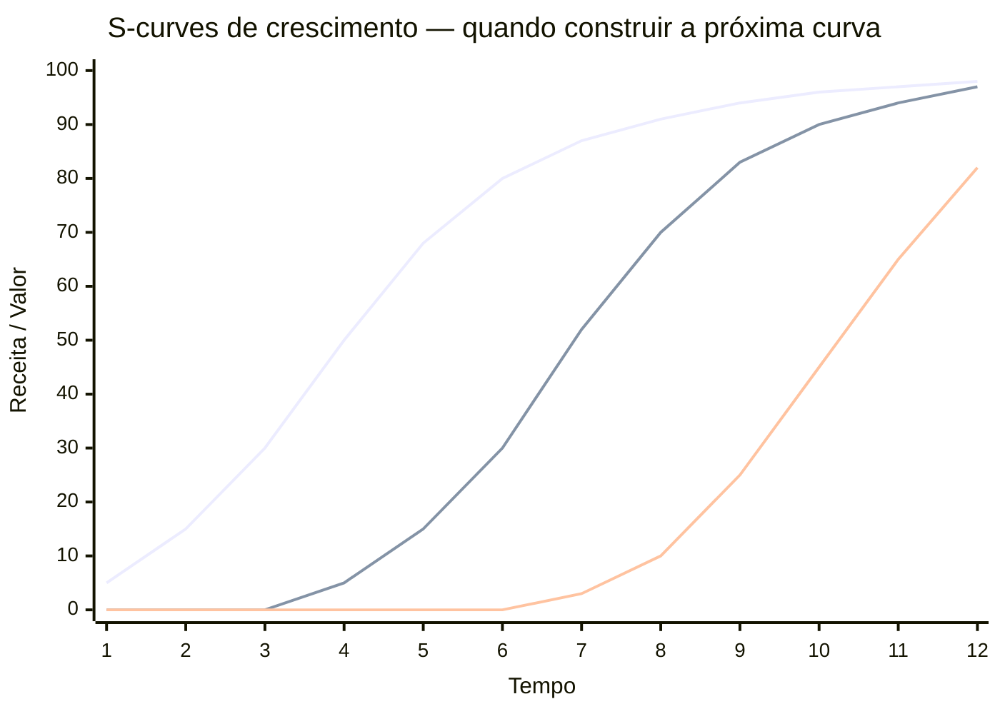
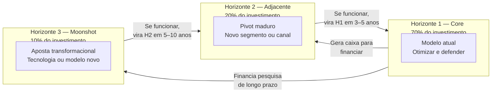

## FASE 15 — REINVENÇÃO E SEGUNDA CURVA

> [!question] Pergunta de FMF nessa fase
> Você atingiu desaceleração, e está considerando segunda curva. A pergunta crítica. *Você tem founder-market-fit com a nova curva também, ou está projetando a sua competência da curva atual numa área onde não tem a mesma profundidade?* Fundadores de sucesso na curva 1 frequentemente falham na curva 2 porque assumem que a vantagem transfere. Frequentemente não transfere. Mergulho de validação (Fases 2 a 4) é obrigatório na curva 2. Não é redundância. É reconhecimento de que você é iniciante no novo terreno.

### O que esse apêndice cobre

Detecção antecipada de saturação do modelo de crescimento vigente, e construção deliberada da próxima fonte de crescimento antes que a atual colapse. O entregável é o Diagnóstico de Saturação, mais o Plano de Segunda Curva — pivot (mudança de direção estratégica) maduro, expansão transformacional, ou autodisrupção controlada.

> [!abstract] Resumo operacional
> **Entregável:** Diagnóstico de Saturação com dados (não intuição) mais Plano de Segunda Curva — tipo de pivot escolhido com justificativa, ambidestria organizacional 70/20/10 instalada e segunda curva em operação com primeiros sinais de tração.
>
> **Sinais de saída:**
> - Três ou mais candidatas a segunda curva avaliadas em TAM e FMF, com tipo de pivot escolhido e critério go/no-go explícito com métricas e prazo.
> - Time dedicado à nova curva com orçamento separado e métricas próprias (de aprendizado, não de resultado financeiro), e clientes-piloto ou receita inicial mensurável.
> - Comunicação ao board e ao time documentada, sem êxodo motivado por incerteza.
>
> **Três armadilhas mais comuns:**
> 1. Negação de saturação — "o nosso canal ainda vai voltar" quando quase nunca volta no mesmo formato.
> 2. Segunda curva cosmética — lançar "nova feature" ou "nova marca" sem mudar a natureza do motor de crescimento.
> 3. Abandonar o core cedo demais — o core financia a segunda curva, e matá-lo prematuramente mata a empresa inteira.

### POR QUE

Nenhum modelo de crescimento dura para sempre. O princípio de "a cada doze a dezoito meses o modelo satura" (ver [[#FASE 12 — PRODUCT-MARKET FIT|Fase 12]]) opera em toda empresa pós-PMF. Fundadores que anteveem a curva de saturação entram em novos ciclos de crescimento exponencial. Fundadores que não anteveem vivem a decadência da curva anterior, frequentemente sem perceber que já passaram do pico até que fique tarde demais.

Essa fase é recorrente, não pontual. Empresas saudáveis entram nela a cada doze a vinte e quatro meses e saem com uma nova aposta estratégica em execução, enquanto a aposta anterior ainda roda. A falha clássica é esperar que o modelo principal quebre antes de construir o próximo. Nessa altura, não há mais caixa, nem moral, para reinventar.

### Quando usar

Comece quando pelo menos dois dos sinais antecedentes de saturação (listados no COMO) aparecem por dois ou mais trimestres consecutivos. Termine quando a segunda curva está em operação com sinais iniciais de tração — não apenas decidida no papel. Revisite ciclicamente. Em grandes empresas maduras, o ideal é que sempre haja uma "[[#FASE 15 — REINVENÇÃO E SEGUNDA CURVA|Fase 15]]" rodando em paralelo com a operação principal.

### Quem envolve

O executor principal é o CEO, diretamente. Essa não é tarefa delegável. Exige visão estratégica e autoridade para alocar recursos contra inércia organizacional. Os participantes são a liderança C-level, board, advisors estratégicos, e clientes-âncora em modo consultivo. O decisor é o CEO, com input do board em decisões sobre alocação de capital ou pivôs drásticos.

### Como executar

Seis passos. Mais uma pergunta de pré-checagem.

> [!note] Como ler as três curvas
> Curva 1 (superior) é o core atual: cresce rápido, depois desacelera e satura. Curva 2 (média) é a segunda aposta: deve começar a ser construída enquanto a curva 1 ainda está crescendo — não depois de saturar. Curva 3 (inferior) é a aposta futura. Empresas que constroem a próxima curva tarde ficam sem caixa e moral para fazê-lo. Empresas que constroem cedo têm a curva 1 financiando a construção da curva 2.

#### Antes de começar, esgotou os seis caminhos de expansão?

Uma confusão comum em fundadores é tomar saturação de *um* caminho de crescimento como saturação *geral*, e partir prematuramente para reinvenção — quando ainda há espaço na [[#FASE 14 — ESCALA: TIME, OPERAÇÕES, CRESCIMENTO E CAPITAL|Fase 14]] (Crescimento e Capital).

Antes de abrir um ciclo de reinvenção, faça o diagnóstico honesto. A [[#FASE 14 — ESCALA: TIME, OPERAÇÕES, CRESCIMENTO E CAPITAL|Fase 14]] traz seis caminhos de expansão disciplinada: três intra-conta (workflow adjacente, papel adjacente, ownership de sistema) e três extra-conta (segmento, geografia, produto). Quantos você efetivamente ativou e esgotou? Fundadores experientes entram na [[#FASE 15 — REINVENÇÃO E SEGUNDA CURVA|Fase 15]] real só depois de ter rodado pelo menos três ou quatro dos seis caminhos com seriedade.

> [!warning] Saturação real versus cansaço do fundador
> Saturação real existe, e exige reinvenção. Mas "saturação" invocada para justificar troca de direção antes da hora é frequentemente uma racionalização para o cansaço do fundador. E troca de direção feita por cansaço produz segundas curvas que nascem mortas. Se você ainda não tentou expandir intra-conta com método, o que parece saturação do negócio pode ser apenas saturação de um canal específico. Resolvível com movimento muito mais barato do que reinvenção.

#### Passo 1, monitore os sinais antecedentes de saturação

> [!note]
> O ambiente macroeconômico — SELIC, inflação, câmbio e ciclos de VC — afeta diretamente o timing ideal para declarar reinvenção e iniciar a segunda curva. Ver [[apendice-ef|Apêndice EF — Ciclos Macroeconômicos]].

A saturação não acontece de repente. Dá sinais seis a dezoito meses antes da queda visível. Monitore mensalmente, em cinco categorias.

**Sinais de saturação de canal.** CAC crescente por três ou mais meses consecutivos, sem aumento proporcional de LTV. Pipeline coverage diminuindo trimestre a trimestre. Taxa de conversão por etapa do funil degradando. "Custos escondidos" crescendo: mais SDRs por AE, mais ads por lead, mais conteúdo por MQL.

**Sinais de saturação de produto.** NPS decrescente em coortes novas (comparado com coortes antigas na mesma época). As features mais usadas são as mesmas há doze ou mais meses — estagnação do surface product. Os clientes-top começam a pedir o que os concorrentes já oferecem. Retention D90 degradando por coorte.

**Sinais de saturação de mercado.** Crescimento absoluto da indústria desacelera. Múltiplos concorrentes entrando (antes eram dois ou três, agora são dez ou mais). Consolidação por M&A entre concorrentes. Grandes players generalistas (Microsoft, Google, SAP, Salesforce) entrando no seu nicho.

**Sinais de saturação de ICP.** Taxa de penetração no ICP-alvo acima de quarenta por cento — sobrou pouco mercado virgem. Novos deals vêm crescentemente de segmentos adjacentes "por acidente". NRR caindo porque contas grandes já estão no limite de expansion.

**Sinais de saturação interna.** Time sênior em platô: ficam na empresa, mas param de gerar ideias novas. Reuniões de estratégia viram reuniões de otimização. Talento sênior externo recusa ofertas, citando "não vi o próximo capítulo".

> [!important] Regra operacional
> Se dois ou mais sinais em duas ou mais categorias aparecem por dois ou mais trimestres, você está em saturação. Se três ou mais categorias, a saturação é urgente.

#### Passo 2, diagnostique o tipo de saturação e o caminho de reinvenção

> [!tip] Apêndice CL — Pivot: Tipos, Gatilhos e Execução
> Taxonomia completa de pivôs (produto, segmento, canal, modelo de receita), quando cada tipo é adequado, como comunicar internamente e externamente, e como medir se o pivô funcionou.

Nem toda saturação exige a mesma resposta. Há seis tipos clássicos de pivot maduro — cada um com gatilho e resposta diferentes.

| Tipo de pivô | Quando aplicar | Exemplo |
|---|---|---|
| Platform pivot (produto vira plataforma) | Produto virou feature, há espaço para plataforma sob o produto | Slack era jogo (Glitch), virou plataforma de mensagens |
| Segment pivot (troca de segmento-alvo) | PMF em um ICP, mas mercado adjacente é maior | Superhuman começou em fundadores tech, expandiu enterprise |
| Technology pivot (troca da base tecnológica) | Base tecnológica ficou obsoleta (IA, cloud, mobile-first) | Muitos SaaS pré-2023 reconstruíram sobre LLMs |
| Customer need pivot (mesma base, dor diferente) | Mesmo cliente, dor diferente que descobriu-se mais valiosa | Instagram era Burbn (check-in app), virou fotos |
| Value capture pivot (troca do modelo de receita) | Produto funciona, modelo de monetização errado | Freemium para enterprise. Transacional para SaaS |
| Engine of growth pivot (troca do motor de crescimento) | Canal saturou, precisa trocar motor | PLG para Sales-led. Viral para Paid. Inbound para Outbound |

Cada tipo exige intervenção diferente em quatro frentes: produto (quanto reconstruir), time (que skills adicionar), GTM (que canal e motion), e capital (quanto, e de quem).

O processo de diagnóstico dura de três a seis semanas e tem quatro etapas. Semanas 1-2: análise dos sinais de saturação por categoria, com dados quantitativos e entrevistas qualitativas com clientes — churn (cancelamento) interviews, won/lost analysis, top clientes felizes. Semana 3: workshop de liderança em off-site de dois a três dias para mapear possíveis pivôs. Semana 4: scoring dos pivôs por tamanho da oportunidade, fit com capacidades, custo de execução e reversibilidade. Semanas 5-6: decisão, planejamento inicial, comunicação ao time e — se houver — ao board.

#### Passo 2B — modelo quantitativo para a decisão pivot vs. persevere

> [!tip] Apêndice EJ — Tomada de Decisão em Condições de Incerteza
> Frameworks para decisões de alto impacto e baixa reversibilidade: expected value, análise de cenários, pre-mortem e como evitar vieses cognitivos (sunk cost, confirmation bias) na decisão de pivotar ou perseverar.

A decisão de "pivotar ou persevere (persistir na direção atual)" é a mais difícil em qualquer fase. Na Fase 15, ela reaparece em forma mais complexa: não é "abandonar o produto" — é "abandonar a curva atual antes que expire". A pressão é diferente: a empresa tem receita, tem time, tem investidores. Cada pivô tem custo de confiança, de operação e de capital.

O modelo abaixo transforma a decisão em scorecard quantitativo. Não elimina o julgamento, mas obriga a tornar explícitas as premissas que sustentam "continuar" ou "mudar".

**Scorecard de pivot vs. persevere (adaptado de Steve Blank + Eric Ries + dados propriamente calibrados).**

Para cada dimensão, atribua de 1 a 5, onde 1 = forte sinal de pivot e 5 = forte sinal de perseverar.

| Dimensão | 1 (pivotar) | 3 (neutro) | 5 (perseverar) | Sua nota |
|---|---|---|---|---|
| **Tendência de crescimento** | Crescimento desacelerou por 3+ trimestres sem explicação externa | Crescimento estável mas sem aceleração | Crescimento acelerando ou acima de mercado | — |
| **NPS / percepção de valor** | NPS < 20 e caindo; clientes usam mas não recomendam | NPS 20-40 estável | NPS > 50 e crescente; clientes são advocates | — |
| **Churn estrutural** | Churn (cancelamento) > 5%/mês em SaaS, sem melhora nos últimos 6 meses | Churn estável em nível aceitável | Churn < 2%/mês e caindo, ou logo churn quase zero | — |
| **Competição** | Competidor com produto materialmente melhor crescendo mais rápido | Competição intensa mas equilibrada | Você está ganhando participação de mercado | — |
| **CAC payback** | CAC payback > 24 meses e piorando | CAC payback 12-24 meses estável | CAC payback < 12 meses e melhorando | — |
| **Energia do time** | Time sênior perdendo fé; perguntas sobre direção frequentes | Time neutro, executando sem entusiasmo | Time animado, ownership alto, propostas proativas | — |

**Interpretação.**

Soma 24-30: persevere. Os fundamentos são sólidos. Se há saturação, é de crescimento — explore expansão de segmento, canal ou geografia antes de pivotar o produto.

Soma 15-23: zona de alerta. Reinvenção necessária, mas não total. Explore movimentos de Horizonte 2 (adjacências) sem abandonar Horizonte 1.

Soma 6-14: sinal forte de pivot. A estratégia atual não tem os fundamentos para escalar. Pivot não significa fracasso — significa atualizar a aposta com base em aprendizado real.

**O que pivot significa em Fase 15 (vs. Fase 6-9).**

Em Fase 6-9, pivot frequentemente é mudança de produto, segmento ou modelo de negócio fundamental. Em Fase 15, pivot é mais granular: mudar o motor de crescimento (de PLG para enterprise sales), mudar o segmento de expansão (de SMB para enterprise), mudar a proposta de valor para novos clientes, ou entrar em categoria adjacente (plataforma vs. produto ponto). O custo é maior, mas o aprendizado também é. Empresa que chegou na Fase 15 tem vantagens que empresa em Fase 6 não tem: base instalada, dados, equipe, marca e capital.

> [!important] O maior erro em Fase 15
> Pivotar para algo completamente novo porque é empolgante — e não porque os dados indicam. "Vamos para IA" sem evidência de que o segmento atual está saturado é distração disfarçada de estratégia. O scorecard serve para separar as duas coisas.

#### Passo 3, aplique ambidestria organizacional (70/20/10 modificado)

> [!tip] Apêndice R — Founder Mode: Delegação e Quando Manter Presença Direta
> Como o fundador decide onde manter controle operacional direto versus delegar, especialmente em momentos de reinvenção — quando o Founder Mode é vantagem competitiva e quando vira gargalo.

Reinvenção não significa parar o negócio atual. Significa rodar duas ou três apostas em paralelo, com alocação deliberada.

Setenta por cento do investimento e do time vão para o core atual — otimização, defesa e extensão da curva. Vinte por cento para o adjacente — pivot maduro, expansão de ICP, nova geografia. Dez por cento para moonshot — aposta transformacional, tecnologia nova, modelo novo.

Essa alocação varia por estágio. Empresas muito maduras, ou em saturação aguda, aumentam adjacente para trinta a quarenta por cento. Empresas com core em crescimento forte mantêm em dez a quinze por cento.

> [!warning] Erros comuns de implementação
> Alocação no papel, não na prática. Dez por cento de moonshot vira dois por cento em dinheiro real, e zero por cento em atenção do CEO. Se não é defendido ativamente, morre. Time misto. Pessoas do core tentando tocar moonshot em vinte por cento do tempo. Resultado. Nenhum dos dois anda. Moonshot exige time dedicado. Métricas iguais. Exigir do moonshot as mesmas métricas do core (NRR, CAC payback) mata a aposta. Moonshot tem métricas de *aprendizado*, não de *resultado financeiro*.

A estrutura organizacional para ambidestria tem três camadas. Core business unit: CEO ou COO tocando, com métricas de crescimento e eficiência. New venture unit: líder dedicado reportando direto ao CEO, com métricas de validação — hipóteses testadas, clientes-piloto, aprendizados. Governança separada: board review distinto para cada unit, com cadência diferente e critérios de sucesso diferentes.

#### Passo 4, lide com o Innovator's Dilemma (autodisrupção)

Clayton Christensen documentou por que empresas bem-sucedidas tendem a ser disrompidas. Elas continuam otimizando racionalmente para clientes atuais — que pagam mais e pedem mais do mesmo — enquanto novos entrantes atacam por baixo com produtos mais simples e baratos, que eventualmente ficam bons o suficiente para o mercado principal.

> [!warning] Sinais de que você está do lado errado do Innovator's Dilemma
> Os seus clientes top pedem features incrementais cada vez mais complexas. Você tem três ou mais concorrentes "muito pequenos para levar a sério". Os seus clientes do SMB estão migrando para os entrantes. A sua margem vem crescentemente dos top vinte por cento de clientes.

A estratégia de autodisrupção tem quatro elementos. Separe o experimento disruptivo em unit própria, com brand distinta, time distinto e margem inferior tolerada. Aceite que pode canibalizar parte do core — melhor canibalizar você mesmo do que deixar outro fazer. Meça diferente: volume de adoção e velocidade de aprendizado, não receita imediata. Dê tempo: dezoito a trinta e seis meses é prazo realista para autodisrupção mostrar tração.

O exemplo clássico: a Microsoft se autodisrompendo de licenças perpétuas (Office) para subscrição cloud (Office 365). No início, cada usuário que migrava gerava menos receita imediata. Em cinco anos, transformou a empresa.

#### Passo 5, considere M&A como alavanca de reinvenção

> [!note]
> Grandes corporações como canal de distribuição para a segunda curva — incluindo estrutura de parceria, co-desenvolvimento e acesso a base instalada — estão no [[apendice-fd|Apêndice FD — Parceria com Grandes Corporações]]. Parcerias estratégicas como alavanca de reinvenção (JVs, acordos de distribuição, alianças tecnológicas) estão no [[apendice-dy|Apêndice DY — Business Development]].

Quando construir a segunda curva internamente é lento ou arriscado demais, comprar pode ser mais rápido. Há três modalidades.

Acqui-hire (comprar um time): você identifica uma startup pequena com time técnico excepcional, assume o time e descontinua o produto. O custo costuma ser de R$ 500 mil a R$ 3 milhões por engenheiro sênior.

Tuck-in acquisition (comprar produto complementar): empresa pequena com produto que encaixa no seu roadmap. Valuations típicos: três a oito vezes ARR.

Strategic acquisition (comprar capacidade nova): produto, mercado ou tecnologia que levariam anos para construir internamente. Valuations variam muito — cinco a vinte vezes ARR em SaaS.

Avalie qualquer aquisição por cinco critérios: custo de construir internamente versus custo de comprar; tempo até impacto (internamente: dezoito a trinta e seis meses; M&A: seis a doze meses mais integração); risco de execução; fit cultural (mais importante do que fit técnico); e capacidade real de integrar — M&A mal integrado é mais de sessenta por cento dos casos.

#### Passo 6, comunique a reinvenção ao time

> [!tip] Apêndice BH — Post-Mortems Estratégicos
> Como conduzir post-mortems de estratégias ou apostas que não funcionaram: estrutura de análise, como separar causas de sintomas, e como transformar aprendizado coletivo em mudança de processo — especialmente relevante ao encerrar a primeira curva.

> [!tip] Apêndice AI — Casos de Fracasso
> Análise de empresas brasileiras e globais que falharam na transição de curvas ou em pivôs mal-executados: padrões recorrentes de erro e o que distingue fracasso evitável de fracasso estrutural.

Essa costuma ser a parte mais difícil. O time que construiu a primeira curva é emocionalmente investido nela. Comunicar que "agora vamos construir uma segunda coisa em paralelo" gera ansiedade, fofoca e saída de talento.

Use cinco elementos no playbook de comunicação.

Transparência sobre o porquê: compartilhe os dados de saturação. Não é "mudança por mudança" — é diagnóstico sério.

Respeito pelo que foi construído: a primeira curva não é "errada", é "ciclo natural".

Convite, não imposição: quem quer trabalhar na nova curva se oferece; quem prefere o core fica no core.

Commitment temporal: "Nos próximos dezoito meses, vamos testar X. Se funcionar, expandimos. Se não, voltamos ao foco exclusivo no core."

Celebre mini-wins públicos da segunda curva assim que aparecerem — isso mantém a moral do time.

### PERGUNTAS A RESPONDER

- Em quais das cinco categorias de saturação eu tenho sinais acumulados nos últimos dois trimestres?
- Qual é o tipo de pivot maduro que melhor responde ao meu diagnóstico?
- Tenho ambidestria organizacional real, ou os dez por cento de moonshot existem apenas no papel?
- Estou do lado certo, ou errado, do Innovator's Dilemma?
- Construir, ou comprar, é mais rápido para a segunda curva?
- O meu time entende o porquê da reinvenção, ou está em modo "espera para ver"?
- Tenho caixa suficiente para financiar dezoito a trinta e seis meses de segunda curva, enquanto o core sustenta a empresa?

> [!tip] Apêndice CS — Bootstrap vs Venture Capital: a Escolha Fundacional
> Como o modelo de financiamento escolhido na Fase 14 determina as opções de segunda curva: empresa bootstrapped tem liberdade de ritmo mas limitação de capital para apostas; empresa VC-backed tem expectativa de crescimento acelerado que pode conflitar com a paciência necessária para a segunda curva.

### Métricas

Taxa de crescimento do core. Alerta se desacelera por mais de dois trimestres consecutivos.

Percentual de revenue de produtos lançados nos últimos vinte e quatro meses. Saudável: acima de quinze a vinte e cinco por cento em empresas em scale-up.

NPS por coorte temporal. Coortes novas devem ter NPS maior ou igual ao das coortes antigas.

Concentração de revenue (percentual dos top vinte por cento dos clientes). Concentração crescente é sinal de saturação.

Métricas da segunda curva (separadas das do core). Cinco ou mais hipóteses bet-the-company testadas por trimestre. Três ou mais clientes-piloto ativos no primeiro semestre da segunda curva. Learning velocity (hipóteses resolvidas por mês) pelo menos igual à da [[#FASE 7 — EXPERIMENTOS DE VALIDAÇÃO DO PROBLEMA|Fase 7]] original — se for menor, a segunda curva está sendo tratada como projeto lateral, não como fundação.

Alocação de tempo do CEO entre core e new ventures. Meça mensalmente via calendar audit. O alvo mínimo é quinze por cento em new ventures nos primeiros seis meses da [[#FASE 15 — REINVENÇÃO E SEGUNDA CURVA|Fase 15]], e vinte e cinco por cento ou mais se há sinais positivos iniciais. Abaixo de dez por cento por três meses consecutivos indica que o core está absorvendo atenção — risco real de matar a segunda curva por negligência.

### SAÍDA DESTA FASE

Você conclui a [[#FASE 15 — REINVENÇÃO E SEGUNDA CURVA|Fase 15]] (em qualquer ciclo) quando os oito itens abaixo estão cumpridos.

1. Diagnóstico de saturação está escrito com dados (não apenas intuição). Os sinais de desaceleração documentados com números.
2. Três ou mais candidatas a segunda curva foram avaliadas em TAM mais FMF. FMF Check aplicado à candidata escolhida.
3. Tipo de pivot, ou reinvenção, está escolhido com justificativa.
4. Critério go ou no-go explícito, com métricas e prazo, está definido.
5. Ambidestria organizacional real está operando. Time dedicado à nova curva, métricas próprias, e orçamento próprio (recurso separado da operação atual).
6. Segunda curva tem primeiros sinais de tração (não só decisão). Clientes-piloto, receita inicial, ou adoção mensurável.
7. O time entende a lógica, e está engajado (sem êxodo motivado por incerteza).
8. Comunicação ao board, e ao time, documentada.

**Checklist final.**

- [ ] Identifiquei sinais de desaceleração (crescimento caindo, NRR estagnando, TAM do segmento atual se esgotando)?
- [ ] Avaliei potenciais "segundas curvas". Novos segmentos, novos produtos, ou nova categoria?
- [ ] Apliquei FMF Check sobre a nova curva. Tenho founder-market-fit na nova direção?
- [ ] Defini critério go ou no-go para a nova aposta com métricas observáveis?
- [ ] Dediquei recurso específico (time mais capital) para a nova curva, separado da operação atual?
- [ ] Tenho plano de sucessão na curva atual, caso o fundador migre prioridade para a curva nova?
- [ ] Comuniquei a intenção ao conselho, e ao time principal, com clareza?
- [ ] Defini horizonte de avaliação. Quando decido se a segunda curva está emergindo, ou não?

**Primeiros passos práticos.**

1. Listar sinais de desaceleração objetivos. Números. Não intuição.
2. Brainstormar três a cinco possíveis "segundas curvas", com avaliação inicial de TAM mais FMF.
3. Aplicar o FMF Check sobre cada candidata.
4. Escolher uma para explorar seriamente. Alocar recurso específico por seis meses antes de decidir.

### EXEMPLO PRÁTICO

**Análise de Segunda Curva, Magazine Luiza reconstruída para 2014-2016, sob Frederico Trajano.**

Reconstrução do diagnóstico que Frederico Trajano e a liderança da Magazine Luiza poderiam ter feito por volta de 2014 e 2016. Quando a empresa decidiu transformar profundamente a operação digital. A análise que segue é didática. Não é documento interno da Magalu. Mas espelha as alavancas que a literatura empresarial, e a comunicação pública da empresa, indicam que foram avaliadas.

**Sinais de saturação da primeira curva (varejo físico de eletrodomésticos, interior do Sudeste).** Crescimento de same-store sales (lojas comparáveis em períodos comparáveis) desacelerando. O varejo físico no Brasil entrava em fase de baixa expansão, com pressão competitiva crescente. Ticket médio em produtos categoria âncora (eletrodomésticos linha branca, eletrônicos) sob pressão por concorrência online. Concorrentes online (Americanas, Submarino, Mercado Livre) crescendo a taxas de trinta a cinquenta por cento ao ano, enquanto o varejo físico crescia em um dígito. Perfil do consumidor jovem (dezoito a trinta e cinco anos) majoritariamente comprando online. Varejo físico ficando concentrado em consumidor mais de quarenta e cinco anos, e em geografias específicas. Margem do varejo físico estável, mas comprimida por aluguel, mais folha, mais concorrência.

**Candidatas a segunda curva.**

| Candidata | TAM | Vantagem competitiva potencial | Observação |
|---|---|---|---|
| A. E-commerce próprio integrado a lojas físicas (omnichannel) | Mercado de e-commerce BR, ~R$ 100 bi+ em 2015 | Alta. Uso da rede física como nó logístico que pure players online não têm | Exige reinventar tecnologia, equipe, cultura |
| B. Marketplace abrindo plataforma para terceiros | Sub-segmento do TAM e-commerce | Média. Mercado Livre já tinha vantagem de rede | Exige escala e tecnologia de plataforma |
| C. Verticalizar para serviços financeiros (crédito ao consumidor) | Mercado de crédito popular | Média. Base de clientes existente | Exige licença bancária ou parceria, risco regulatório |
| D. Vender dados e inteligência de varejo para terceiros | Pequeno mas crescente | Baixa. Não era posicionamento natural | TAM modesto |

**FMF Check, Candidata A (omnichannel).** A organização tem conhecimento profundo do mercado de varejo? Sim. Quase sessenta anos de operação no setor. A empresa tem ativos diferenciados? Sim. Rede de lojas físicas em cidades onde concorrentes online não tinham presença logística. A liderança tem energia, e convicção, para sustentar transformação de cinco a dez anos? Sim. Frederico Trajano publicamente comprometido. Conselho alinhado. Controle familiar permitindo horizonte longo de pagamento. Veredito: aposta-âncora natural.

**FMF Check, Candidata B (marketplace).** Conhecimento do mercado? Sim, indireto (varejo). Vantagem competitiva contra Mercado Livre, líder consolidado? Difícil. Mercado Livre já tinha rede massiva de sellers e consumidores. Veredito: vale como complemento da Candidata A. Não como aposta isolada.

**FMF Check, Candidata C (serviços financeiros).** Conhecimento? Limitado. Varejo conhece consumidor. Não conhece banking. Veredito: considerar via parceria, não construção própria, em fase posterior.

**Decisão estratégica que de fato aconteceu.** Aposta-âncora: Candidata A. Omnichannel integrado, com tecnologia própria, e investimento massivo em equipe digital. Complemento: Candidata B. Abrir o marketplace Magalu progressivamente para sellers de terceiros, usando a base logística como diferencial. Posterior: variantes da Candidata C. Magalu Pay (carteira digital) e parcerias financeiras vieram nos anos seguintes, depois que o omnichannel já estava consolidado.

**Critério de sucesso de longo prazo (cinco a dez anos).** Receita digital crescer de minoria para maioria do faturamento total. Margem combinada (físico mais digital) estável ou crescente, mesmo com mix mudando para online — que tipicamente tem margem menor. Capitalização da empresa refletindo a tese transformacional (múltiplos de tech, não de retail tradicional).

**O que de fato aconteceu, resultado público.** Entre 2015 e 2020, a Magalu investiu massivamente em tecnologia. Contratação de engenheiros e designers em escala atípica para varejo. Escritório tech em São Paulo. Aquisições de empresas digitais (Netshoes em 2019, Estante Virtual, Época Cosméticos, e outras). A integração físico-digital virou diferencial real. As lojas funcionavam como pontos de retirada, devolução, e como hub logístico para entrega rápida em cidades onde Mercado Livre não tinha presença. O marketplace Magalu abriu para sellers terceiros, e cresceu até virar parte significativa da receita. O pico de valuation da empresa em 2020 (durante a pandemia, com aceleração de e-commerce) foi de ordem de R$ 130 bilhões — múltiplos de empresa tech, não de varejista tradicional. A correção posterior em 2022 a 2024 (alta de juros, pós-pandemia) mostrou volatilidade do mercado, mas a transformação estrutural do negócio se consolidou. A Magalu já não era a Magalu de 2010.

> [!important] A lição transferível da Magalu
> Análise de segunda curva exige três coisas que a Magalu fez certo. Diagnóstico honesto da saturação da curva atual — não esperar a curva atual cair antes de investir na próxima. Escolha de candidata baseada em ativo diferenciado que a empresa já tem (no caso, lojas físicas como rede logística), não em "o que está na moda". Comprometimento de longo prazo da liderança: transformação digital de varejista tradicional é trabalho de uma década, e exige CEO disposto a defender o investimento em todos os trimestres ruins do caminho. Quem trata segunda curva como "projeto especial" com prazo de doze meses sempre falha. Quem trata como nova curva de receita sustentada por cinco a dez anos pode ter êxito.

### Armadilhas

Negação de saturação. "O nosso canal ainda vai voltar". Quase nunca volta no mesmo formato.

Pivot reflexivo. Mudar tudo aos primeiros sinais ruins, sem diagnóstico. Saturação real, e flutuação normal, são diferentes.

Segunda curva cosmética. Lançar "nova feature!", ou "nova marca!", sem mudar a natureza do motor de crescimento.

Abandonar o core cedo demais. O core financia a segunda curva. Matar core prematuramente mata a empresa inteira.

Segunda curva em comitê. Envolver quinze VPs em cada decisão da nova aposta mata velocidade. New venture unit precisa de autonomia.

"Vamos contratar um VP de Inovação". Sem autonomia real e sem poder de decisão, viram teatros caros.

Ignorar o Innovator's Dilemma. Achar que "somos diferentes, o nosso setor não é assim". Os clientes top sempre querem mais do mesmo. Os disruptores sempre começam por baixo.

---

### CASO BRASILEIRO, Magazine Luiza, a segunda curva sob a família Trajano

A Magazine Luiza é rede de varejo tradicional brasileira, fundada em 1957 em Franca, São Paulo. Nos anos 2010, o varejo brasileiro enfrentava ascensão acelerada do e-commerce, liderada inicialmente por Americanas, Submarino, e posteriormente por Mercado Livre como marketplace.

O ponto de decisão (início da [[#FASE 15 — REINVENÇÃO E SEGUNDA CURVA|Fase 15]]). Em torno de 2015 a 2016, sob liderança de Frederico Trajano (filho de Luiza Helena Trajano, CEO histórica), a empresa decidiu que transformação digital não era projeto auxiliar — era *segunda curva de negócio*. A primeira curva (varejo físico de eletrodomésticos no interior de SP e MG) estava sendo pressionada por e-commerce nacional. Continuar fazendo o mesmo garantiria declínio.

**Cinco movimentos de reinvenção.**

Integração físico-digital. Lojas físicas viraram pontos de retirada, e de experiência. Estoque foi unificado. Aplicativo passou a ser protagonista.

Marketplace próprio. A Magalu abriu plataforma para sellers terceiros, replicando o modelo do Mercado Livre, mas com braço logístico das lojas físicas.

Aquisições estratégicas. A Magazine Luiza comprou diversas empresas de tech durante a década (Netshoes, Estante Virtual, Época Cosméticos, entre outras), incorporando capacidades de e-commerce especializado.

Cultura tech dentro de varejista tradicional. Contratação massiva de engenheiros, designers, e produtos. Escritório tech em São Paulo. Salários e benefícios em linha com startups de tecnologia.

Comunicação ao mercado. Frederico Trajano tornou-se uma das vozes públicas mais articuladas sobre transformação digital de varejo no Brasil, gerando reconhecimento institucional.

A duração e o custo. A transformação não foi evento — foi sustentada por uma década. Investimento em tecnologia e aquisições consumiu grande parte do caixa gerado pelo varejo físico durante anos. O momento de máxima valorização veio em 2020 e 2021, durante a aceleração de e-commerce na pandemia. A correção posterior (2022 a 2024) mostrou a volatilidade do mercado. Mas a reinvenção havia sido estrutural, não conjuntural.

**Cinco lições transferíveis.**

Reinvenção é estratégia, não projeto. Quem trata como projeto auxiliar falha. Quem trata como segunda curva sustentada por cinco a dez anos pode ter êxito.

Integração entre curvas antiga e nova é diferencial. A Magalu usou o ativo da primeira curva (lojas físicas) para alimentar a segunda (logística distribuída do e-commerce) — combinação que pure players não tinham.

Liderança fundadora com voz pública acelera transformação. Em mercado de capitais e em mercado de talento, CEO que articula narrativa atrai ambos.

Aquisições como alavanca de competência, não substituta de construção interna. A empresa comprou capacidades específicas enquanto construía internamente o restante.

Transformações bem-feitas ainda enfrentam ciclos. Valor de mercado de empresas em transformação oscila com macro. O teste verdadeiro é o da persistência, não o do pico.

---

### FERRAMENTAS DESTA FASE

Reinvenção e segunda curva combinam estratégia, growth, posicionamento, e ferramentas de inovação. Detalhamento no [[#APÊNDICE BG — FERRAMENTÁRIO COMPLETO DO EMPREENDEDOR|Apêndice BG]]. Onze ferramentas centrais.

##### Inovação (BG.19)

Innovator's Dilemma, Disruptive Innovation (Clayton Christensen, 1997). Por que empresas bem-sucedidas falham em adotar tecnologias disruptivas. Low-end disruption versus New-market disruption. Use ao enfrentar competidores com tecnologia "inferior" em dimensões atuais, mas superior em outras. Ver BG.19.1.

Ambidextrous Organization (O'Reilly e Tushman, 2004). Exploit mais Explore simultaneamente, com unidades separadas — resposta estrutural ao Innovator's Dilemma. Use quando empresa madura precisa inovar sem sufocar core business. Ver BG.19.2.

Open Innovation (Henry Chesbrough, 2003). Importar e exportar ideias sistematicamente via corporate VC, innovation challenges, university partnerships e acqui-hires. Ver BG.19.3.

S-Curves of Innovation (Richard Foster, 1986). Tecnologias seguem curva S: emergência, aceleração, maturidade. Os incumbentes estão em platô quando os entrantes estão em aceleração. Ver BG.19.4.

##### Estratégia

Three Horizons Framework (McKinsey) — estrutura que divide o investimento em H1 core, H2 emergente e H3 apostas futuras, para rodar presente e futuro ao mesmo tempo. Ver BG.2.4.

Category Design (Play Bigger) — método para redefinir a categoria em que a empresa compete, especialmente útil quando a segunda curva exige reposicionamento. Ver BG.12.7.

Crossing the Chasm (Moore) — como atravessar o abismo entre early adopters e o mercado principal, aplicado aqui à expansão para verticais adjacentes. Ver BG.12.6.

Blitzscaling (Hoffman e Yeh) — quando reinvenção é em mercado winner-takes-most e velocidade importa mais que eficiência. Ver BG.12.5.

Playing to Win (Martin e Lafley) — framework de estratégia competitiva centrado em cinco escolhas: arena, vantagem, capacidades, sistemas e winning aspiration. Use para reexaminar as cinco escolhas na nova curva. Ver BG.2.1.

Scenario Planning (planejamento por cenários) — desenvolvido por Shell e Schwartz para testar estratégia contra múltiplos futuros possíveis antes de comprometer capital. Ver BG.2.6.

Wardley Mapping — mapa visual que mostra em que estágio evolutivo cada componente do negócio está (custom, product, commodity) para identificar onde investir na segunda curva. Ver BG.2.5.

---

### SÍNTESE DA FASE 15

Nessa fase você diagnosticou a saturação (com dados, não intuição), avaliou candidatas à segunda curva pelo critério TAM mais FMF, escolheu o tipo de pivot maduro e instalou ambidestria organizacional real — time dedicado, orçamento próprio e métricas de aprendizado, não de resultado financeiro imediato. A reinvenção bem-feita é estrutural: Magalu levou uma década, Microsoft levou cinco anos com canibalização tolerada. Empresas que tratam [[#FASE 15 — REINVENÇÃO E SEGUNDA CURVA|Fase 15]] como "projeto de inovação" com prazo curto sempre falham.

A [[#FASE 16 — EXIT STRATEGY|Fase 16]] começa aqui: fundadores que chegaram a esse ponto, com segunda curva rodando ou com decisão clara sobre o próximo capítulo, estão em posição de planejar o exit com poder de barganha.

> [!note] Quando a "segunda curva" é uma empresa nova (fundador serial)
> Há um caminho alternativo à reinvenção dentro da empresa atual: o fundador faz o exit (Fase 16) e relança em empresa nova. Esse caminho é tratado no [[#APÊNDICE BF — SECOND-TIME FOUNDER|Apêndice BF]], que cobre o que muda quando você empreende com track record (rede mais densa, investidores que voltam, padrões pessoais que ajudam ou prejudicam, decisão entre repetir setor ou pivotar de domínio). Se a sua segunda curva é "outra empresa", não "outro produto na mesma empresa", BF é a continuação natural depois do exit da Fase 16.

# fase15 #reinvencao #segunda-curva #pivot #saturacao #innovators-dilemma #ambidestria #autodisrupcao #m-and-a #magalu

---
