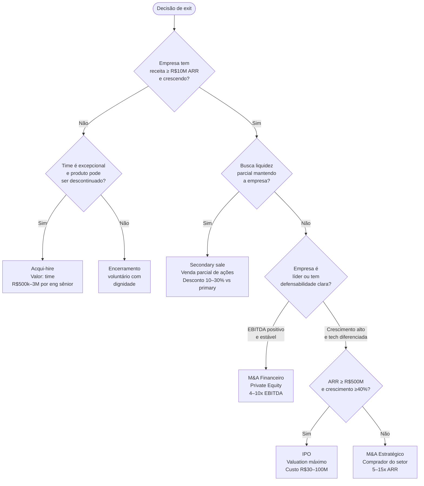

## FASE 16 — EXIT STRATEGY

### O que esse apêndice cobre

Planejamento, e execução, da saída do(s) fundador(es), total ou parcial, do negócio construído. O entregável é o Plano de Exit. Contendo cenários, preparação, estrutura fiscal, e decisões estratégicas sobre timing, e método.

### POR QUE

Exit é frequentemente tratado como "fim" distante. Algo para se preocupar "quando chegar lá". É um erro. Exit é evento planejado, não sorteado. E decisões tomadas três a cinco anos antes dele determinam o valor realizado, e o custo fiscal.

Os fundadores que pensam em exit só quando aparece comprador tipicamente recebem valuations trinta a sessenta por cento menores do que poderiam. Pagam duas a três vezes mais em impostos do que poderiam ter pagado com estrutura preparada. Vendem em janela ruim (mercado em baixa). E perdem alinhamento com cofundadores e investidores na reta final.

> [!important] O sentido do planejamento de exit
> Planejamento de exit não é sobre vender logo. É sobre *ter a opção* quando fizer sentido vender. Founder que mantém a opção em aberto tem poder de barganha. Founder que precisa vender, quando o telefone toca, vende mal.

### Quando usar

Comece o planejamento estratégico dois a três anos antes de qualquer exit provável. Isso significa: começar a pensar em exit de Série A em diante. A execução leva seis a dezoito meses entre a decisão de vender, e o fechamento. Revisite anualmente. Mesmo se o exit não é prioridade imediata. As condições de mercado mudam.

### Quem envolve

O executor principal é o CEO. Com CFO, e advisor de M&A. Os participantes são cofundadores, board, maior investidor, advogados especializados em M&A, e banker (se IPO, ou M&A grande). O decisor final são os sócios fundadores. Com aprovação do board, conforme termos.

### Como executar

Seis passos.

> [!tip] Regra de ouro do exit
> Nenhum tipo de exit é "melhor" em abstrato. O melhor é aquele que combina: sinais de mercado favoráveis (múltiplos altos), empresa preparada (data room, métricas auditáveis), e fundador com clareza sobre o próximo capítulo. Quando os três se alinham, exit flui. Quando um está fora, você negocia em desvantagem.

#### Passo 1, mapeie os 5 tipos principais de exit

Cada um tem timing, valuation, requisitos, e implicações fundamentalmente diferentes.

##### Tipo A, M&A estratégico, venda para concorrente ou complementar

O comprador típico é empresa maior do mesmo setor, ou de setor adjacente. Buscando consolidação, expansão geográfica, ou tecnologia. O valuation típico é cinco a quinze vezes ARR para SaaS B2B. Uma a cinco vezes a receita para serviços. Múltiplos mais altos para tech diferenciada. Os requisitos: ARR de R$ 10-20 milhões ou mais, crescimento saudável, e defensibilidade identificável. O tempo do processo: seis a doze meses do primeiro contato ao closing. Os prós: liquidez total rápida, e prêmio estratégico possível. Os contras: integração pode destruir valor, cultura se perde, e lock-ups longos frequentes (dezoito a trinta e seis meses).

##### Tipo B, M&A financeiro, venda para private equity

O comprador típico é fundo de PE, buscando negócio com fluxo de caixa estável. O valuation típico é quatro a dez vezes EBITDA (dependente de crescimento, recorrência, e margem). Os requisitos: EBITDA positivo e crescente, métricas operacionais maduras, e team management sólido. O tempo: seis a nove meses. Os prós: preserva a empresa como entidade. Liquidez parcial, ou total, para fundadores. Os contras: PE tipicamente quer setenta a cem por cento do equity. A direção da empresa passa para eles.

##### Tipo C, IPO (Initial Public Offering)

Viável quando a receita é de R$ 500 milhões a R$ 1 bilhão anualizada, com crescimento alto (quarenta por cento ano contra ano ou mais em B2B SaaS), e path to profitability claro. A preparação necessária: dois a três anos de auditoria. Governança corporativa em nível de empresa pública. CFO experiente em mercados públicos. Banker selecionado. O tempo do processo formal: seis a nove meses de preparação do S-1 ou prospecto, mais roadshow. Os prós: valuation potencialmente mais alto. Liquidez contínua para todos os stakeholders. Os contras: muito caro (R$ 30-100 milhões ou mais em custos). Exposição a mercado. Escrutínio trimestral. Regulação pesada.

##### Tipo D, Secondary sale (venda parcial)

Os fundadores e funcionários vendem parte das suas ações antes do exit final. Tipicamente para fundos de secondary, ou em rodada primária estruturada. Usado em empresas pós-Série B ou C. Quando os fundadores querem "tirar algumas fichas da mesa" sem vender a empresa. O valuation: geralmente dez a trinta por cento de desconto sobre valuation primary. Os prós: alivia risco pessoal do fundador. Preserva upside futuro. Não exige vender a empresa. Os contras: transfere parcela de controle. Pode gerar desalinhamento com investidores que ainda não têm liquidez.

##### Tipo E, Acqui-hire

Usado quando o produto, ou mercado, não funcionou. Mas o time é excelente. O comprador típico: big tech, ou scale-up, precisando de time técnico. A estrutura: empresa adquirida é descontinuada. Equity dos fundadores convertido em pacote de retenção (RSUs com vesting de dois a quatro anos). O "valuation" típico: R$ 500 mil a R$ 3 milhões por engenheiro sênior, mais retention bonus. Os prós: alternativa a fechar a empresa com perdas. Time preservado. Os contras: fundadores tipicamente realizam muito pouco. Investidores podem não recuperar o capital.

#### Passo 2, entenda os sinais de que é hora de considerar vender

A decisão de vender não é só sobre oportunidade do comprador. É também sobre contexto do mercado, da empresa, e dos fundadores. Em três categorias.

**Sinais externos (mercado).** Múltiplos de mercado no topo histórico do setor. Consolidação acelerando (dois ou mais grandes M&A em doze meses no setor). Concorrente levantou rodada gigante, e vai investir agressivamente (a sua defesa fica mais cara). Mudança regulatória, ou tecnológica, iminente que pode mudar o jogo.

**Sinais internos (empresa).** Crescimento desacelerando, e pivô difícil de executar. Capital necessário para o próximo salto é grande demais para cenários VC realistas. Time fundador em desalinhamento crônico sobre direção. Concentração em clientes, ou canais, expondo a risco crescente.

**Sinais pessoais (fundador).** Paixão, e energia, decrescendo depois de cinco a dez anos na jornada. Oportunidades pessoais (outro negócio, saúde, família) competindo. Risco pessoal desproporcional (patrimônio líquido todo concentrado no negócio). O próximo capítulo exige skills que você não tem, ou não quer desenvolver.

> [!important] Regra operacional sobre sinais de exit
> Dois ou mais sinais em duas ou mais categorias merece considerar a sério. Não significa decidir. Significa abrir a conversa com board, e advisors. Sinais isolados em uma única categoria são mais frequentemente ruído do que sinal.

#### Passo 3, prepare a empresa para exit (2-3 anos antes)

Empresa preparada para exit vale vinte a quarenta por cento mais que empresa em estado "operacional normal". O que preparar, em cinco frentes.

##### Preparação financeira

Auditoria externa das demonstrações (últimos três anos). DRE, balanço, e fluxo de caixa, limpos e defendíveis. Cap table organizada, e sem zonas cinzentas. Contratos materiais documentados. Projeções financeiras de três a cinco anos, com premissas claras.

##### Preparação operacional

Processos críticos documentados (vide [[#FASE 14 — ESCALA: TIME, OPERAÇÕES, CRESCIMENTO E CAPITAL|Fase 14]], Operações). KPIs recorrentemente medidos, e reportados. Organograma limpo, sem dependências excessivas de pessoas-chave. Dados históricos organizados em data warehouse acessível.

##### Preparação jurídica

Due diligence interno feito (contratos de trabalho, IP, marcas, licenças, contratos comerciais, e compliance regulatório). Propriedade intelectual claramente atribuída à empresa. Compliance LGPD em dia, e auditável. Acordo de sócios atualizado (drag-along, tag-along, saída).

##### Preparação de governança

Board formal, com pelo menos um independente. Reuniões regulares, com atas. Decisões estratégicas documentadas.

##### Data room pronto

Documentação organizada para apresentar a potenciais compradores. Em nove categorias. Estrutura legal e societária. Financeiros históricos auditados, mais projeções. KPIs operacionais por ano e trimestre. Cohort analysis. Pipeline comercial. Contratos materiais (top vinte clientes, parcerias estratégicas, e fornecedores críticos). Documentação de IP. Contratos trabalhistas, e policies de RH. Relatórios de compliance (fiscal, LGPD, trabalhista).

##### Preparação do CEO

Narrativa estratégica da empresa praticada (pitch de trinta minutos para compradores). Relações com potenciais compradores construídas (eventos, intros via banker). Advisor de M&A, ou banker, contratado.

#### Passo 4, estruture o processo de venda (quando decidir executar)

**Timeline típica de M&A estratégico, em seis janelas.** Mês 1-2: contratação de banker, ou M&A advisor. Preparação do material. Mês 2-4: criação de shortlist de potenciais compradores (dez a vinte e cinco empresas). Primeiras conversas via banker, ou network. Mês 4-6: assinatura de NDAs. Envio de CIM (Confidential Information Memorandum). Recebimento de IOIs (Indications of Interest). Mês 6-8: management presentations com três a cinco compradores sérios. Recebimento de LOIs (Letters of Intent). Mês 8-10: seleção de comprador preferido. Exclusividade (sessenta a noventa dias). Due diligence profunda. Mês 10-12: negociação do SPA (Share Purchase Agreement). Closing.

> [!important] O papel do banker, ou advisor
> Cobra dois a cinco por cento do valor da transação. Mas tipicamente aumenta o preço em quinze a trinta por cento versus venda direta. E evita armadilhas legais e fiscais. Em deals acima de R$ 50 milhões, praticamente obrigatório. O fee parece alto até você ver o que ele recupera em negociação.

**Os elementos-chave do SPA (Share Purchase Agreement), em sete pontos.**

Purchase price. Valor total, e forma (cash, equity, seller note, earnout).

Earnout. Parcela do preço condicionada a performance futura (tipicamente quinze a trinta e cinco por cento do total, pagos em um a três anos). Cuidado: earnouts frequentemente não são pagos integralmente.

Lock-up. Fundadores ficam X meses, ou anos, pós-closing. Típico: dezoito a trinta e seis meses, com retention bonus.

Non-compete. Fundadores não podem competir por X anos em Y mercados.

Representations and Warranties. Declarações sobre estado da empresa. Falsidade gera indenização.

Escrow. Parcela do preço retida em conta-escrow (tipicamente dez a quinze por cento por doze a dezoito meses) para cobrir eventuais claims.

Closing conditions. O que precisa acontecer entre assinatura, e closing (aprovações regulatórias, consentimentos de terceiros, etc.).

#### Passo 5, planeje tax structuring (pode salvar 20-40% do exit)

Esse é o ponto mais negligenciado pelos fundadores. E o mais consequente. Decisões feitas *anos antes* do exit afetam drasticamente o IR pago.

**No Brasil, quatro estruturas comuns.**

Pessoa física recebendo. IR sobre ganho de capital (quinze a vinte e dois vírgula cinco por cento progressivo). Simples, mas caro.

Holding pessoal (PJ). Distribui dividendos isentos (regra atual). Mas pode gerar IR sobre ganho de capital na venda da empresa subjacente.

Estrutura offshore. Delaware, Cayman, BVI, Luxemburgo. Legal se estruturada cedo. Com CFC rules, e tratados. Complexidade legal, e compliance, alta. Exige contador, mais advogado, especializados.

Seção 1202 QSBS (se empresa americana). Isenção, ou desconto, em ganho de capital se deter ações por cinco anos ou mais. Pode economizar cem por cento do imposto federal em até US$ 10 milhões.

> [!warning] Princípio sobre tax structuring
> Qualquer estrutura exige preparação de dois a cinco anos antes do exit. Fazer na última hora é fazer errado. E fazer errado, em deal de R$ 100 milhões, custa R$ 10-30 milhões em imposto evitável.

> [!important] Recomendação firme sobre tax advisor
> Contrate tax advisor especializado em M&A (não contador regular) dois ou mais anos antes do exit esperado. O custo: R$ 50-200 mil. O retorno: frequentemente R$ 1-20 milhões ou mais economizados.

#### Passo 6, alinhe com cofundadores, investidores e time-chave

Exit gera conflitos previsíveis. Em três frentes.

**Entre cofundadores.** Um quer vender, outro não. O valuation "satisfatório" diverge entre sócios. Lock-up pós-venda é tolerável para um, prisão para outro. Prevenção: o acordo de sócios deve prever drag-along (maioria obriga minoria a vender), tag-along (minoria pode exigir vender junto), e critério claro para decisão de venda (percentual de aprovação).

**Entre fundadores e investidores.** Investidor quer liquidez. Fundador quer continuar crescendo. Liquidation preference gera desalinhamento. Se o preço é menor que duas a três vezes o valuation, o investidor preferencial recebe mais, e o fundador, menos. Prevenção: o acordo de sócios deve prever protective provisions claras, e alinhamento formal sobre quando vender (por exemplo, "se a oferta é maior ou igual a X, o board vota").

**Com time-chave.** Exit frequentemente significa saída de C-level pós-lockup. Retention bonuses pós-closing para reter talento crítico. Stock options precisam ter aceleração em change-of-control para funcionar como ferramenta de retenção.

### PERGUNTAS A RESPONDER

- Qual dos cinco tipos de exit é mais provável no meu horizonte de três a cinco anos?
- A minha empresa está preparada operacionalmente, financeiramente, e juridicamente, para exit?
- O meu tax structuring foi feito com antecedência de dois ou mais anos?
- Tenho board, banker, e advisors especializados, quando a hora chegar?
- O meu acordo de sócios cobre drag-along, tag-along, e protective provisions claras?
- Cofundadores, e investidores, estão alinhados sobre "quando vender"?
- Qual é o meu número mínimo aceitável (walk-away), e qual é o alvo?
- Tenho plano de vida pós-exit (próximo capítulo profissional, e pessoal)?

### Métricas

Múltiplos de saída comparáveis no setor. Mapear três ou mais transações comparáveis por trimestre (mesmo setor, estágio, e geografia similar). Dispersão entre comps abaixo de trinta por cento sinaliza base sólida para negociação. Acima de cinquenta por cento indica que o seu setor não tem preço consensual, e o exit será mais negociação do que referência.

Qualidade do data room (checklist de quarenta a sessenta itens). Percentual preenchido.

Pipeline de compradores potenciais. Dez a vinte e cinco contatos mapeados. Relacionamento em construção.

Diferencial entre valuation interno (DCF), e valuation de mercado comparável. Abaixo de vinte por cento de divergência.

Percentual dos fundadores com tax structuring implementado. Cem por cento.

Tempo de preparação pré-exit. Idealmente, dezoito meses ou mais.

### SAÍDA DESSA FASE

**Critérios de saída, [[#FASE 16 — EXIT STRATEGY|Fase 16]] como preparação.** A preparação está concluída quando os dez itens abaixo estão cumpridos.

1. Plano de Exit está documentado, com cenários e timing esperado. Critério pessoal de exit documentado em uma página (valor, controle, lock-up aceitável, visão pós-exit).
2. Tipos de exit viáveis estão mapeados com racional estratégico (IPO, strategic sale, secondary, buyback).
3. Empresa está operacionalmente preparada. Data room em preparação. Documentos contábeis, contratos, e métricas auditáveis começando a ser organizados.
4. Tax structuring foi implementado há dois ou mais anos do exit esperado.
5. Acordo de sócios está robusto (drag-along, tag-along, protections).
6. Cinco a quinze potenciais compradores, ou parceiros, estão identificados com racional. Relações com potenciais compradores estão sendo construídas.
7. Assessor financeiro qualificado (banco de investimento, ou M&A advisor) está contratado, ou em conversa avançada.
8. Janela temporal realista (um a três anos), e gatilhos (métricas ou eventos), para iniciar processo estão definidos.
9. Alinhamento entre fundadores, investidores, e time-chave, está documentado.
10. Plano pós-exit definido. Os primeiros seis meses mapeados.

**Critérios de saída, [[#FASE 16 — EXIT STRATEGY|Fase 16]] como execução.** A execução está concluída quando o exit acontece com. Preço dentro, ou acima, da faixa-alvo. Termos (earnout, lock-up, non-compete) negociados de forma justa. Tax load otimizado. Transição pós-closing planejada.

**Checklist final.**

- [ ] Defini critério pessoal de exit. O que eu quero em termos de valor, controle, e pós-vida?
- [ ] Tenho clareza sobre tipos de exit viáveis (IPO, strategic sale, secondary, buyback)?
- [ ] Tenho assessor financeiro qualificado (banco de investimento, ou M&A advisor) contratado, ou em conversa?
- [ ] Preparei data room inicial (documentos contábeis, contratos, e métricas auditáveis)?
- [ ] Mapeei cinco a quinze potenciais compradores, parceiros de rodada, ou subscritores de IPO?
- [ ] Defini janela temporal realista (um a três anos), e gatilhos (métricas ou eventos), para iniciar processo?
- [ ] Considerei implicações pessoais, e fiscais (lock-up, earnout, implicações tributárias)?
- [ ] Tenho plano do que fazer nos próximos seis meses pós-exit (não cair em vazio)?

**Primeiros passos práticos.**

1. Escrever em uma página o que você quer pessoalmente do exit. Valor, controle, lock-up aceitável, e visão pós-exit.
2. Listar cinco a quinze potenciais compradores, ou investidores, com racional estratégico para cada um.
3. Agendar conversa preliminar (sem commitment) com um a dois bancos de investimento, ou M&A advisors.
4. Começar a organizar data room. Mesmo que o processo seja em dezoito meses. Preparação leva tempo.

### EXEMPLO PRÁTICO

**Plano de Exit, RD Station reconstruído para 2020-2021, ano da venda à TOTVS.**

Reconstrução do plano de exit que a RD Station, pioneira brasileira de marketing automation, fundada em 2011 em Florianópolis por Eric Santos, Pedro Ivo Sebba, André Siqueira, Bruno Vargas, e Guilherme Lopes, poderia ter formalizado nos meses que antecederam a venda à TOTVS. Anunciada em outubro de 2021, por R$ 1,86 bilhão.

**O que os fundadores queriam pessoalmente, hipóteses razoáveis.** Valor: realização de capital substancial depois de uma década de construção. Liquidez parcial para founders, e early team, já alcançada em rodadas anteriores. Exit consolida o restante. Controle pós-exit: continuar liderando a operação dentro do grupo TOTVS por um período de transição, com autonomia operacional preservada. Lock-up, e earnout: aceitáveis dado o perfil de comprador estratégico de longo prazo (TOTVS, não fundo financeiro). Pós-exit: continuidade na operação no curto prazo. Investimento, e empreendedorismo, como caminho de longo prazo.

**Tipo de exit priorizado.** Strategic sale a um player brasileiro de software empresarial, que pudesse acelerar a tese da RD em mid-market e enterprise. E oferecer canal cruzado para a base instalada do comprador.

**Mapa de potenciais compradores, provavelmente avaliados.**

| Comprador | Racional estratégico | Prioridade |
|---|---|---|
| TOTVS | Líder em ERP brasileiro, sem braço de marketing automation, canal massivo de PMEs, sinergia clara | Alta |
| Salesforce | Player global em CRM, já tem Marketing Cloud, mas integraria base BR | Média (preço potencial alto, mas integração complicada) |
| HubSpot | Concorrente direto em marketing automation, aquisição de mercado-país | Média (overlap de produto, antitruste possível) |
| Locaweb / Stone (via Linx) | Players brasileiros com base PME | Média |
| Private Equity | Buy-and-build em SaaS B2B brasileiro | Média (preço típico abaixo de strategic) |

**Preparação do data room (seis a doze meses antes do processo).** Em sete frentes. Balanços, e DREs auditados, dos últimos cinco anos. Métricas SaaS detalhadas: ARR, NRR, GRR, CAC, payback, magic number, expansão por coorte. Cap table detalhado, com vesting de fundadores e early team, e opções outstanding. Contratos-chave: top cinquenta clientes, parceiros de canal, e fornecedores de tecnologia. IP: patentes, marcas registradas, repositórios de código documentados, e dependências open source. Compliance: LGPD (RD lida com dados de marketing, material), trabalhista, e fiscal. Documentação organizacional: estrutura de C-level, planos de retenção, e pipeline de talento.

**Banco de investimento contratado.** Bancos brasileiros com prática consolidada em tech M&A (Itaú BBA, BTG Pactual, ou XP Investimentos, têm divisões competentes. Boutiques como Riza Capital, e Vinci Partners, também atuam). Fee típico: um a três por cento para deals desse porte.

**Janela temporal, reconstrução.** Iniciar preparação: cerca de doze meses antes da carta de intenção. Data room pronto: cerca de seis meses antes. Conversas exploratórias com três a cinco compradores, em paralelo: quatro a seis meses antes da carta de intenção. Processo formal de due diligence: três a quatro meses. Fechamento: anúncio público em outubro de 2021. Closing depois das aprovações regulatórias.

**Implicações pessoais, e fiscais.** Ganho de capital pessoa física: alíquota progressiva de quinze a vinte e dois vírgula cinco por cento (faixa máxima para deals desse porte). Planejamento tributário via advogado fiscal: estrutura de offshore controlado, holdings, e timing de reconhecimento do ganho. Earnout estruturado: parte do valor condicionado a metas operacionais nos vinte e quatro a trinta e seis meses pós-deal. Alinhando interesses dos fundadores remanescentes com o comprador.

**Plano pós-exit, provável.** Continuidade operacional, com integração progressiva à TOTVS. Eric Santos como CEO da RD Station dentro do grupo nos primeiros anos. Founders eventualmente migrando para investimento, e empreendedorismo (Eric Santos virou figura ativa do ecossistema brasileiro pós-deal. Outros fundadores em trajetórias paralelas).

**O que de fato aconteceu, resultado público.** Em outubro de 2021, a TOTVS anunciou aquisição da RD Station por R$ 1,86 bilhão (combinação de cash, mais ações TOTVS, mais earnout). A operação foi descrita como uma das maiores aquisições de SaaS já feitas no Brasil até aquele momento. E tornou a TOTVS uma plataforma com oferta integrada de ERP mais marketing automation para mid-market brasileiro. Eric Santos seguiu como CEO da RD Station dentro do grupo nos anos seguintes. A integração foi descrita como bem-sucedida em comunicação pública da TOTVS. Para o ecossistema brasileiro, o deal funcionou como prova de conceito de exit estratégico de SaaS B2B brasileiro vendido para comprador também brasileiro, em escala bilionária. Sem ter que ir para fora.

> [!important] A lição transferível da RD Station
> Exit não é evento de um dia. É processo de doze a vinte e quatro meses, que começa com preparação operacional muito antes de o telefone tocar. Métricas SaaS auditáveis, governança madura, equipe que sobrevive à saída do fundador, e relacionamento prévio com bancos de investimento, e potenciais compradores, são pré-requisitos. Quem improvisa essas peças quando o comprador aparece negocia em desvantagem, e perde vinte a quarenta por cento do preço final.

### Armadilhas

"Exit quando chegar a hora". Decisões retroativas não funcionam. Prepare desde Série A.

Venda com um único interessado. Nunca negocie exit sem pelo menos dois ou três compradores em paralelo. Competição vale vinte a cinquenta por cento do preço final.

Aceitar earnouts sem cuidado. Earnouts de trinta por cento ou mais frequentemente não são pagos. Prefira cash no closing, quando possível. Se earnout alto for inevitável (cenário comum em compra estratégica de empresa que ainda depende do fundador para integração), o [[#APÊNDICE BR — SUCESSÃO NO EXIT E TRANSIÇÃO PÓS-AQUISIÇÃO|Apêndice BR]] cobre como estruturá-lo com proteções: metas controláveis pelo time vendedor, definições objetivas (não "esforços razoáveis"), cap em decisões pós-closing do comprador que possam afetar metas, e cláusulas de aceleração se o comprador atrapalha a operação que sustenta o earnout. Earnout de trinta por cento ou mais sem essas proteções = "promessa que provavelmente não será paga".

Ignorar lock-up. Três anos de lock-up em empresa que você vendeu pode ser pior do que não vender. Avalie.

Desconsiderar tax structuring. A diferença entre estrutura bem-planejada, e mal-planejada, pode ser trinta a cinquenta por cento do valor realizado.

Vender por exaustão, não por estratégia. Se você vende porque não aguenta mais, o seu preço será ruim. Se possível, resolva exaustão antes (descanso, advisor, delegação). Depois avalie exit racionalmente.

"Não preciso de banker". Em deals acima de R$ 30 milhões, banker quase sempre paga o próprio fee em preço adicional.

Falar com comprador sem NDA. Informação estratégica vazada sem proteção legal.

Due diligence superficial do comprador. Você está comprando-o também. Especialmente se há earnout, ou lock-up. Veja-o operar antes de assinar.

---

### CASO BRASILEIRO, Movile e a estratégia de exits sequenciais

A Movile é holding brasileira de tecnologia, fundada em 1998. Ao longo dos anos 2000 e 2010, acumulou participações em dezenas de startups brasileiras, e latino-americanas, em setores variados (delivery, educação infantil, eventos, mídia móvel, pagamentos). O acionista principal foi Fabrício Bloisi (CEO por longo período), com participação relevante da Naspers, depois Prosus, como investidora.

A decisão estratégica. Em vez de perseguir IPO único da holding (caminho natural para grupo com portfolio), a Movile executou estratégia de *exits sequenciais por ativo*. Cada empresa do portfolio era desenvolvida até amadurecimento. Monetizada em momento favorável individualmente. E o caixa reinvestido no ativo-chave (iFood).

**Exits representativos.** Sympla foi vendida em parte para a Movile consolidar controle. E posteriormente teve movimentos estratégicos adicionais. PlayKids teve evolução, e exits em momentos distintos. iFood tornou-se o ativo central. Em transações progressivas, a Naspers/Prosus aumentou participação. E a Movile reestruturou o seu papel em torno do iFood como negócio principal. Outros ativos (Wavy em mídia mobile, entre outros) tiveram trajetórias específicas.

O papel do iFood no grupo. iFood tornou-se a maior empresa de delivery de comida da América Latina. Com participação dominante no mercado brasileiro, e presença relevante em outros países. Discussões públicas sobre IPO de iFood recorreram durante a década. Com janelas abertas, e fechadas, dependendo de condições de mercado.

**Cinco lições transferíveis.**

Exit não precisa ser evento único. Em portfolio com múltiplos ativos, exits sequenciais podem maximizar valor total, e reduzir risco de timing. Se um mercado está ruim no ano, outro pode estar bom.

Concentração de capital no vencedor. Reinvestir recursos dos exits menores no ativo de maior escala (iFood) acelera posição competitiva do ativo-chave.

Strategic versus financial optionality. A Movile manteve optionality ao não se comprometer com IPO único, ou venda única. Flexibilidade que custa em complexidade de governança. Mas preserva janelas de decisão.

Investidor de longo prazo como viabilizador. Naspers/Prosus como investidora principal, com horizonte longo, permitiu estratégia não-linear que VC tradicional, com fundos de sete a dez anos, teria dificuldade em tolerar.

Fundador com capital de paciência. Executar estratégia de décadas sem exit imediato exige fundador que não esteja financeiramente pressionado a liquidar. A incompatibilidade entre pressa pessoal do fundador, e paciência institucional do grupo, é fratura comum em holdings.

---

### FERRAMENTAS DESSA FASE

Exit strategy combina negociação de alto impacto, mais valuation rigorosa. Detalhamento no [[#APÊNDICE BG — FERRAMENTÁRIO COMPLETO DO EMPREENDEDOR|Apêndice BG]]. Treze ferramentas centrais.

##### Valuation (BG.18)

Discounted Cash Flow (DCF). Valor presente de FCFs futuros, descontados por WACC. Padrão em corporate finance. Limitado em startups early-stage. Use em empresas maduras, com FCF previsível. Ver BG.18.9.

Comparable Company Analysis e Precedent Transactions. Valuation via múltiplos de empresas similares públicas, ou M&A recentes. EV/Revenue, EV/EBITDA. Use em triangulação com DCF. Mais relevante para startups. Ver BG.18.10.

##### Negociação (BG.15)

Harvard Negotiation, BATNA e ZOPA (Fisher e Ury, 1981). Essencial em M&A. O seu BATNA é continuar o negócio, ou outras ofertas. Ver BG.15.1.

Never Split the Difference (Voss, 2016). Tactical empathy para entender motivações reais do comprador (estratégicas versus financeiras). Ver BG.15.2.

Ackerman Method. Protocolo de counter-offers, e non-monetary extras (earn-out, retention bonus, advisor role). Ver BG.15.3.

Getting Past No (Ury, 1991). Para impasses emocionais. Ver BG.15.4.

##### Decisão e análise (BG.5)

Expected Value, Bayesian Thinking. Avaliar opções. Aceitar oferta X com probabilidade Y, versus continuar crescendo. Ver BG.5.7.

Cost-Benefit Analysis. NPV de opções de exit, versus continuar operando. Custo de oportunidade. Ver BG.5.6.

Pre-mortem (Klein, 2007). Imaginar que o deal fracassou. Revela integration, earn-out, e retention risks, antes de assinar. Ver BG.5.3.

Red Team / Blue Team. Contestar valuation, e termos, antes de assinar. Ver BG.5.4.

##### Comunicação e posicionamento

Pyramid Principle (Minto, 1987). Estruturar teaser, memorandum, e management presentations. Ver BG.4.4.

Positioning (Ries e Trout, 1981). Posicionar empresa como categoria única para comprador. Categoria vende com múltiplo prêmio. Ver BG.13.1.

Unit Economics e Rule of 40. Sinais de saúde da empresa, que o comprador vai analisar. Estar acima de benchmarks significa múltiplo maior. Ver BG.18.1, e BG.18.5.

---

### Quando exit é shutdown, encerramento voluntário com dignidade

A maior parte desse livro trata a saída da empresa como venda (M&A), ou listagem (IPO). Mas existe uma forma de exit que raramente aparece em manuais. E que, na prática, é mais comum. *O encerramento voluntário*. Não é fracasso dramático, nem venda negociada. É decisão consciente de encerrar a operação enquanto ainda é possível fazê-lo com dignidade. Preservando relações, e recursos.

Os fundadores dedicam anos a construir as suas empresas. E, com frequência, apenas semanas a encerrá-las. Por pressa. Por vergonha. Por ter ficado longo demais. O resultado é encerramento mal feito. Relacionamentos rompidos. Lições não internalizadas. Marca pessoal prejudicada. Dinheiro perdido que poderia ter sido preservado. O encerramento bem-feito é trabalho tão profissional quanto o começo bem-feito. E merece planejamento específico.

#### Três cenários de encerramento voluntário

**Cenário A, o modelo não fecha.** A empresa tem produto. Tem alguns clientes. Mas os unit economics não chegam no território viável. E você testou todas as variações razoáveis. Diferente de fracasso. Aqui, você *validou* que o modelo não funciona. O que é aprendizado real. O capital restante permite encerramento ordenado.

**Cenário B, mudança da situação pessoal do fundador.** Você continua a acreditar na empresa, mas não pode continuar operando. Doença grave. Situação familiar que exige tempo integral. Oportunidade profissional externa impossível de recusar. A empresa é viável. Você é quem não pode continuar. A escolha entre encerrar, e transferir a liderança, é real.

**Cenário C, pivot que exigiria recomeçar.** A empresa atual não é mais o que você quer construir. E o pivot necessário é tão grande que equivale a começar outra empresa. Encerrar a atual, devolver capital ainda disponível, e começar a nova é mais honesto do que fingir que é pivot da atual.

Em todos os três, *o encerramento voluntário acontece enquanto ainda existe capital, e escolha*. Diferente do encerramento por insolvência, que é imposto, e tem regras legais rígidas, o voluntário permite escolhas sobre ritmo, comunicação, e preservação de valor residual.

#### Os seis passos do encerramento ordenado

##### Passo 1, confirme a decisão com três perspectivas externas, antes de comunicar

Converse com cofounder (se houver), um mentor sênior, e pelo menos um investidor, antes de anunciar. Não para pedir permissão. A decisão é sua. Mas para testar se não existe rota que você não viu. Se as três pessoas confirmam que encerrar é a decisão certa, você reduz a chance de arrependimento posterior.

##### Passo 2, mapeie obrigações e recursos antes de comunicar

Quanto de caixa resta? Quantos contratos vigentes? Quantos funcionários, e com que obrigações trabalhistas? Quais clientes em serviço ativo? Quais fornecedores com contratos em curso? Esse mapa de duas a três páginas é o que permite fazer o encerramento ordenado. Sem ele, você entra em modo reativo conforme cada parte descobre.

##### Passo 3, comunique ao time antes de qualquer parte externa

Sempre. Sem exceção. Time que descobre por boato, ou por terceiros, é time que nunca mais confia. E você vai trabalhar com algumas dessas pessoas por décadas na vida. Direta, ou indiretamente. A comunicação ao time é presencial, se possível. Em horário pensado (idealmente manhã de segunda, não sexta à tarde). Com tempo para perguntas.

O conteúdo da comunicação. A decisão foi tomada. Por que foi tomada. Timeline do encerramento. O que acontece com cada funcionário (quando é o último dia, qual rescisão, quais referências prometidas, quais ajudas de recolocação). Qual o papel esperado de cada um nas próximas semanas.

##### Passo 4, comunique aos investidores de forma estruturada

Investidor profissional prefere ser informado cedo, e com plano, do que tarde, e em caos. O formato: reunião individual (por videoconferência, se necessário) com cada investidor de equity significativo. Idealmente, vinte e quatro a quarenta e oito horas antes da comunicação pública. Explicar decisão, plano de encerramento, valor residual de capital a ser devolvido (se houver), e timeline. Pedir feedback sobre o plano, antes de executar.

> [!tip] Como investidores reagem a encerramento bem-feito
> Os investidores reagem melhor do que os fundadores tipicamente esperam. Porque VC que viu muitos portfolios sabe que a maioria não dá certo. Fundador que encerra bem preserva relação para a próxima empresa. Fundador que some, ou faz encerramento caótico, queima ponte profissional.

##### Passo 5, comunique a clientes, fornecedores e parceiros no momento certo

Clientes ativos merecem aviso antecipado (trinta a noventa dias, tipicamente). Com plano de transição. Ajuda a encontrar alternativas. Exportação de dados. Contratos que podem ser transferidos. Os fornecedores precisam saber de não-renovação de contratos. Os parceiros (integradores, revendedores) merecem conversa individual sobre implicações.

A comunicação pública formal (LinkedIn post do fundador, post no blog da empresa se houver, nota de imprensa se a empresa tinha perfil público) acontece *depois* dessas conversas privadas. Não antes. A comunicação pública genérica antes de avisos privados é percebida como frieza. E prejudica relações de longo prazo.

##### Passo 6, encerramento operacional e contábil

Quitar débitos existentes. Receber recebíveis. Cancelar contratos recorrentes (SaaS, infraestrutura, contador, etc.). Fazer rescisões trabalhistas corretas. Dar baixa em órgãos relevantes (Junta Comercial, Receita, CNPJ). Preservar documentação para eventuais obrigações fiscais futuras. Esse trabalho leva três a nove meses depois do anúncio. E é tipicamente conduzido em conjunto com contador, e advogado.

> [!warning] A tentação de delegar tudo e ir embora
> A tentação de "delegar tudo, e ir embora" é forte depois do desgaste emocional. Resistir a essa tentação preserva você de problemas futuros com a Receita, ou com ex-funcionários. Encerramento mal-feito tem cauda longa. Reaparece em audits fiscais três anos depois, ou em ações trabalhistas cinco anos depois.

#### O que preservar ao encerrar

Em cinco frentes.

Valor residual de capital. Se há caixa, devolver aos investidores na proporção do que investiram (respeitando liquidation preferences no contrato de investimento). Mesmo quantia pequena devolvida é sinalização poderosa.

Relações com o time. Carta pessoal de recomendação para cada funcionário. Disposição de fazer intros para recolocação. Disponibilidade para referências futuras.

Relações com investidores. Conversa sobre aprendizados específicos. Documentação do que deu errado (essa documentação tem valor de pesquisa para o VC). Disposição de apoiar em due diligence de outras empresas.

Lições documentadas. Escrever para si um documento de três a cinco páginas, com o que aprendeu, o que faria diferente, e o que valeu do esforço. Esse documento é insumo crítico para a próxima empresa (se houver).

Marca pessoal. Encerrar bem tipicamente *fortalece* a reputação do fundador. Muitos founders que viram second-time founders, ou advisors, começam essa segunda fase com equity na nova empresa, porque encerraram a primeira com dignidade.

#### Armadilhas típicas do encerramento

Adiar a decisão por esperança irrealista. Cada mês adicional com a decisão adiada corrói capital, relações, e energia.

Encerrar sem comunicar adequadamente. Time, ou investidor, descobrindo por terceiros.

Encerrar sem preservar documentação fiscal. Obrigações residuais aparecem dois a três anos depois.

Comunicação pública de encerramento com tom amargo, ou acusatório. Marca pessoal prejudicada por anos.

Não buscar apoio profissional (contador, advogado, terapeuta) durante o processo.

Isolamento social pós-encerramento. Muitos fundadores sofrem depressão situacional.

> [!important] Encerrar bem é insumo da próxima empresa
> Encerramento voluntário feito bem é, muitas vezes, o que separa fundador que recomeça do que desiste de empreender para sempre. *Como você encerra a empresa anterior é a maior variável preditiva de como será a próxima*.

---

### SÍNTESE DA FASE 16

Exit não é o oposto de construir empresa. É continuação dela, em outro modo. Quem trata o exit como evento que aparece sozinho perde vinte a quarenta por cento do valor que poderia ter realizado, e paga duas a três vezes mais imposto do que pagaria com estrutura preparada. Quem trata exit como capítulo planejado, com dois a três anos de preparação, negocia com poder, escolhe o comprador, e desenha os termos.

A diferença entre os dois caminhos é o tempo. Tax structuring exige dois a cinco anos. Data room exige seis a doze meses. Pipeline de compradores exige relação construída ao longo de anos, não primeiro contato em pânico. Cada uma dessas peças, feita na última hora, custa mais do que custaria feita com antecedência. Somadas, custam o suficiente para definir o resultado financeiro de uma década de trabalho.

Os cinco tipos de exit (M&A estratégico, M&A financeiro, IPO, secondary, acqui-hire) servem a fundadores e empresas diferentes. O tipo certo é escolha consciente, não default do mercado. E o exit certo, no timing certo, é alinhamento entre os três fatores. Sinais de mercado favoráveis, empresa preparada, fundador com clareza sobre o próximo capítulo. Quando os três se encontram, o exit é trabalho fluido. Quando um está fora, o exit é negociação em desvantagem.

Exit também não é sempre venda. O encerramento voluntário, com dignidade, é exit raramente discutido em manuais. Mas frequentemente o caminho certo. Encerrar bem preserva capital residual, relações com time, investidores, e o próprio fundador para a próxima jornada. *Como você encerra a empresa anterior é a maior variável preditiva de como será a próxima*.

# fase16 #exit #m-and-a #ipo #secondary #acqui-hire #shutdown #tax-structuring #lock-up #earnout

---

### APÊNDICES DA PARTE IV
