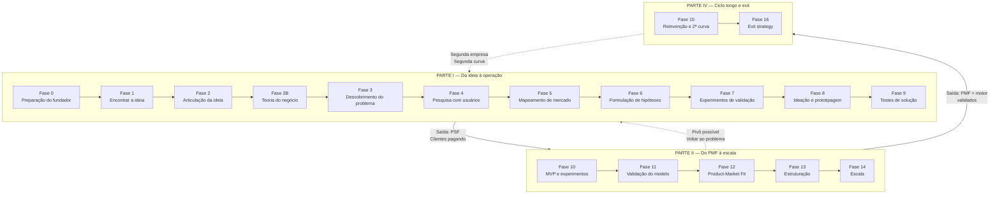

# IGNIÇÃO

*Enciclopédia consultiva para o empreendedor brasileiro*

> [!tip] Dica para leitura no Obsidian
> Este arquivo foi otimizado para Obsidian. Os links do Sumário são wiki-links nativos, basta clicar.
> - **Leitura fluida:** habilite **Reading Mode** (ícone de olho no canto superior direito)
> - **Navegação:** use o **Outline** no painel lateral direito (`Ctrl/Cmd + Shift + O`) para ver toda a hierarquia de headings
> - **Busca dentro deste documento:** `Ctrl/Cmd + F`
> - **Busca em todo o vault:** `Ctrl/Cmd + Shift + F`
> - **Mapa de conexões:** se dividir em múltiplos arquivos no futuro, o Graph View (`Ctrl/Cmd + G`) fica muito útil

---

## Nota do autor

Este livro começou como um arquivo de texto solto. Uma anotação aqui, uma observação ali, coisas que eu queria poder reencontrar em algum momento futuro da minha trajetória empreendedora. Quando percebi, o arquivo tinha crescido absurdamente, e com o crescimento veio uma tentação que eu resisti por algum tempo: transformar rascunho pessoal em algo mais estruturado.

Resisti porque a pergunta óbvia me incomodava. Existem centenas de livros de empreendedorismo no mercado, muitos escritos por pessoas com trajetórias mais notáveis que a minha, muitos com argumentos melhor polidos. O que justifica escrever mais um?

A resposta honesta é que este livro não foi escrito para o mercado. Foi escrito para mim. O fato de outras pessoas eventualmente poderem ler é consequência, não objetivo, e essa consequência só existe porque o livro, depois de pronto, também parece útil para quem esteja construindo algo num contexto parecido com o meu. A hierarquia importa: se eu tivesse escrito pensando primeiro em terceiros, teria escrito pior. Honestidade primeiro pra mim, qualidade pública como subproduto.

O que está aqui é, em essência, depoimento. Alguém tentando construir um negócio sério no Brasil, registrando para si mesmo o que aprendeu até onde aprendeu, na esperança de que as decisões futuras sejam um pouco menos cegas que as passadas. Não é livro de quem chegou, é o livro de quem está no meio da subida e parou para anotar o que sabia, antes que esquecesse.

Algumas coisas sobre o que isto efetivamente é, registradas para o eu de daqui a três, cinco, dez anos:

**Isto é uma enciclopédia, não um livro.** Em algum momento da escrita, eu parei de fingir que estava produzindo prosa contínua. O material não queria ser narrativa, queria ser referência. Aceitei. As fases são verbetes longos sobre etapas da trajetória, os apêndices são verbetes de profundidade temática, o ferramentário é catálogo de instrumentos. Você consulta isto, não lê. Quando precisar de algo em três parágrafos, abra em três parágrafos. O resto pode esperar até a próxima vez que precisar.

**As opiniões aqui são minhas e datadas.** Muito do que afirmo com convicção em abril de 2026 vai parecer ingênuo daqui a dez anos. Tudo bem. Documento canônico tem a vantagem de poder ser revisitado: na próxima edição, eu reescrevo os trechos que envelheceram mal. O que importa é que, neste momento, esta é a minha melhor compreensão organizada, não autoridade, não verdade final, apenas o que consegui reunir.

**Este não é o livro de um especialista.** É o livro de um praticante em formação. Se um dia eu for especialista em alguma coisa específica, escrevo um livro diferente sobre ela. Por enquanto, este é o registro do operacional que juntei, em parte do que vivi, em parte do que aprendi com quem passou antes, em parte do que estudei porque não tinha referência pronta.

**A escrita foi mais valiosa que o resultado.** Organizar o que eu sabia, descobrir o que eu *pensava que sabia* mas não articulava, pesquisar as lacunas, entrevistar mentalmente fundadores que admiro, isso produziu clareza que nenhum livro de outra pessoa produziria. Fica registrado aqui o único conselho que eu tiraria de toda essa experiência, em uma frase: o esforço de escrever ensina mais que o livro pronto. Inclusive este.

Quanto ao uso: foi feito para acompanhar decisões reais, não para ser lido de capa a capa. Quando eu estiver em crise, que eu encontre aqui não consolo abstrato, mas pergunta concreta que me force a diagnosticar o problema real. Quando eu estiver considerando pivotar, que eu encontre aqui o framework que me impeça de pivotar por desespero em vez de por evidência. Quando eu estiver prestes a fazer uma contratação sênior, que eu encontre aqui o lembrete das armadilhas específicas dessa decisão. Esse é o uso pretendido, bússola operacional para os momentos em que eu, sob pressão, não consigo pensar com a clareza que tinha quando escrevi isto.

Se você chegou até aqui e não é a pessoa para quem este livro foi escrito, o material pode te servir mesmo assim, grande parte é aplicável a qualquer fundador brasileiro. Mas alguns trechos vão parecer específicos demais ou idiossincráticos. São. É documento com autor, não com público. Use o que for útil, descarte o resto.

Boa sorte na minha jornada, em cada momento em que eu voltar aqui para buscar uma resposta que este livro possa oferecer a mim mesmo.

*Abril de 2026.*

---

## Sobre este livro

### O que isto é

Este livro tem cerca de 380 mil palavras. Cobre como começar uma empresa no Brasil, como crescê-la, e como sair dela. Está dividido em quatro partes que seguem essa ordem cronológica: Da Ideia à Operação, Do PMF à Escala, Em Escala, Ciclo Longo e Exit. Cada parte tem fases (a sequência principal) e apêndices (profundidade temática para quando você precisar). No fim há uma seção de Referência com ferramentário, templates, glossário, bibliografia e índice remissivo.

Não é narrativa contínua. Não é livro inspiracional. É um documento para consulta em decisões reais. Foi escrito assumindo que você tem pressa, tem uma dor concreta, e precisa de resposta operacional.

### As duas vozes do livro

O livro alterna entre duas vozes. Quando trata de material consagrado, frameworks como OKR, Hoshin Kanri, JTBD, Crossing the Chasm, o registro é sóbrio, próximo do verbete enciclopédico. O autor se apaga. O que importa é fidelidade ao conceito original.

Em outros momentos o livro opina. Sobre quando não empreender, sobre saúde mental do fundador, sobre o ecossistema brasileiro, sobre padrões de fracasso que vi de perto. Quando há opinião, o livro avisa. Você lê algo como "minha leitura, contestável, é que" e sabe que entrou em terreno autoral. Os dois modos coexistem ao longo do livro, e você sabe qual está lendo a cada momento.

### Por que brasileiro

Empreender no Brasil tem especificidades que raramente aparecem em livros importados. Tributação, regulação, ciclos de capital local, estrutura de canais, relação com governo, dinâmica societária, operação em múltiplas moedas. Traduzir Silicon Valley direto para São Paulo gera decisões ruins. O livro parte do contexto brasileiro e estende para o global quando necessário, não o contrário. CLT, MEI, Simples Nacional, INPI, LGPD, BNDES, BACEN, CVM, Receita Federal. Não são detalhes. São a moldura.

### Como usar

O livro não pede leitura linear. Aceita ser aberto em qualquer página por quem tem problema concreto.

Se você está pensando em empreender, comece pelas Fases 0 a 2. Preparação, encontrar a ideia, articular a ideia. Reserve três a quatro horas. Pare e execute antes de continuar.

Se você já tem uma ideia mas ainda não validou, vá para as Fases 3 a 7. Descoberta do problema até experimentos de validação. De quatro a seis horas. Consulte o BG.6 para técnica de entrevista.

Se está construindo MVP ou buscando product-market fit, são as Fases 8 a 12, mais os apêndices AB, Pivot, BG.10 e BG.11.

Se já tem PMF e está escalando, vá para a [[#FASE 13 — ESTRUTURAÇÃO JURÍDICA, FINANCEIRA E OPERACIONAL|[[#FASE 1 — ENCONTRAR A IDEIA|Fase 1]]3]] antes da [[#FASE 14 — ESCALA: TIME, OPERAÇÕES, CRESCIMENTO E CAPITAL|[[#FASE 1 — ENCONTRAR A IDEIA|Fase 1]]4]], mesmo que pareça óbvia. Quem pula estruturação volta a ela depois de quebrar coisa cara. Apêndices críticos nessa altura: V (Captação), CF (Planejamento de Rodada), CG (Growth como função), BG.17 (Liderança). Aqui a leitura é por tema, não por sequência.

Se está em crise ou considerando pivô, há três rotas combinadas. Apêndice Pivot, Apêndice de Crise, [[#APÊNDICE Y — SAÚDE MENTAL, DINÂMICA DE CO-FOUNDERS E HUMANIDADE DO FUNDADOR|Apêndice Y]] sobre saúde mental. Crise societária acrescenta [[#FASE 0 — PREPARAÇÃO DO EMPREENDEDOR|Fase 0]] e Apêndices AH e BP. Crise de caixa acrescenta [[#FASE 13 — ESTRUTURAÇÃO JURÍDICA, FINANCEIRA E OPERACIONAL|[[#FASE 1 — ENCONTRAR A IDEIA|Fase 1]]3]] e Apêndices AN e AT.

Se está preparando saída, [[#FASE 16 — EXIT STRATEGY|Fase 16]] e os Apêndices BR e BF.

Para consulta pontual use o sumário e o índice remissivo. Cada fase tem entrada padronizada (O Que, Por Que, Quando, Quem, Como, Saída) que serve para diagnóstico rápido. O ferramentário BG cataloga aproximadamente uma centena de ferramentas por categoria.

E se você só tem quinze minutos, abra a fase do seu momento atual. Leia a abertura, as armadilhas, e a saída da fase. É suficiente para reorientar foco.

### Sobre os exemplos: PadariaPro e os casos reais

Você vai encontrar PadariaPro mencionado em vários templates ao longo do livro. É um caso fictício, criado para ilustrar todo o ciclo de instrumentos do livro num único arco coerente, da Declaração Inicial da ideia, na [[#FASE 2 — ARTICULAÇÃO E CAPTURA DA IDEIA|Fase 2]], até o Plano de Exit, na [[#FASE 16 — EXIT STRATEGY|Fase 16]]. PadariaPro é um SaaS de gestão para padarias artesanais brasileiras com três a cinco lojas. Você acompanha os fundadores, também fictícios, preenchendo cada template em sequência. Story Tree, Canvas da Cunha, Banco de Hipóteses, Cartão de Experimento, Especificação de MVP, OKRs, Plano de Time, e por aí vai. A função é pedagógica. Um caso único permite ver continuidade entre os instrumentos sem ter que reaprender contexto a cada novo template.

Onde o caso real funciona melhor, o livro usa empresas brasileiras documentadas. Stone, Quinto Andar, Hotmart, Magazine Luiza, RD Station, Linx. Os pontos onde elas aparecem são Especificação de MVP, Diagnóstico de PMF, Máquina de Crescimento em escala, Análise de Segunda Curva e Plano de Exit. Casos reais nesses pontos adicionam nuance e textura que um caso fictício não consegue produzir. Em alguns templates da Parte I, como Declaração Inicial, Roteiro de Entrevista e Canvas da Cunha, você verá PadariaPro e um caso real lado a lado, para mostrar como o instrumento se comporta em contextos diferentes.

Tanto os casos reais quanto o PadariaPro são instrumentos. Nenhum dos dois é receita.

### Como este livro envelhece

Envelhece rápido: nomes de fundos, valuations específicos, ferramentas de IA, features de produtos, alíquotas tributárias, regimes regulatórios. Envelhece devagar: frameworks clássicos, padrões de descoberta, psicologia do fundador, dinâmicas de mercado. Ao reler em ano futuro, desconfie de datas e números. Confie em processos e padrões. A próxima edição vai corrigir o que envelheceu mal. Esse é o privilégio de documento canônico sobre livro impresso.

### O que este livro não é

Não substitui advogado, contador, terapeuta, consultor regulatório ou mentor humano. Não é bola de cristal. Quando diz que a chance de sucesso em X é baixa, isso reflete padrões observáveis, não destino. As respostas para seu caso específico envolvem pessoas e contextos que nenhuma enciclopédia consegue antecipar.

Empreender no Brasil é difícil. O livro não disfarça isso. Mas é possível, e milhares de pessoas conseguem todo ano. Este livro existe para aumentar a probabilidade de você estar entre elas, reduzindo erros evitáveis, preparando para os inevitáveis, e devolvendo o tempo que seria gasto descobrindo o que outros já descobriram.

---

## Mapa do livro

> [!note] Como navegar o livro
> O fluxo é linear (Fase 0 → 16) mas o uso é não-linear. Empreendedor em Fase 12 consulta Fases 3-4 para re-validar, apêndices para aprofundar e Fase 15 para planejar. Use o sumário abaixo para localizar o seu momento atual.

## Sumário

### [[#PARTE I — DA IDEIA À OPERAÇÃO]]

- [[#FASE 0 — PREPARAÇÃO DO EMPREENDEDOR]]
- [[#FASE 1 — ENCONTRAR A IDEIA]]
- [[#FASE 2 — ARTICULAÇÃO E CAPTURA DA IDEIA]]
- [[#FASE 2B — CONSTRUÇÃO DA TEORIA DO NEGÓCIO]]
- [[#FASE 3 — DESCOBERTA DO PROBLEMA]]
- [[#FASE 4 — PESQUISA COM USUÁRIOS (CUSTOMER DISCOVERY APROFUNDADO)]]
- [[#FASE 5 — MAPEAMENTO DE MERCADO E CONCORRÊNCIA]]
- [[#FASE 6 — FORMULAÇÃO RIGOROSA DE HIPÓTESES]]
- [[#FASE 7 — EXPERIMENTOS DE VALIDAÇÃO DO PROBLEMA]]
- [[#FASE 8 — IDEAÇÃO E PROTOTIPAGEM DE SOLUÇÕES]]
- [[#FASE 9 — TESTES DE SOLUÇÃO E USABILIDADE]]
- [[#APÊNDICE D — ARMADILHAS MENTAIS E VIESES]]
- [[#APÊNDICE AJ — DINHEIRO PESSOAL DO FUNDADOR]]
- [[#APÊNDICE Y — SAÚDE MENTAL, DINÂMICA DE CO-FOUNDERS E HUMANIDADE DO FUNDADOR]]
- [[#APÊNDICE AK — ACELERADORAS, PROGRAMAS E PARCEIROS INSTITUCIONAIS PARA STARTUP BRASILEIRA]]
- [[#APÊNDICE AL — REDE, MENTORES E ADVISORS — COMO CONSTRUIR O CAPITAL HUMANO DO EMPREENDEDOR]]
- [[#APÊNDICE F — ABORDAGEM CIENTÍFICA vs LEAN STARTUP: QUANDO USAR CADA UMA]]
- [[#APÊNDICE G — FRAMEWORK DE DECISÃO POR GATES (PROBLEM CORE + SCALE LEVERS + EXPLORATORY)]]
- [[#APÊNDICE H — TRL E CRL: MATURIDADE TECNOLÓGICA E DE MERCADO]]
- [[#APÊNDICE L — IDEA → WEDGE → SCALE: O FRAMEWORK ANTLER COMO LENTE TRANSVERSAL]]
- [[#APÊNDICE AI — CASOS DE FRACASSO BRASILEIROS E LIÇÕES]]
- [[#APÊNDICE B — COMO FECHAR UMA FASE: COMMITTED NEXT MOVE E SINAIS OBSERVÁVEIS|Apêndice B — Como fechar uma fase]]
- [[#APÊNDICE C — CATÁLOGO DE MÉTRICAS POR FASE|Apêndice C — Catálogo de Métricas por Fase]]
- [[#APÊNDICE E — RECURSOS E LEITURAS RECOMENDADAS]]

### [[#PARTE II — DO PMF À ESCALA]]

- [[#FASE 10 — MVP E EXPERIMENTOS DE MERCADO]]
- [[#FASE 11 — VALIDAÇÃO DO MODELO DE NEGÓCIO]]
- [[#FASE 12 — PRODUCT-MARKET FIT]]
- [[#FASE 13 — ESTRUTURAÇÃO JURÍDICA, FINANCEIRA E OPERACIONAL]]
- [[#FASE 14 — ESCALA: TIME, OPERAÇÕES, CRESCIMENTO E CAPITAL]]
- [[#APÊNDICE AB — PRODUTO EM ESCALA E DESCOBERTA CONTÍNUA]]
- [[#APÊNDICE CL — PIVOT: TIPOLOGIA, DECISÃO E EXECUÇÃO]]
- [[#APÊNDICE CN — DIVERSIDADE DE JORNADAS: CASOS ALÉM DO CÂNONE]]
- [[#APÊNDICE AO — DADOS, ANALYTICS E EXPERIMENTAÇÃO]]
- [[#APÊNDICE Z — AI COMO PARTE DO PRODUTO (AI-NATIVE PRODUCT)]]
- [[#APÊNDICE CP — SALES: MOTION COMPLETA, DO OUTBOUND AO RENEWAL]]
- [[#APÊNDICE CG — GROWTH COMO FUNÇÃO ORGANIZACIONAL: TIME DE GROWTH, BUILD VS HIRE, RELAÇÃO COM PRODUTO]]
- [[#APÊNDICE AY — MARKETING DE PERFORMANCE EM PROFUNDIDADE]]
- [[#APÊNDICE AR — CONTENT MARKETING E SEO COMO DISCIPLINA]]
- [[#APÊNDICE AS — COMMUNITY BUILDING COMO DISCIPLINA]]
- [[#APÊNDICE CQ — MARCA, PR E POSICIONAMENTO DE LONGO PRAZO]]
- [[#APÊNDICE X — PRICING STRATEGY COMO DISCIPLINA]]
- [[#APÊNDICE AA — CUSTOMER SUCCESS COMO DISCIPLINA]]
- [[#APÊNDICE CB — SUBSCRIPTION ECONOMY EM PROFUNDIDADE: ALÉM DO "COBRA MENSALMENTE"]]
- [[#APÊNDICE BN — EXECUTIVE HIRING: CONTRATAR LÍDERES SÊNIOR E C-LEVEL]]
- [[#APÊNDICE CO — RECRUTAMENTO TÉCNICO EM PROFUNDIDADE]]
- [[#APÊNDICE BZ — PERFORMANCE REVIEWS ESTRUTURADOS: CICLO, CALIBRAÇÃO E CONEXÃO COM COMPENSAÇÃO]]
- [[#APÊNDICE AP — CULTURA COMO DISCIPLINA]]
- [[#APÊNDICE BU — DIVERSIDADE, EQUIDADE E INCLUSÃO (DEI) EM STARTUP BRASILEIRA]]
- [[#APÊNDICE AG — REMOTE, HYBRID E DISTRIBUÍDO COMO DISCIPLINA]]
- [[#APÊNDICE CR — ENGINEERING MANAGEMENT: GESTÃO DO TIME TÉCNICO E DEVELOPER EXPERIENCE]]
- [[#APÊNDICE BC — TECHNICAL DEBT COMO DISCIPLINA GERENCIADA]]
- [[#APÊNDICE CH — IA NA ENGENHARIA INTERNA: COPILOT, AGENTES E PRODUTIVIDADE DE DEV]]
- [[#APÊNDICE V — CAPTAÇÃO DE EQUITY, PITCH E RELACIONAMENTO COM INVESTIDORES]]
- [[#APÊNDICE CF — PLANEJAMENTO DE RODADA COMO PROCESSO: FUNDRAISING COMO PROJETO ESTRUTURADO]]
- [[#APÊNDICE CE — VALUATION METHODS: COMO INVESTIDORES CALCULAM E COMO VOCÊ CALCULA PARA NEGOCIAR]]
- [[#APÊNDICE P — FINANCIAMENTO NÃO-DILUITIVO]]
- [[#APÊNDICE CS — BOOTSTRAP vs VENTURE CAPITAL: A ESCOLHA FUNDACIONAL]]
- [[#APÊNDICE AN — MODELAGEM FINANCEIRA OPERACIONAL]]
- [[#APÊNDICE AT — GESTÃO DE CAIXA EM PROFUNDIDADE]]
- [[#APÊNDICE W — CONTABILIDADE, TRIBUTÁRIO E REGIMES FISCAIS PARA STARTUP BRASILEIRA]]
- [[#APÊNDICE CD — MODELAGEM FINANCEIRA COM COHORTS: PROJEÇÕES QUE FUNCIONAM EM EMPRESA RECORRENTE]]
- [[#APÊNDICE T — LGPD, COMPLIANCE E GOVERNANÇA DE DADOS]]
- [[#APÊNDICE AH — CONTRATOS E ASPECTOS LEGAIS OPERACIONAIS]]
- [[#APÊNDICE R — FOUNDER MODE, DELEGAÇÃO E QUANDO PARAR DE FAZER]]
- [[#APÊNDICE BQ — GESTÃO DE TEMPO DO FUNDADOR E OPERATING CADENCE]]
- [[#APÊNDICE S — CATEGORY DESIGN]]
- [[#APÊNDICE I — IA GENERATIVA COMO ACELERADOR DO EMPREENDEDOR (2026)]]
- [[#APÊNDICE CT — IA COMO CO-PILOTO DO FUNDADOR (2026)]]
- [[#APÊNDICE J — FRAMEWORK DE CANAIS DE AQUISIÇÃO]]

### [[#PARTE III — EM ESCALA]]

- [[#APÊNDICE AM — BOARD E GOVERNANCE]]
- [[#APÊNDICE BI — EMPRESA FAMILIAR E SUCESSÃO: GOVERNANÇA, DINÂMICA E PSICOLOGIA]]
- [[#APÊNDICE BP — DISPUTA SOCIETÁRIA E SAÍDA DE SÓCIO]]
- [[#APÊNDICE AF — ESG, IMPACT E GOVERNANÇA PARA STARTUP]]
- [[#APÊNDICE CU — INTERNACIONALIZAÇÃO: ESTRUTURA E PRODUTO PARA MÚLTIPLOS MERCADOS]]
- [[#APÊNDICE BS — VISTO E IMIGRAÇÃO PARA FUNDADOR BRASILEIRO]]
- [[#APÊNDICE BT — HEDGING CAMBIAL E GESTÃO DE MOEDA MULTICOUNTRY]]
- [[#APÊNDICE BY — TESOURARIA EM ESCALA: GESTÃO DE CAIXA MULTI-MOEDA, MULTI-PAÍS E MULTI-CONTA]]
- [[#APÊNDICE BB — VENTURE DEBT E REVENUE-BASED FINANCING (RBF)]]
- [[#APÊNDICE BA — SECONDARY E LIQUIDEZ DE FOUNDER]]
- [[#APÊNDICE CI — EQUITY CROWDFUNDING NO BRASIL: CAPTAÇÃO PÚBLICA DE PEQUENOS INVESTIDORES]]
- [[#APÊNDICE CJ — TOKENIZAÇÃO PARA FOUNDERS: ATIVOS DIGITAIS, SECURITY TOKENS E QUANDO NÃO É HYPE]]
- [[#APÊNDICE BW — FRAUDE INTERNA E CONTROLES INTERNOS]]
- [[#APÊNDICE CV — SEGURANÇA DA INFORMAÇÃO: DA CERTIFICAÇÃO À ENGENHARIA]]
- [[#APÊNDICE CW — CRISE E CONTINUIDADE: PREVENÇÃO, RESPOSTA, RECUPERAÇÃO]]
- [[#APÊNDICE BV — LAYOFFS E DOWNSIZING: COMO DEMITIR EM ESCALA SEM DESTRUIR A EMPRESA]]
- [[#APÊNDICE AW — REGULATÓRIO SETORIAL BRASILEIRO]]
- [[#APÊNDICE CM — BIOTECH E HEALTHTECH: PLAYBOOK DE REGULAÇÃO, ENSAIOS E CAPITAL]]
- [[#APÊNDICE CA — HARDWARE E DEEP TECH: CONSTRUIR NEGÓCIO COM FABRICAÇÃO, IP E HORIZONTES LONGOS]]
- [[#APÊNDICE AE — MARKETPLACE DYNAMICS E RISCO DE PLATAFORMA]]
- [[#APÊNDICE CC — PLATAFORMA VS PRODUTO: QUANDO CONSTRUIR PLATAFORMA E QUANDO NÃO]]
- [[#APÊNDICE CK — B2B2C: QUANDO SUA EMPRESA VENDE PARA OUTRA EMPRESA QUE VENDE PARA CONSUMIDOR]]
- [[#APÊNDICE CX — CANAIS INDIRETOS E PARCERIAS: PARCERIAS, FRANQUIAS, CHANNEL]]
- [[#APÊNDICE BM — COMUNICAÇÃO PÚBLICA DO FUNDADOR: NARRATIVA, IMPRENSA E PORTA-VOZ]]
- [[#APÊNDICE CY — MARCA PESSOAL DO FUNDADOR: DISTRIBUIÇÃO, AUTORIDADE E CUSTO DE REPUTAÇÃO]]
- [[#APÊNDICE BE — OPEN SOURCE COMO ESTRATÉGIA]]

### [[#PARTE IV — CICLO LONGO E EXIT]]

- [[#FASE 15 — REINVENÇÃO E SEGUNDA CURVA]]
- [[#FASE 16 — EXIT STRATEGY]]
- [[#APÊNDICE BR — SUCESSÃO NO EXIT E TRANSIÇÃO PÓS-AQUISIÇÃO]]
- [[#APÊNDICE BJ — M&A ATIVO E ROLL-UPS: FUNDADOR COMO COMPRADOR]]
- [[#APÊNDICE BL — SEARCH FUNDS E ETA (ENTREPRENEURSHIP THROUGH ACQUISITION)]]
- [[#APÊNDICE BH — POST-MORTEMS BRASILEIROS: CATÁLOGO DE CASOS EM PROFUNDIDADE]]
- [[#APÊNDICE BF — SECOND-TIME FOUNDER]]

### [[#REFERÊNCIA]]

- [[#APÊNDICE — DATA DE COMPILAÇÃO E NOTA SOBRE ENVELHECIMENTO]]
- [[#APÊNDICE BG — FERRAMENTÁRIO COMPLETO DO EMPREENDEDOR]]
- [[#BG.1 — ESTRATÉGIA CLÁSSICA]]
- [[#BG.2 — ESTRATÉGIA MODERNA]]
- [[#BG.3 — PLANEJAMENTO ESTRATÉGICO E EXECUÇÃO DE LONGO PRAZO]]
- [[#BG.4 — PENSAMENTO ESTRUTURADO E MODELOS MENTAIS]]
- [[#BG.5 — RESOLUÇÃO DE PROBLEMAS E TOMADA DE DECISÃO]]
- [[#BG.6 — PESQUISA QUALITATIVA: MÉTODOS DE INVESTIGAÇÃO]]
- [[#BG.7 — UX RESEARCH E USABILIDADE]]
- [[#BG.8 — PESQUISA QUANTITATIVA E EXPERIMENTAÇÃO]]
- [[#BG.9 — SÍNTESE E ANÁLISE DE RESEARCH]]
- [[#BG.10 — PRODUTO: METODOLOGIAS DE DESCOBERTA E EXECUÇÃO]]
- [[#BG.11 — PRODUTO: PRIORIZAÇÃO E MÉTRICAS]]
- [[#BG.12 — GROWTH E AQUISIÇÃO]]
- [[#BG.13 — MARKETING E POSICIONAMENTO]]
- [[#BG.14 — SALES (METODOLOGIAS DE VENDAS CONSAGRADAS)]]
- [[#BG.15 — NEGOCIAÇÃO]]
- [[#BG.16 — OPERAÇÕES E EXECUÇÃO]]
- [[#BG.17 — LIDERANÇA E GESTÃO DE PESSOAS]]
- [[#BG.18 — FINANÇAS, UNIT ECONOMICS E VALUATION]]
- [[#BG.19 — INOVAÇÃO E SEGUNDA CURVA]]
- [[#APÊNDICE A — TEMPLATES PRONTOS PARA USO]]
- [[#APÊNDICE — GLOSSÁRIO DE TERMOS TÉCNICOS|Glossário de Termos Técnicos]]
- [[#APÊNDICE — ÍNDICE REMISSIVO]]
- [[#GLOSSÁRIO]]
- [[#APÊNDICE — BIBLIOGRAFIA UNIFICADA]]
- [[#APÊNDICE — LISTA DE ABREVIAÇÕES]]
- [[#EPÍLOGO]]

---
